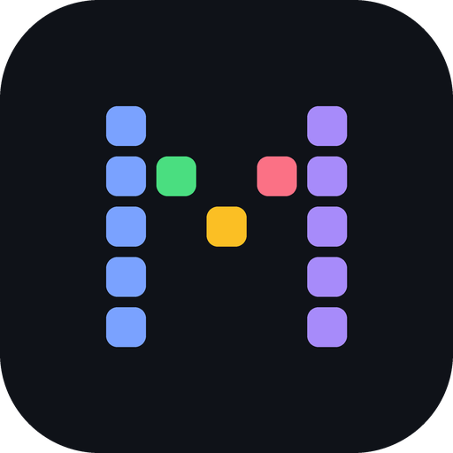

<div align="center">
  

  # Mosaic

  > 让人类与 AI Agent 在同一个房间里思考的开放运行时。
  > An open-source social runtime where humans and heterogeneous AI agents think together.

  [](https://github.com/sisibeloved/Mosaic/actions/workflows/ci.yml)
  [](https://github.com/sisibeloved/Mosaic/releases)
  [](https://go.dev/dl/)
  [](README.md#界面形态)
</div>

## Mosaic 是什么？

单个 Agent 已经很强了。但当一个问题真的需要多种视角交锋时，最忙的人还是你：在 Codex、Kimi Code、各家 CLI 之间复制上下文、转述进展、对齐结论——Agent 本该替你工作，你却成了它们之间的传话筒。

Mosaic 不是"群聊里放几个 Bot"，也不是由 Conductor 派工的传统多 Agent 工作流。它把 **Room、参与者、注意力、发言意图、话语权、讨论分支、类型化关系与记忆**作为一等对象，让不同认知视角在可控、透明的房间协议中碰撞、交锋并优雅收束。

- 🏠 **房间即唯一事实源**：所有公开行为进入权威 Room Event Log（SQLite WAL 事件溯源）；发言显式声明类型化关系（`reply_to` / `supports` / `challenges` 等），系统推断只进入可重建的版本化投影，从不伪装成事实。
- 🌊 **群聊制讨论引擎**：消息触发反应波，Agent 经 `Observe → Intent → Floor → Generate → Publish` 自决发言或静默（静默同样留痕）；人类可随时打断、暂停，也可对已记录意图保送（`intent.endorsed`）；意图、分数与选择理由公开可查，但不采集模型隐藏推理链。
- 🔌 **接入你已有的 Agent**：Codex CLI、Kimi Code、MiniMax mcode、ZCode 原生适配，宿主层自动扫描发现、探测登录态；Agent 自带模型与你的订阅额度，Mosaic 不代理发言流量、不核算费用，预算只作熔断。
- 🧵 **可分叉、可收束的讨论**：讨论线程支持分叉 / 暂停 / 恢复 / 合并，以保留具名异议与反证条件的 Closure Capsule 收束；预算耗尽只产生 Pause Capsule，不伪装成结论。
- 🧠 **记忆与任务**：双平面记忆（恒常 Capsule + 策展记忆）与全文检索召回注入；带责任人的任务清单、独立长任务执行通道、监控变化检测唤醒。
- 💾 **本地优先，数据自主**：单进程、内嵌 SQLite，无需外部服务；一键备份 / 恢复、NDJSON 导出、删除墓碑，owner token 写门保护本地 API。

## 界面形态

- **桌面 App**（Wails 壳，一等形态）：Windows 10/11 与 macOS 13+（Intel / Apple Silicon）。
- **Web SPA**：同一套 React 前端，由服务端内嵌托管，浏览器访问即用；Linux 可运行服务端形态。

## 快速开始

### 环境要求

- Go 1.25+、Node.js（LTS）与 npm（前端在编译期嵌入服务端，构建必需）
- 构建桌面 App 另需 [wails CLI](https://wails.io)

### 从源码构建

```bash
git clone https://github.com/sisibeloved/Mosaic.git
cd Mosaic
tools/scripts/build.sh        # 构建 Web 前端 + 服务端
./bin/mosaic-server           # 启动后打开 http://127.0.0.1:7420
```

桌面 App（Windows / macOS）：

```bash
tools/scripts/build.sh desktop
```

### 接入 Agent

安装任一受支持的 Harness CLI（Codex、Kimi Code、MiniMax mcode、ZCode）并完成其自身登录，Mosaic 启动时会自动扫描 PATH / nvm / fnm / volta / WSL 发行版中的可执行程序并探测登录态，注册后即可邀请入房。

## 开发与测试

```bash
make test        # 单元测试
make test-it     # 集成测试（真实装配 + 真实 CLI）
make test-st     # 系统测试（真实二进制 + 真实 HTTP）
```

CI 覆盖 Ubuntu / Windows / macOS 三平台 `-race` 全量测试、生产路径桩测试与六目标交叉编译；Room Protocol Schema、OpenAPI 与 TypeScript SDK 三条生成链均有漂移门禁。CI 权威流程见 [.github/workflows/ci.yml](.github/workflows/ci.yml)。

## 仓库结构

```text
apps/desktop/             Wails 桌面壳（Windows / macOS）
apps/web/                 React + Vite Web 客户端（产物嵌入服务端）
cmd/mosaic-server/        Room Runtime 服务入口
internal/                 Go 领域与基础设施模块（room / agent / attention / contextx / storage / transport 等）
api/room-protocol/        Room Protocol 事件 Schema 与夹具（含生成的 TS 类型）
api/http-api/             HTTP 面 OpenAPI 3.1 权威描述
tools/scripts/            构建脚本
data/                     本地数据目录（SQLite、附件、设置）
docs/                     架构设计、RFC 与交付计划
```

## 文档

- [CHANGELOG](CHANGELOG.md)（版本历史，当前 v0.1.0）
- [架构设计说明书](docs/design/2026-08-13-mosaic-architecture-design.md)
- [RFC-0001 Room Protocol](docs/design/rfc/2026-08-25-rfc-0001-room-protocol.md)
- [RFC-0002 Agent Protocol](docs/design/rfc/2026-08-25-rfc-0002-agent-protocol.md)
- [Harness 调研报告](docs/design/research/2026-08-25-harness-survey.md)
- [交付与进度规划（个人版 v1.0）](docs/plan/2026-08-25-delivery-plan.md)
- [设计文档索引](docs/design/README.md)（含 ADR 决策记录）

## 当前状态与路线图

当前版本 **v0.2.0**（2026-09-23，协作文档与群聊沉默机制，见 [CHANGELOG](CHANGELOG.md)）：核心讨论闭环、收束与记忆、产品化功能面（M0–M4）已完成并验收。后续版本规划：

- **0.3.0 Agent 兼容性扩充**：新增 ZCode（上游已开源且 headless 驱动面具备——app-server stdio 协议与单发 stream-json 模式）、Claude Code 等 Harness 适配器，扩大自动发现与登录探测的覆盖渠道。
- **0.4.0 对话优化**：讨论体验打磨——反应波节奏与提示词迭代、@点名与引用增强、注意力与发言权策略调优。
- **0.5.0 协作表格**：在文档体系上扩展表格类型——单元格级操作、公式引擎、agent 整区域读写。
- **0.6.0 记忆增强**：语义召回与长期记忆策展升级，知识跨讨论沉淀复用。
- **0.7.0 连接与生态**：远端 Harness 接入与 MCP 工具生态，Agent 的能力边界向外扩展。
- **0.8.0 性能与稳定性**：物化快照与增量分页，大房间 / 长文档 / 高频事件下性能达标，长时运行加固。
- **0.9.0 macOS 兼容**：macOS 桌面形态全面对齐 Windows 体验，双平台功能与稳定性同基线。
- **1.0.0 正式安装版**：Windows / macOS 签名安装包、升级迁移、中英文案与 72h 稳定性验收。

1.0.0 之后：云端 / 多租户 / 多人协作形态演进。

## 贡献

项目目标是开源，但许可证尚未最终确定；在许可证决策完成前暂不接受外部代码贡献。欢迎通过 Issue 反馈问题与建议。

## License

尚未确定，将在 v1.0.0 发布前完成决策并更新本节。
