# Mosaic 架构设计说明书

## 0. 文档控制

### 0.1 产品版本&密级

| 项目 | 内容 |
|---|---|
| 产品 | Mosaic |
| 目标版本 | v0.1.0（MVP） |
| 文档版本 | v0.6 |
| 状态 | Draft |
| 密级 | 公开 |

### 0.2 拟制信息

| 项目 | 内容 |
|---|---|
| 拟制日期 | 2026-08-13 |
| 拟制者 | Mosaic 项目组 / Codex |
| 评审者 | 待定 |
| 批准者 | 待定 |

### 0.3 修订记录

| 版本 | 日期 | 修订人 | 说明 |
|---|---|---|---|
| v0.1 | 2026-08-13 | Mosaic 项目组 / Codex | 根据“Kimi 多 Agent 功能调研”对话形成首版架构设计 |
| v0.2 | 2026-08-24 | Mosaic 项目组 / ZCode | 圆桌行为语义修订：成本退出发言选择（仅保留熔断）、新增对话结构投影与收束协议、reveal 揭示策略、Roundtable rebuttals 参数、意图窗口延迟公平 |
| v0.3 | 2026-08-24 | Mosaic 项目组 / Codex | 分离 Conversation/Epistemic/Control 三平面，修正 cluster/bridge 自指，增加类型化关系、认知状态与证据债务、Closure Capsule、Context Receipt、独立后交叉揭示及反 Goodhart 约束 |
| v0.4 | 2026-08-24 | Mosaic 项目组 / Kimi Code | 圆桌默认形态修订：Roundtable 默认 rebuttals=1、同构回声运行时检测与提示、定向交锋快速通道；OQ-16 已决：讨论上下文窗口管理划归 Agent Harness，Mosaic 统一交付讨论输入并新增权威历史查询接口；OQ-17 已决：人类保送（`intent.endorsed`）+ 记分卡透明；OQ-19 已决：房间不压节奏，仅保留宽松期限，超时/重试/fallback 归 Harness；OQ-16~OQ-19 全部已决；统筹校对：新增架构原则 15（Harness 承担 Agent 侧执行职责），同步 MVP 切片、适应度函数与接口表；OQ-20 已决：外部 Harness 自带模型访问为主，Model Gateway 收缩为 Mosaic 自用模型通道，资源限额与合规语义相应调整；系统不核算费用，限额与熔断仅按轮次/token/时长（9.7 改写） |
| v0.5 | 2026-08-24 | Mosaic 项目组 / ZCode | 勘误与补全：状态恢复 Draft；OQ-20 传导补全——8.2.5 增补 IF-AGENT-PROTOCOL、8.7 部署模型纳入外部 Harness、9.1.4/9.1.5/9.2.2/9.3 信任边界与 egress 同步；统一 cross 子轮原语（rebuttals 与 independent_then_cross 为同一机制）；6.2.6 定向 slot 上限明确；UC-002 与 OQ-03 措辞对齐 OQ-20 决策；修正第 10 章标题笔误 |
| v0.6 | 2026-08-24 | Mosaic 项目组 / Codex | 文档评审确认修正：逻辑/行为视图统一为外部 Harness + Agent Protocol Adapter；补齐 Harness 回调 SSRF 防护；建立投影查询跨可见性非干扰契约及测试门禁 |

### 0.4 Keywords 关键词

Mosaic、Multi-Agent Social Runtime、Shared Cognitive Space、Room Protocol、Room Kernel、Participant、Attention、TurnIntent、Floor、Conversation Graph、Epistemic Projection、Evidence Debt、Closure Capsule、Context Receipt、Event Sourcing、Dialogue Structure Projection、Closure Round、Reveal Policy、Directed Exchange、Homogeneity Detection、History Query。

### 0.5 Abstract 摘要

Mosaic 是一个原生的多智能体社交运行时，使人类与异构 AI Agent 以平等的 Participant 身份，在同一共享认知空间中进行透明、可分支、可打断、可优雅收束的讨论。系统不以固定 Conductor、任务分解或最终交付为中心，而以 Room 及其权威事件流为中心；通过“观察—注意—意图—发言权仲裁—生成—发布—收束”协议，在保持观点自主性的同时控制噪声、重复、循环与资源消耗。不可变 Conversation 事实与版本化 Epistemic Projection 分离，使系统能够追踪 claim/evidence、证据债务和动态立场，并用保留异议与反证条件的 Closure Capsule 收尾，而不把结构收敛伪装成事实共识。

本文定义 Mosaic v0.1 的系统边界、概念模型、逻辑架构、关键行为、数据所有权、实现模型、部署模型以及安全、隐私、可靠性和可观测性策略。MVP 采用模块化单体，以 Go Room Runtime、Next.js Web Client、PostgreSQL/pgvector 和对象存储为基础；事件总线与工作流引擎是后续按负载演进的实现选项，不是首版前置条件。

### 0.6 List of abbreviations 缩略语清单

| 缩略语 | English Full Name | 中文名 |
|---|---|---|
| API | Application Programming Interface | 应用程序接口 |
| DFX | Design for X | 面向质量属性的设计 |
| LLM | Large Language Model | 大语言模型 |
| MCP | Model Context Protocol | 模型上下文协议 |
| OIDC | OpenID Connect | 开放身份连接协议 |
| OTel | OpenTelemetry | 开放遥测标准 |
| PII | Personally Identifiable Information | 个人可识别信息 |
| RAG | Retrieval-Augmented Generation | 检索增强生成 |
| RLS | Row-Level Security | 行级安全 |
| SSE | Server-Sent Events | 服务器发送事件 |
| WS | WebSocket | WebSocket 长连接协议 |

### 0.7 前言

本文是 Mosaic 的首份架构基线。当前没有已批准的上游 RFC，因此将参考对话中已经确认的产品目标视为上游需求输入：

- 人与 Agent 都是房间成员，不采用永久的上下级关系；
- 不使用固定 Conductor 主导发散讨论；
- 对话走向、回应关系、分支和仲裁依据必须可追踪；
- 同时支持广度发散和局部深挖，允许人类随时打断或拉回；
- 拟人化的关键是“知道何时开口、何时沉默”，而不是模拟或暴露隐藏推理链；
- Room Protocol 必须在原生 Chatroom Runtime 中实现，第三方 IM 至多是未来适配端。

本文中的技术选型是 v0.1 建议基线。凡标注为“待验证”或列入开放问题的内容，不构成不可逆承诺。

## 1. 简介

### 1.1 目的

本文用于：

1. 对齐 Mosaic 与传统聊天产品、多 Agent 编排框架的边界；
2. 定义 Room Protocol 的核心对象、状态和交互语义；
3. 为 v0.1 功能设计、详细设计、实现和测试提供架构约束；
4. 给出可从单机 MVP 演进到多实例服务的实现路径；
5. 显式记录安全、隐私、资源、可靠性和许可证风险。

### 1.2 范围

本文覆盖：

- 原生 Web Room 体验；
- Room、Participant、Thread、Event、Intent、Floor、Memory 和 Policy；
- 异构模型适配与 Agent Harness；
- 公开讨论、点名、自动发言、分支/合并、人类打断与讨论收束；
- 权威事件日志、类型化关系、结构/认知投影、Context Receipt、Closure/Pause Capsule、上下文组装和记忆；
- 模型调用、基础工具接入与权限控制；
- API、实时协议、持久化、部署和 DFX。

v0.1 不包含：

- 飞书、Discord、Zulip 等第三方 IM 的双向同步；
- 固定 Conductor 驱动的任务工作流或通用 Agent Swarm；
- Agent 自动购买、发布、删除外部资源等高风险自主操作；
- 原始思维链采集、存储或展示；
- 跨组织公开 Agent 市场；
- 端到端加密；
- 自训练基础模型或强化学习调度器；
- 原生移动端和桌面端客户端。

### 1.3 文档结构

本文先定义概念、目标、原则和系统用例，再给出关键技术方案与逻辑架构，随后将逻辑元素逐层映射到代码、构建、交付和部署模型，最后分析安全、隐私、可靠性、性能、资源和运维属性。

### 1.4 利益相关人

| 角色 | 关注点 |
|---|---|
| 产品负责人 | 是否真正形成“共享认知空间”而非多 Bot 群聊 |
| 人类参与者 | 讨论是否自然、透明、可控，能否随时中断 |
| Agent/模型接入者 | 模型适配成本、身份一致性、工具与记忆边界 |
| 前端工程师 | Timeline、Conversation Graph、流式状态与多端体验 |
| 后端工程师 | 房间一致性、并发仲裁、幂等、事件回放与扩展性 |
| 安全与合规人员 | 租户隔离、提示注入、工具越权、PII、审计与删除 |
| SRE/运维人员 | 可观测性、限流、恢复、外部模型故障和用量 |
| 开源贡献者 | 协议稳定性、模块边界、许可证和开发体验 |

### 1.5 对已有架构的借鉴与反思

| 参考 | 借鉴 | 明确不继承 |
|---|---|---|
| Kimi Claw Group / Agent Swarm 调研 | 多 Agent 身份、独立上下文、线程、异步执行与过程可见性 | 固定 Conductor、Worker 上下级、只向主控回传最终结果 |
| Grok Bot 调研 | 原生 Group Room、持久 Agent、普通消息自主响应、可见 handoff、用户可打断 | 强任务所有权、单用户 Agent Team、不可控的异构模型绑定 |
| LobeHub | Agent Registry、模型/工具适配、MCP、可编辑记忆、自托管经验 | “Chief Agent Operator”及任务团队作为系统中心。LobeHub 当前公开定位强调组织、调度和报告 Agent 团队，Agent Groups 也面向任务协作，故仅复用基础设施思路 [[R2]](#12-参考资料清单) |
| MaiBot | 将“何时开口、何时闭嘴”、自然长短与群体语境适配视为一等行为 | 直接复制实现或人格陪伴目标；其 GPL-3.0 代码不在未完成许可证评估前引入。MaiBot 公开说明明确强调在合适时间说话和沉默 [[R3]](#12-参考资料清单) |
| LangGraph / CrewAI / AutoGen 类框架 | 可选的工具执行、持久任务和状态机实现经验 | 把显式工作流图、Planner 或 Manager 作为 Room 的主交互模型 |

关键反思是：现有系统大多优化“如何让多个 Agent 完成任务”，Mosaic 优化“如何让多个认知主体共同形成讨论”。因此系统中心必须从 Agent/Task 转为 Room/Event，协调机制必须从派工转为中立的发言权与上下文协议。

## 2. 概念模型

### 2.1 核心隐喻

Mosaic 不是聊天记录的容器，而是一台管理“认知进程”的 Room Runtime：

```text
操作系统                     Mosaic
Process                  -> Participant Session
Scheduler                -> Attention / Floor Scheduler
IPC                      -> Room Event
Process Tree             -> Conversation Graph
Journal                  -> Room Event Log
Access Control           -> Room / Tool Policy
```

类比只用于说明职责边界；Mosaic 不试图实现完整的社会仿真。

### 2.2 领域关系

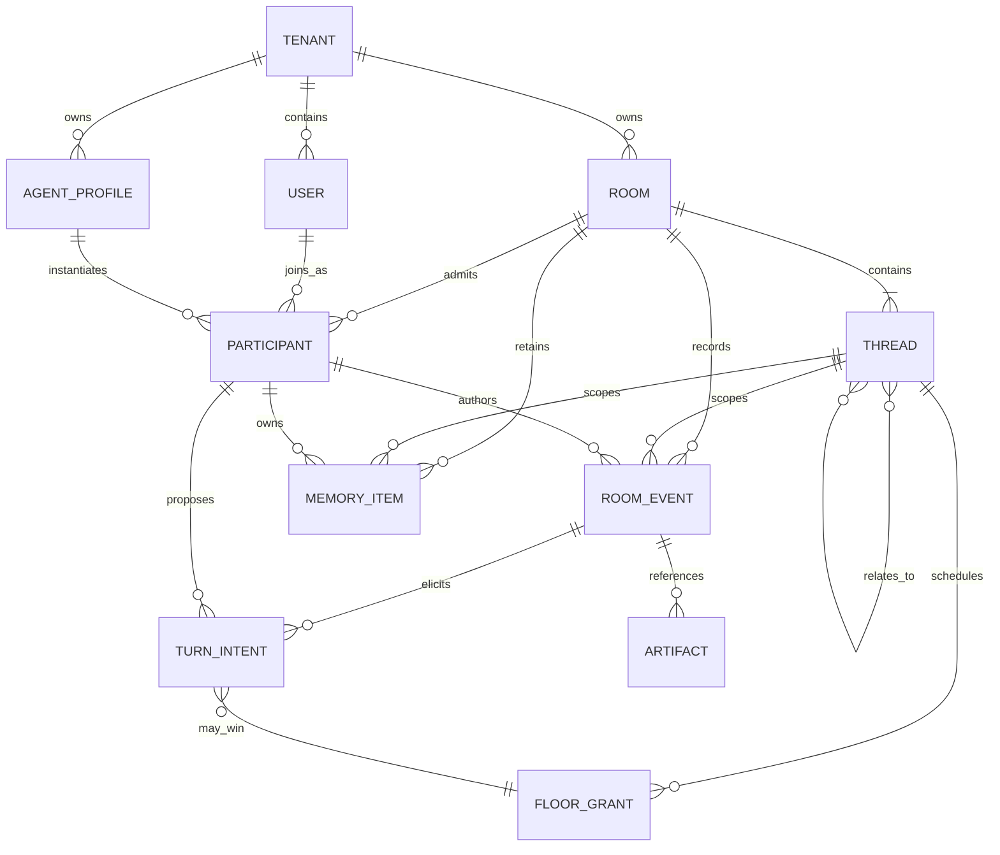

### 2.3 核心对象

| 对象 | 定义 | 关键约束 |
|---|---|---|
| Room | 共享认知空间及一致性边界 | 一个 Room 的写入按单调序号线性化 |
| Participant | 房间成员的统一抽象 | Human 与 Agent 在发言语义上同构；权限可不同 |
| Agent Profile | 可复用的 Agent 身份、模型、认知特征与能力声明 | Profile 与具体 Room 中的 Participant Session 分离 |
| Thread | Conversation Graph 中的讨论上下文节点 | 生命周期支持 pause、resume、close、reopen、merge、archive；认知阶段另由 Epistemic Projection 描述 |
| Room Event | Room 中已发生事实的不可变记录 | Message 只是其中一种事件；事件不可原地改写 |
| TurnIntent | Agent 对某一轮的结构化行动建议 | 是提案，不直接产生公开发言 |
| FloorGrant | Room Kernel 授予的有限时发言许可 | 必须绑定 room、thread、round、participant 和期限 |
| Message Relation | Participant 在发布时显式声明的类型化事件关系 | 直接回复锚点唯一；跨轮关系有类型、来源与可见性校验 |
| Epistemic Projection | 从 Room Event 派生的 cluster、claim、evidence、stance 与 convergence 读模型 | 可重建、带算法版本与事件水位；不得反向改写 Room Event |
| Closure Capsule | 一次被接受收束的结构化快照 | 记录结论、异议、假设、反证条件、开放问题、证据债务与重开条件 |
| Pause Capsule | 预算/轮次硬顶或显式暂停时的未收敛快照 | 记录 pause reason、已覆盖范围、未解决问题和恢复水位；不得触发 thread.closed |
| Context Receipt | 一次 Intent/Generate 实际使用的上下文清单 | 记录 event/memory/summary/projection 版本，不记录隐藏推理链 |
| Memory Item | 从事件派生、可编辑、带来源的记忆 | 不是真相；必须记录 provenance、scope 和版本 |
| Artifact | 文件、图像、报告等外部内容引用 | 二进制不进入事件日志，只记录不可变引用和元数据 |
| Policy | 房间模式、节奏、预算、权限与安全规则 | 确定性硬规则优先于模型判断 |

### 2.4 Participant 对称性与非对称性

“人和 Agent 平等”指二者都是可观察、可发言、可回应、可加入分支的 Participant，不表示安全权限完全相同：

| 能力 | Human | Agent |
|---|---:|---:|
| 公开发言 | 是 | 需 FloorGrant（被直接点名时也需登记 grant） |
| 创建/加入 Thread | 是 | 可提交 fork intent，由 Policy 决定 |
| 中断自动续聊 | 是 | 否 |
| 修改 Room Policy | 需角色权限 | 否 |
| 调用工具 | 可手动 | 按 capability 与 approval policy |
| 查看隐藏推理链 | 不涉及 | 不采集、不展示 |
| 查看公开仲裁元数据 | 是 | 通过上下文投影可见 |

### 2.5 Conversation Graph

Thread 使用有向图而不是严格树：

- `forked_from`：从某事件或 Thread 分叉；
- `responds_to`：讨论目标指向另一 Thread 的结论；
- `merged_into`：摘要或结论合并到一个或多个目标 Thread；
- `related_to`：非层级关联。

v0.1 禁止图的执行依赖环，但允许 `related_to` 构成环。一个 Thread 只有一个主 `forked_from`，可有多个 `merged_into` 目标。合并是追加 `thread.merged` 事件和 merge summary，不会删除支线历史。

### 2.6 Room、Thread 与轮次状态

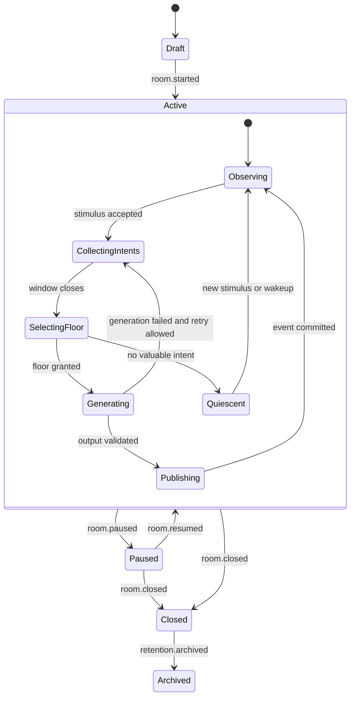

Thread 使用两个正交维度，避免把运行状态与认知状态组合成不断膨胀的单一枚举：

- **生命周期状态**：`active / paused / closed / merged / archived`。`closed` 可通过显式 reopen 开启新的 `discussion_epoch_id`；`merged` 与 `archived` 不自动恢复；
- **认知阶段投影**：`exploring / diverging / integrating / converging / stable / evidence_blocked`。它是可重建投影，不是阻止写入的权威状态；进入收束由 6.9.5 驱动。

`thread.phase.changed` 固化系统当时采用的阶段判断与投影版本，但 cluster/claim 的具体推断仍可重建。Room 暂停时，所有 Agent 自动轮次暂停；人类仍可读取历史并由有权限者恢复 Room。

### 2.7 Conversation、Epistemic 与 Control 三平面

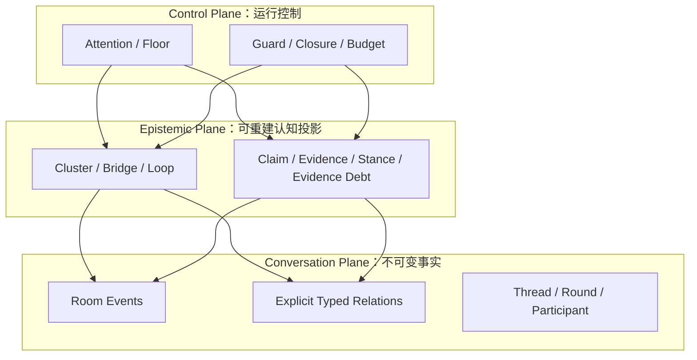

Conversation Plane 记录“发生了什么”；Epistemic Plane 推断“当前有哪些论点、证据和认知缺口”；Control Plane 决定“下一步允许发生什么”。Control 可以消费投影，但不得把推断伪装成事实，也不得借结构指标动态注入立场或成为隐藏 Conductor。

## 3. 架构和关键质量属性目标

### 3.1 架构目标

1. **Room-centric**：Room Event Log 是唯一权威事实源，客户端、Agent 与记忆都是其投影或消费者。
2. **平等但有秩序**：不设置永久内容主导者；以中立、可解释、可配置的 Floor Policy 控制节奏。
3. **过程透明**：公开谁回应谁、意图类型、选择理由、分支与合并；不公开隐藏思维链。
4. **广度与深度兼容**：主线和支线共享协议，支持自由发散、点对点深挖和非固定总结者收束。
5. **异构且可替换**：模型供应商、Agent Harness、工具和未来 Channel Adapter 通过稳定端口接入。
6. **可回放与可评测**：同一事件日志可重建 Room 投影；模型非确定性决策以输出事件固化，支持离线评测。
7. **先简单后扩展**：v0.1 使用模块化单体和 PostgreSQL；只在观测数据达到阈值后拆服务或引入消息中间件。

### 3.2 关键架构需求

| ID | 需求 | v0.1 验收口径 |
|---|---|---|
| AR-001 | 人类和至少 3 个异构 Agent 可加入一个 Room | 支持 1–10 个在线 Participant，其中 Agent ≥ 3 |
| AR-002 | 普通公开消息可触发多个 Agent 独立评估，但不会全员抢答 | 每轮 Intent 全记录，公开发言数遵守 mode 上限 |
| AR-003 | Agent 不能直接调用 Agent | 领域 API 不提供 `invokeAgent`；定向语义仅为 Room Event 的 `addressed_to` |
| AR-004 | 人类可在 500 ms 内暂停自动续聊 | 接收 pause 后不再提交新的 Agent 发言；在途生成被取消或结果丢弃 |
| AR-005 | Thread 可 fork、pause、resume、close、reopen、merge | 所有操作生成事件并可从日志重建图；reopen 创建新的 discussion epoch |
| AR-006 | 实时过程可观察 | P95 已提交事件到客户端投影 < 1 s（不含 LLM 生成） |
| AR-007 | Room 内事件顺序一致且不重复 | 唯一 `(room_id, seq)`；命令幂等键去重 |
| AR-008 | 单个模型故障不阻塞整个 Room | 超时/错误形成可见状态；其他候选者仍可继续 |
| AR-009 | 预算可控 | 每 Room/Thread/轮次可配置 token、时长、自动轮次上限；不含费用维度 |
| AR-010 | 支持删除与导出 | 可导出 Room Event/Artifact 清单；按策略删除投影和对象，保留最小审计墓碑 |
| AR-011 | 决策可评测 | 记录 Intent、选择特征、Policy 版本和结果指标，不记录隐藏推理链 |
| AR-012 | 多租户隔离 | 所有资源带 tenant_id，鉴权后在应用层和数据库层双重约束 |
| AR-013 | 讨论可优雅收束 | Thread 仅在 Closure Capsule 被接受或有权限的人类显式放弃时关闭；预算/轮次硬顶只产生 Pause Capsule 与未收敛标记；纯 Agent 房间可按 Policy 自主接受收束 |
| AR-014 | 结构推断、事实与可见性分离 | cluster/claim/bridge 等投影均带算法版本与水位，可从 Room Event 重建；推断不得覆盖显式关系；主体 P 的投影响应必须等价于仅使用 P 可见来源重建的结果 |
| AR-015 | 收束结果可逆且不伪造共识 | Closure Capsule 必须保留具名异议、假设、反证条件与重开触发；`silent`/超时不计为同意 |
| AR-016 | 模型运行上下文可审计 | 每次 Intent/Generate 都生成 Context Receipt，可回答该运行实际看到了哪些授权事件、记忆和投影版本 |

### 3.3 假设和约束

- 首版以单区域、云端、在线 Web 使用为主；离线协作不在 v0.1 范围。
- 外部模型 API 具有速率限制、费用和不可控延迟，不能成为数据库事务的一部分。
- 模型输出不可信，所有结构化输出必须校验；所有工具参数必须经过 Policy Gate。
- 不保证相同输入得到相同模型输出；事件回放复现的是已发生结果，而不是重新调用模型。
- 公开“发言理由”是简短、结构化、面向用户的理由，不是模型隐藏推理。
- v0.1 的 Agent 自动续聊最大深度与每轮发言数必须有硬上限。
- 初始技术团队规模未知，故避免在没有容量证据时采用微服务。

#### 3.3.1 生命周期约束

- `Agent Profile` 的修改采用版本化快照；已发生事件引用原版本。
- Agent 离开 Room 不删除其历史发言；只终止当前 Participant Session。
- Room 关闭后拒绝新发言，但允许读取、导出和按权限重新打开（重新打开形成新 Room，引用旧 Room）。
- Thread merge 不删除源 Thread。
- `thread.closed` 必须引用被接受的 Closure Capsule 或显式人类放弃事件；预算/轮次硬顶只能写入 `thread.paused` 与 Pause Capsule。
- `thread.reopened` 在同一 Thread 下创建新的 `discussion_epoch_id`，必须引用旧 Closure Capsule 并声明 reopen reason。
- Epistemic Projection 的算法升级采用旁路重建与版本切换，不能原地覆盖历史结果或修改 Room Event。
- Event payload Schema 遵循“只增字段、字段可选、显式版本”的兼容策略；破坏性变更发布新事件类型或主版本。
- 默认数据保留期由部署方配置；用户删除请求与法定审计保留冲突时，以明确的部署政策处理。

## 4. 架构原则

1. **Room 是权威，UI 与 Agent 不是权威。** 客户端本地状态、模型上下文、向量索引都可重建。
2. **事件表示事实，命令表示请求。** 命令可拒绝，只有事务提交后的事件才能驱动后续行为。
3. **Agent 通过房间交流。** Agent 发言或点名生成公开/受控可见事件，不能直接唤醒另一 Agent。
4. **协调观点的机会，不裁定观点的真伪。** Floor Policy 只决定发言机会、节奏与安全边界，不替代参与者产生观点。
5. **硬约束先于模型策略。** 权限、预算、轮次、幂等、最大深度等必须由确定性代码执行。
6. **公开理由，不公开思维链。** 对用户展示 intent type、target、简短 rationale 和选择因素。
7. **生成在事务之外，发布在事务之内。** LLM 调用可取消、重试；只有通过验证的输出才原子写入 Event Log。
8. **每个 Room 单写序。** 同一 Room 命令串行化，不同 Room 并发执行，从源头降低状态竞争。
9. **派生数据可丢弃。** Conversation Projection、摘要、Embedding 和缓存都带源事件水位，可重建。
10. **渐进式基础设施。** 先用进程内事件分发与 PostgreSQL outbox；再按吞吐、隔离和可用性证据引入 NATS/Temporal。
11. **最小必要上下文。** Agent 只获得完成本次 Observe/Intent/Generate 所需的 Room/Thread 投影和授权记忆。
12. **可观察的自治。** 自动行为必须可暂停、可限额、可追溯、可被人类覆盖。
13. **推断不是事实。** cluster、claim、bridge、stance 与 convergence 必须作为带版本的可重建投影存在；系统推断关系不得写回或覆盖 Participant 的原始发言。
14. **指标不得成为目的。** bridge、对话密度和收束率只作诊断与组合特征，未经过因果验证不得直接成为在线奖励或单一优化目标。
15. **Harness 承担 Agent 侧执行职责。** Mosaic 只维护协议推进所需的宽松时限，以及服务人类抢占与预算熔断的取消通道；上下文窗口管理与压缩、请求级超时、重试、provider fallback 均由 Agent Harness 自行处理。Mosaic 的保证是权威历史完整可查，而不是替 Agent 管理其运行。

## 5. 系统用例模型

### 5.1 上下文模型

#### 5.1.1 上下文图

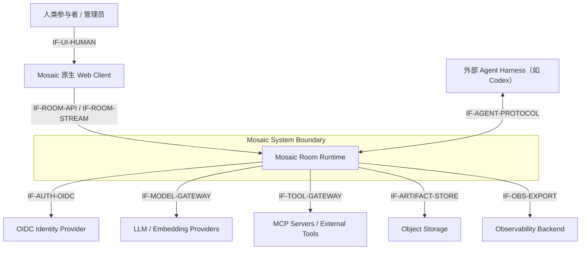

#### 5.1.2 外部接口描述

| 接口组 | 方向 | 职责 | 机制 |
|---|---|---|---|
| IF-UI-HUMAN | Human ↔ Client | 展示 Timeline/Graph/状态并接受输入 | 浏览器 UI |
| IF-ROOM-API | Client ↔ Runtime | Room、Participant、Thread、消息、Policy 与控制命令 | HTTPS JSON API |
| IF-ROOM-STREAM | Runtime → Client，Client → Runtime 控制 | 事件投影、流式草稿、状态、取消与心跳 | WebSocket；SSE 为降级候选 |
| IF-AGENT-PROTOCOL | Runtime ↔ 外部 Agent Harness | Observe/EvaluateIntent/Generate/Summarize 下发，历史查询与结果回传（OQ-20） | HTTPS 回调 + 长连接，具体形态待定 |
| IF-AUTH-OIDC | Runtime ↔ IdP | 登录、身份声明、会话建立 | OIDC Authorization Code + PKCE |
| IF-MODEL-GATEWAY | Runtime ↔ Providers | 仅限 Mosaic 自用模型：Embedding 与内部 utility；Agent 发言流量由外部 Harness 直连（OQ-20） | Provider Adapter + HTTPS streaming |
| IF-TOOL-GATEWAY | Runtime ↔ Tools | 工具发现、调用、审批与结果回传 | MCP/HTTP；按能力隔离 |
| IF-ARTIFACT-STORE | Runtime ↔ Object Storage | 大文件、图像和报告读写 | S3-compatible API + signed URL |
| IF-OBS-EXPORT | Runtime → Backend | 指标、日志、Trace、审计告警 | OTel / Prometheus-compatible export |

### 5.2 关键系统用例模型

#### 5.2.1 需求编号：UC-001 创建并启动 Room

##### 5.2.1.1 关键系统用例

有权限的人类创建 Room，设定目的和模式，邀请人类或 Agent Profile；Room Kernel 固化 Participant Profile 版本、执行 Model Binding 同构检测（6.4）并启动 Room。

##### 5.2.1.2 交互场景

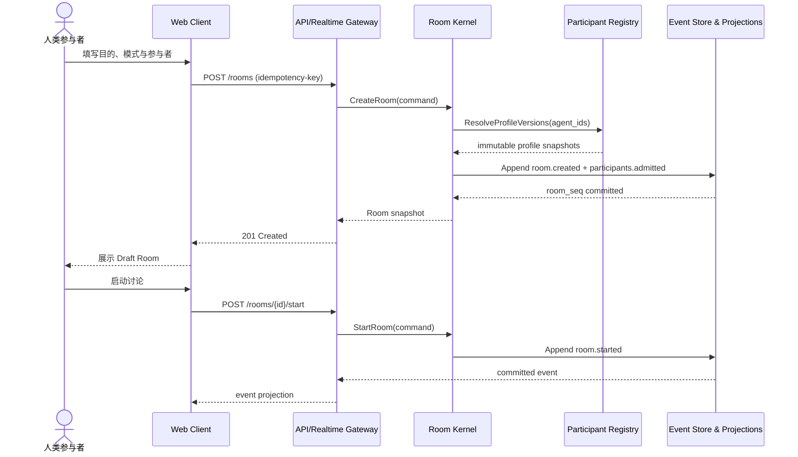

#### 5.2.2 需求编号：UC-002 普通消息触发自主讨论

##### 5.2.2.1 关键系统用例

人类提交一条没有点名的公开消息。所有符合资格的 Agent 先独立生成轻量 TurnIntent，Attention Engine 依据模式、相关性、新颖性、多样性与公平性选择 0–N 个发言者（预算只作资格与熔断，不参与选择，见 6.2.2）；获选 Agent 生成发言，经验证后按该轮 reveal 策略发布。

##### 5.2.2.2 交互场景

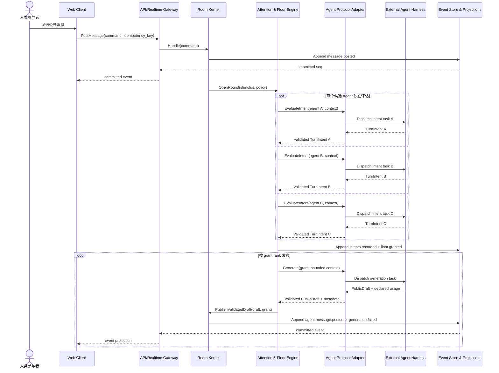

#### 5.2.3 需求编号：UC-003 点名与点对点深挖

##### 5.2.3.1 关键系统用例

人类点名一个或多个 Agent，或任何 Participant 提议就某分歧创建支线。点名给予优先资格但不绕过权限、预算和事件登记。支线有独立目标、上下文、参与者子集和自动轮次上限。

##### 5.2.3.2 交互场景

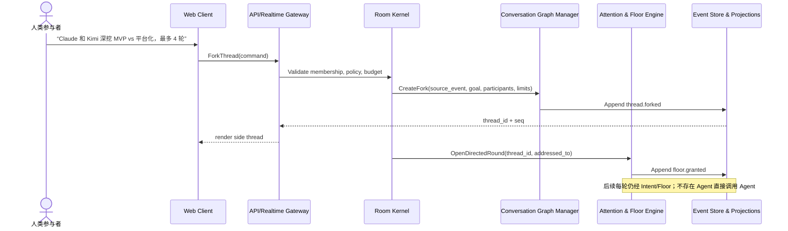

#### 5.2.4 需求编号：UC-004 人类打断、暂停与拉回

##### 5.2.4.1 关键系统用例

人类输入新消息或显式暂停时，Room Kernel 提升控制命令优先级，取消在途模型调用、使未消费 FloorGrant 失效，并阻止迟到结果发布。拉回主线通过暂停支线并在目标 Thread 追加 pullback 事件完成。

##### 5.2.4.2 交互场景

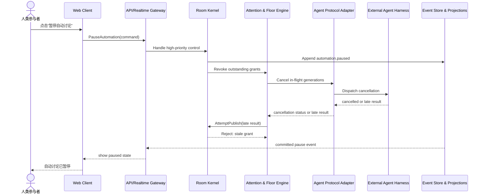

#### 5.2.5 需求编号：UC-005 合并支线

##### 5.2.5.1 关键系统用例

Participant 请求合并支线。系统生成有来源引用的 merge summary 草稿，经人类确认或房间策略批准后，将 `thread.merged` 与摘要消息追加到目标 Thread。源 Thread 变为 merged，但仍可浏览。

##### 5.2.5.2 交互场景

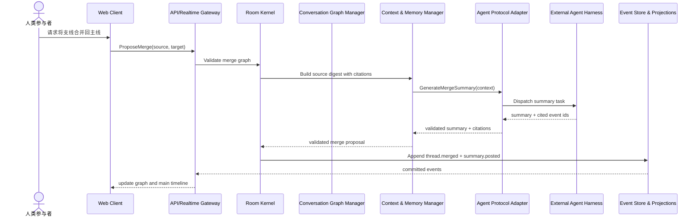

#### 5.2.6 需求编号：UC-006 优雅收束与证据阻塞

##### 5.2.6.1 关键系统用例

人类请求收束，或 Policy 基于版本化 Epistemic Projection 提议收束。候选 Agent 在同一水位提交 `conclude | object | abstain`；系统区分合格异议、无增量 dissent 与 timeout，生成类型化 Closure Capsule。若缺少外部事实则以 `evidence_blocked` 收束并创建 Evidence Request；预算耗尽只生成 Pause Capsule，不关闭 Thread。

##### 5.2.6.2 交互场景

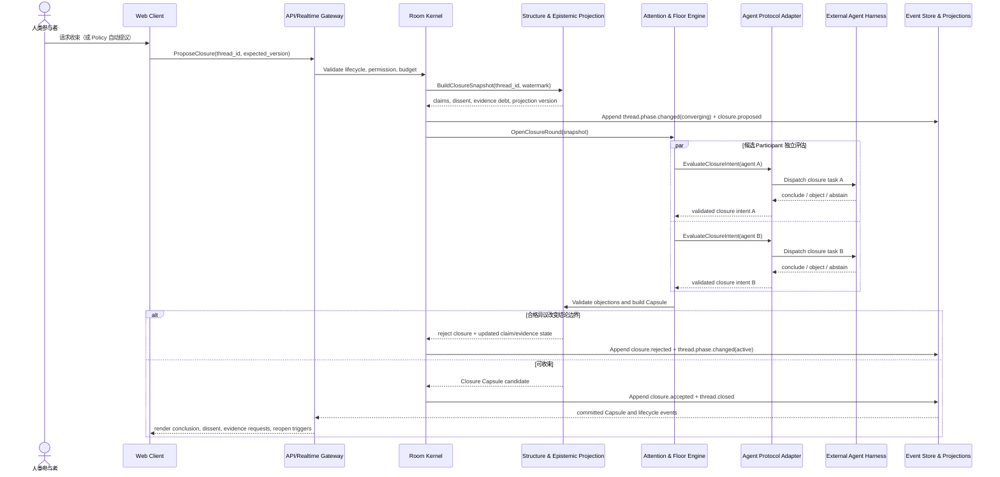

## 6. 关键技术方案设计

### 6.1 Room Protocol 与权威事件日志

Room Protocol 定义“房间中什么可以发生、以什么顺序发生、谁能观察或发起、发生后如何投影”，而不是定义具体 LLM Prompt。

#### 6.1.1 命令与事件

- **Command**：带 actor、tenant、expected room version、idempotency key 的变更请求；可能失败。
- **Event**：已提交事实，具有稳定 event id、room-local `seq`、schema version、visibility 和 causation/correlation 元数据；不可原地修改。
- **Projection**：面向 Timeline、Graph、Participant State、Budget 和 Memory 的可重建读模型。

核心事件族：

| 事件族 | 示例 |
|---|---|
| Room | `room.created`, `room.started`, `room.paused`, `room.closed` |
| Membership | `participant.admitted`, `participant.joined`, `participant.left`, `participant.muted`, `participant.homogeneity.noticed` |
| Conversation | `message.posted`, `reaction.added`, `typing.started`（暂态） |
| Thread | `thread.forked`, `thread.paused`, `thread.resumed`, `thread.phase.changed`, `thread.closed`, `thread.reopened`, `thread.merged`, `thread.archived` |
| Attention | `round.opened`, `intent.recorded`, `intent.endorsed`, `floor.granted`, `floor.revoked`, `round.closed` |
| Agent execution | `generation.started`, `generation.failed`, `tool.approval_requested`, `tool.completed` |
| Memory | `memory.proposed`, `memory.accepted`, `memory.edited`, `memory.expired` |
| Control | `automation.paused`, `automation.resumed`, `budget.exhausted`, `policy.changed` |
| Epistemic feedback | `projection.feedback.recorded`, `evidence.requested`, `evidence.resolved` |
| Closure | `closure.proposed`, `closure.accepted`, `closure.rejected`, `pause_capsule.created` |

#### 6.1.2 一致性策略

- 每个 Room 是一致性与顺序边界，`room_events(room_id, seq)` 唯一。
- Room Kernel 使用数据库事务与行级 room version/advisory lock 串行提交同一 Room 的命令；不同 Room 可并发。
- 事务同时写 Event 和 Outbox。进程内 dispatcher 在提交后驱动投影与异步工作；崩溃后从 Outbox/水位恢复。
- 客户端以 `last_seen_seq` 续传，检测缺口时走快照 + 增量事件恢复。
- LLM 生成不持有数据库锁。生成结果携带 `grant_id` 和 `base_seq`，提交时验证 grant 未撤销、Room 未暂停、Thread 仍可写。

#### 6.1.3 可见性

事件的 `visibility` 至少支持：

- `public`：Room 中所有可见成员；
- `participants`：指定 Participant 子集；
- `moderators`：房间管理员与审计者；
- `system`：仅运行时内部。

TurnIntent 的用户可见投影只包含 intent type、target、简短 rationale、分数区间和选择结果；模型原始输出、供应商请求体、隐藏推理不得进入 public payload。

### 6.2 Attention、TurnIntent 与 Floor Arbitration

Mosaic 的核心循环为：

```text
Stimulus committed
  → Candidate discovery
  → Parallel Observe / Intent evaluation
  → Deterministic eligibility filters
  → Scoring and diversity selection
  → FloorGrant issuance
  → Bounded generation
  → Validation and ordered publication
  → Next round or quiescence
```

#### 6.2.1 TurnIntent

```json
{
  "intent_id": "int_...",
  "participant_id": "par_...",
  "thread_id": "thr_...",
  "discussion_epoch_id": "epoch_...",
  "action": "speak",
  "type": "challenge",
  "reply_to": "evt_...",
  "addressed_to": ["par_kimi"],
  "relations": [
    {"target_event_id": "evt_prior", "kind": "challenges", "provenance": "explicit"}
  ],
  "public_rationale": "这里的成本假设尚未验证",
  "topic_tags": ["cost", "mvp"],
  "scores": {
    "relevance": 0.86,
    "novelty": 0.74,
    "urgency": 0.40,
    "confidence": 0.78
  },
  "estimated_tokens": 420,
  "context_watermark": 148,
  "schema_version": 1
}
```

`action` 初版为 `speak | react | fork | summarize | silent`，收束轮使用 `conclude | object | abstain`（见 6.9.5）；`timeout` / `unavailable` 是系统状态，不是 Intent。`type` 可取 `answer | extend | challenge | support | question | redirect | synthesize`。所有字段均由 JSON Schema 验证，超范围分数被拒绝而非静默修正。

#### 6.2.2 选择策略

先应用确定性资格过滤：成员在线/启用、Thread 可写、未超 cooldown、非重复 Intent、点名/模式限制满足。预算只作确定性 admission 与熔断，不进入候选价值排序；预算维度仅含轮次、token、时长与发言数，系统不采集价格、不核算费用（9.7）。每轮在评分前预留最大 speaker 的对称 token 额度；额度不足时统一缩短 response cap、减少本轮 speaker 上限、暂停或询问人类，不得在 Floor 之后替换已获选 Agent。token 用量以 Harness 自报 usage 为准（见 9.7）。再计算可解释的选择分：

```text
score =
  w_r * relevance
  + w_n * novelty
  + w_d * viewpoint_diversity
  + w_u * urgency
  + w_t * direct_address
  - w_f * recent_floor_share
  - w_p * repetition_risk
```

`novelty` 与 `repetition_risk` 使用 6.9.2 的版本化结构投影作为组合特征：frontier cluster、有效重访与 provisional bridge 提高探索价值；没有 claim/evidence 状态变化的重复关系提高重复风险。结构热度不能直接等价价值，系统同时结合 embedding、最近 floor share、exploration debt、dyad share 与硬规则。随后使用 MMR 式贪心选择 0–N 个 Intent；`challenge` / `question` 在 Roundtable 与 Review 模式下降低相似度惩罚，避免少数派因与主流共享背景而被压掉。模型自报分数仅是输入，不能覆盖确定性约束。

**记分卡透明（v0.4，OQ-17 已决）**：每种模式的评分权重与硬资格规则对房间成员可见，可在 Policy 边界内按 Room 配置并版本化；未获选的 Intent 及其分数区间保留可查，用户始终能回答“为什么 TA 没被选上”。仲裁从黑箱裁判变为透明记分牌；权重可见不等于系统对单条 Intent 的内容价值作裁决。

#### 6.2.3 公平不等于轮流

- 用滑动窗口记录每个 Participant 的 floor share；
- 对连续发言施加退避，对长期未发言但高相关的视角给予有限加权；
- 被直接点名的 Agent 具有优先资格，但可因不可用、预算或安全拒绝；
- 人类发言永远不经过内容评分，但受权限、速率和 Room 状态约束；
- 意图收集窗口使用按模式配置的宽松超时（仅为维持协议推进，不做延迟优化与自适应窗口逻辑）；迟到的 TurnIntent 自然滚入下一轮评分，避免慢速模型被系统性排除；请求级超时、重试与 fallback 由 Agent Harness 自行处理（见 6.4）；
- 跟踪 `exploration_debt`，保护高新颖但长期未被回应的 frontier cluster；
- 跟踪 `dyad_share`，除 Deep Dive 外避免同一 Participant 对长期垄断公开讨论；
- **人类保送（v0.4，OQ-17 已决）**：人类可对任一已记录 Intent 显式保送——写入 `intent.endorsed` 事件后直接授予 Floor 或加权；保送不绕过预算、硬资格与安全校验，且对全体可见。“让 TA 说完”的判断权归人，不归算法；
- `silent` 是正常结果，不产生公开噪声，但可进入聚合的“本轮旁听状态”。

#### 6.2.4 房间模式

| 模式 | 最大自动发言者/轮 | 主要权重 | 自动续聊 | 典型用途 |
|---|---:|---|---:|---|
| Roundtable | 每个 Agent 1 次（+ rebuttals 子轮） | 覆盖度、公平 | 否 | 收集不同视角并交叉交锋 |
| Open Floor | 1–3 | 新颖性、相关性、多样性 | 有限 | 自然头脑风暴 |
| Deep Dive | 1–2 | 回应关系、深度 | 有限 2–6 轮 | 点对点深入讨论 |
| Review | 1–3 | 风险、证据、非重复 | 否/有限 | 方案评审 |
| Decision | 1–2 | 收敛、争议覆盖、证据 | 否 | 形成可解释决策 |

模式只改变 Policy 参数，不改变协议和对象模型。两个补充语义：

- **Roundtable 的 rebuttals 参数**：v0.4 起默认 rebuttals = 1，即每轮主发言后追加一轮受预算约束的 cross-challenge 子轮（即 6.2.5 的 cross 子轮原语在该模式下的参数化），使“互相交锋”成为圆桌默认形态而非可选配置；rebuttals = 0 退化为“平行收集独立视角”，rebuttals = 2..k 允许多轮交锋。产品文案不得把 rebuttals = 0 的 Roundtable 表述为“Agent 之间会互相反驳”。
- **候选过滤的模式差异**：Roundtable 与 Review 模式下，6.8 的候选过滤只执行硬资格（在线、预算熔断、cooldown），不做语义相关性预过滤，保证跨界质疑有机会进入 Intent 阶段。

#### 6.2.5 发布顺序与揭示策略

多个获选者并存时，Policy 可按轮选择 reveal 策略：

- `sequential`：按 grant rank 顺序生成与发布，后续生成前按新水位重新验证。利于呼应与即时去重，代价是首名发言锚定整轮；
- `simultaneous`：所有获选者基于冻结的同一 `context_watermark` 独立生成并同时提交，提交前仅做硬校验。它保证生成时互不可见，而不仅是 UI 同时展示；
- `independent_then_cross`：先按 `simultaneous` 产生独立首轮并统一揭示，再开放一个受预算约束的 cross-response 子轮。它将观点独立性与相互回应分离，适合 Brainstorm/Roundtable，并为 `independent_convergence` 提供可评测基线。cross-response 子轮是全文档唯一的交叉回应机制原语：Roundtable 的 `rebuttals = k`（6.2.4）即本策略在 Roundtable 模式下的参数化命名，二者不得实现为两套机制。

观点收集类轮次默认 `simultaneous` 或 `independent_then_cross`；收束轮与 Decision 模式默认 `sequential`。三种策略共享事件语义，但必须记录 `reveal_strategy`、冻结水位、候选完成/超时集合和子轮关系。意图/生成迟到者可在上下文仍有效时进入下一轮，不能因 Provider 更慢而被系统性排除。

#### 6.2.6 定向交锋快速通道

圆桌中“我直接问你”是最高频动作；若每次 A→B 追问都要等待完整轮次仲裁，交锋感会被节奏稀释。v0.4 引入定向交锋快速通道：

- 公开消息携带 `addressed_to` 时，除既有的优先资格（6.2.3）外，系统为被点名者在下一轮预留一个定向回应 slot；该 slot 仍受硬资格、预算、cooldown 约束；每轮定向 slot 不超过该模式单轮最大自动发言者数的一半（向上取整），且任何模式下每轮至多 2 个——Roundtable 等全员发言模式下定向 slot 只影响发言顺序与优先资格，不增加发言名额，避免点名通道挤占正常评分名额；
- 若被点名者的回应再次 `addressed_to` 回原发言者，形成 A→B→A 交锋链，可在同一 Thread 内以缩短的意图窗口连续进行，直到达到模式最大交锋深度；
- 快速通道只加速“被问者先答”，不改变评分公式对其他候选者的约束，也不构成 Agent 直调 Agent（原则 3 不变：一切发言仍是公开 Room Event）；
- 连续交锋受 `dyad_share` 与最大交锋深度双重限制，防止二人捕获公开讨论（见 6.9.3）；达到上限后交锋双方回到正常评分队列。

### 6.3 Conversation Graph 与上下文隔离

每个 Thread 包含：`goal`、participant scope、mode override、source event、state、budget、context watermark 和 merge policy。上下文不等于完整历史拼接，而由 Context Builder 按以下顺序组装：

1. 固定 Room 目的、Policy 和 Agent Profile 版本；
2. 当前 Thread 目标、状态、参与者和来源事件；
3. Thread 最近窗口；
4. 主线/父 Thread 的结构化摘要与关键事件引用；
5. 被检索的 Room/Participant Memory（带 provenance）；
6. 明确点名、当前 Intent 与 FloorGrant；
7. 工具能力和输出 Schema。

支线默认不接收其他支线的完整内容，只通过显式 typed relations、授权投影或合并摘要获得信息，避免上下文污染。Context Builder 沿 `reply_to`、显式 `relations` 和版本化 claim 谱系回溯，并按因果祖先、当前 cluster、对立/未解决 claim、最近窗口设置独立配额，避免热点历史吞掉全部 token。

**上下文职责划分（v0.4，OQ-16 已决）**：接入的 Agent 是 Harness + LLM 的组合（如 Codex + GPT 系列）。Mosaic 不再按各 Model Binding 的上下文预算与摘要粒度差异化组装讨论上下文——上下文窗口管理与超窗压缩由 Agent 自身 Harness 的能力负责。Mosaic 向所有 Agent 交付统一的讨论输入，并提供权威、结构化的讨论历史查询接口（按 Thread、时间窗、事件 ID、关系链与 claim 谱系检索），Agent 按需调用取回历史。“同桌不同视角”若出现，源于各 Harness 保留/压缩能力的差异，属于 Agent 个体属性，不由 Mosaic 拉平或掩饰；Mosaic 的保证是：不存在任何对 Participant 授权可见却无法查询的历史。

每次组装生成 Context Receipt（6.10.4）：Receipt 记录 Mosaic 交付了什么、Agent 查询了什么；Harness 内部保留或压缩了什么不属于 Mosaic 审计范围。任何未交付、未查询或对当前 Participant 不可见的来源都不能被当作已知上下文。

### 6.4 Agent Runtime 与异构模型适配

Agent Profile 由四类配置组成：

- Identity：名称、头像、简介；
- Cognitive Profile：风险偏好、分歧倾向、创造性、详略、发言频率等可解释参数；
- Model Binding：provider、model、能力、fallback policy 的声明性描述；用于身份标识、同构检测、token 用量基准与审计，实际模型访问与凭据由 Harness 自持，Mosaic 不代理 Agent 发言流量（OQ-20）；
- Capability Policy：允许的工具、Memory scope、最大预算与审批要求。

长期认知倾向与分歧偏好只能由人类在 Agent Profile 层透明配置（包括显式指派 devil's advocate）；Attention/Floor 不得为制造多样性而动态修改观点参数——这是原则 4 的边界。

Profile 不等于某一议题的永久立场。Participant 在公开讨论中形成或修订的具体立场由 stance/commitment projection 从 Room Event 派生，并保留证据与修订历史（6.10.2）。Agent 可以公开改变主意；系统不得为了角色一致性阻止证据驱动的立场变化。

**同构回声检测**：Mosaic 允许但不假设异构。Room 创建、Participant 加入或 Model Binding 变更时，系统比较各 Agent 的 provider + model 组合；发现多个 Agent 共用同一模型时，写入 `participant.homogeneity.noticed` 系统事件并在 UI 给出回声室风险提示，但不阻止创建——同模型不同 Cognitive Profile 的对比本身是合法用法，创建者可显式确认，确认后提示降级为常驻标识。同构组关系记入收束与评测元数据：同构组内达成的一致在 `independent_convergence` 中按弱独立收敛处理（见 6.10.2），不得与异构独立生成后的一致等价。

Agent Harness 只暴露以下端口，不感知 Web 或数据库细节：

```text
Observe(context) -> AttentionAssessment
EvaluateIntent(context, assessment) -> TurnIntent
Generate(context, floorGrant) -> PublicDraft
Summarize(context, purpose) -> GroundedSummary
Embed(content) -> Vector（由 Mosaic 自用模型通道实现，不要求 Harness 暴露）
Cancel(runId)
```

讨论历史的按需回查由 Mosaic 提供权威只读结构化接口（经 Tool Gateway 的审批与审计通道），由 Harness 自行决定何时查询以及如何纳入自身上下文；窗口管理与压缩是 Harness 的内部职责，Mosaic 不感知也不校验（见 6.3）。同理，请求级超时、重试与 provider fallback 均由 Harness 按 Profile 声明的策略自行处理；Mosaic 只保留两类时限——维持协议推进的宽松 round/grant 期限，以及服务人类抢占与预算熔断的取消通道（UC-004）。

Agent 发言的模型调用由外部 Harness 直连其 Provider 完成（OQ-20）：Mosaic 不持有 Provider 凭据、不做请求级代理；Model Gateway 收缩为 Mosaic 自用模型通道（embedding 与投影/检索等内部用途），与 Agent 发言流量隔离。供应商切换不改变 Agent Profile 身份；实际模型以 Profile 声明与 Harness 自报的 run 级元数据记录（`model.binding.changed`），保持可追踪性。

### 6.5 记忆与检索

Memory 分四层：

| 层级 | 内容 | 默认可见性 | 生命周期 |
|---|---|---|---|
| Room Memory | 目标、共识、争议、术语、未解决问题 | Room | Room 级 |
| Thread Memory | 局部结论、假设、证据与待办 | Thread participants | Thread 级 |
| Participant Memory | 该 Agent 在该 Room 的已公开立场、偏好与关系 | Owner + policy | 可跨 Thread；默认不跨 Room |
| Global Profile Memory | 用户明确保存的长期偏好 | User/tenant policy | 可编辑、可删除、默认 opt-in |

Memory Item 必须包含：来源 event ids、提取器/模型版本、置信度、scope、visibility、创建/过期时间和人工编辑历史。Memory 不是权威事实，遇到冲突时展示来源并由上下文策略决定优先级。

收束轮（6.9.5）接受的 Closure Capsule 作为一等 Memory 写入，但按 `closure_type` 区分共识、边界分歧、决定、方案图和证据阻塞，不统一写成“共识”。具名 dissent、assumptions、falsifiers、开放问题、Evidence Requests 与 reopen triggers 均保留 provenance。结束是可逆的认知快照，不是强制共识。

v0.1 使用 PostgreSQL + pgvector 统一存储结构化记忆与 embedding，结合关键词/结构化过滤做混合检索。只有当向量规模、延迟或独立扩缩容需求超过 PostgreSQL 能力时才拆独立向量库。

### 6.6 实时流与用户体验

客户端区分三种状态：

1. **Committed event**：权威、可重放，具有 room seq；
2. **Ephemeral signal**：typing、presence、候选评估中等，可丢失；
3. **Draft stream**：正在生成的文本，只用于体验；完成验证并提交事件后才成为正式消息。

若生成取消或验证失败，客户端撤销 draft 并展示结构化失败状态，不把残缺文本当成 Room 历史。Conversation Graph 和 Timeline 都消费同一 committed event 投影，避免两个 UI 产生不同事实。

### 6.7 工具与 Artifact

工具调用不是 v0.1 的核心验证点，首版只开放低风险、只读工具。内置只读讨论历史查询工具（6.4）与外部工具按同一 capability、审批与审计通道治理。每次工具调用必须：

- 绑定 run、participant、room、thread 和 causation event；
- 通过 capability allowlist 和参数 Schema；
- 按风险级别自动允许、请求人工审批或拒绝；
- 把结果摘要与 Artifact 引用写入事件，不把大二进制写入 Event Log；
- 对网页、文件和工具结果标为“不可信内容”，防止提示注入提升权限。

### 6.8 AI 架构技术方案

AI 子系统采用两阶段甚至三阶段调用以控制调用次数与 token 消耗：

1. 候选过滤：确定性规则、主题订阅和轻量 embedding；
2. Intent 评估：低 token 结构化调用，仅对候选 Agent 执行（具体模型选择归 Harness）；
3. 正式生成：只对获得 FloorGrant 的 Agent 调用主模型。

Roundtable 与 Review 模式下第 1 步退化为纯硬资格过滤（见 6.2.4），避免语义预筛在 Intent 之前消灭跨界观点。

需要建立离线回放评测集，指标至少包括：

- 发言采纳率、用户手动停止率；
- 重复度、视角覆盖度、分歧发现率；
- 直接点名命中率、错误插话率；
- 单轮延迟、token 用量、失败率；
- Participant floor share 与长期沉默偏差；
- 分支创建、阅读、合并和回流率；
- 跨 Agent 对话密度：只作互动形态诊断，按有效 typed relation 与 token/message 数归一，防止鼓励闲聊；
- bridge 指标：分别记录 provisional bridge rate 与延迟确认的 `bridge_yield`，后者才作为新增认知价值候选代理；
- 收束质量：`dissent_survival`、`closure_stability`、Evidence Request 解决率、人工修订率与因遗漏问题/真正新证据导致的重开率；
- 独立收敛：比较冻结同一 context watermark 的首轮立场与 cross-response 后状态，区分独立一致与锚定/同源模型回声；
- 人类结果信号：引用/保存、bridge 导航、Capsule 接受/修订、明确评价和后续决策采纳。

不以“发言越多越好”为目标，核心优化目标是单位 token 与轮次的新增认知价值。

### 6.9 对话结构投影与收束协议

圆桌质量的判定依据不只是发言内容，还包括讨论的结构形态：谁在回应谁、观点如何汇聚、分歧有没有被反复重开。本节定义从既有事件链路派生的对话结构投影，以及建立在其上的优雅终止机制。结构信号可以帮助系统调节注意力，但不能被提升为事实或单一价值裁判。

#### 6.9.1 显式关系与链路字段

结构分析建立在不可变事实与可重建推断的分离之上：

- `correlation_id`：保持 round 内关联语义不变，不承担跨轮语义；
- `discussion_epoch_id`：标识同一 Thread 一次从开启到收束/暂停的讨论纪元，显式 reopen 产生新 epoch；
- `reply_to`：单一直接回复锚点，负责 Timeline 的主要对话归属；
- `addressed_to[]`：希望获得回应的 Participant 集合，不触发 Agent 直调；
- `relations[]`：一条发言对零到多个历史事件的类型化长程关系，每条边包含 `target_event_id`、`kind` 与 `provenance`。初始 `kind` 为 `supports | challenges | extends | questions | evidence_for | supersedes | analogy | relates`。

一条消息可能支持 A、质疑 B，因此无类型的 `relates_to[]` 不足以表达关系。Participant 显式声明的关系随 `message.posted` / `agent.message.posted` 固化；系统推断关系只进入带算法版本的 Epistemic Projection，不得回写消息 payload。跨 Thread/可见性域的关系必须校验目标可见性，禁止通过边泄露私有事件的存在。所有关系与投影响应遵守 6.10.1 的主体非干扰契约。

```json
{
  "reply_to": "evt_primary",
  "addressed_to": ["par_kimi"],
  "relations": [
    {
      "target_event_id": "evt_a",
      "kind": "supports",
      "provenance": "explicit"
    },
    {
      "target_event_id": "evt_b",
      "kind": "challenges",
      "provenance": "explicit"
    }
  ]
}
```

#### 6.9.2 版本化结构投影

结构投影消费 Conversation 与 Attention 事件，以 `projection_version + algorithm_version + event_watermark` 标识结果。不能在包含候选 `relations` 边的全量图上直接做弱连通分量：一条跨 cluster 边会立刻把两侧合成同一分量，使 bridge 定义自我消失。v0.1 采用以下分层语义：

1. **聚类基图**：使用直接回复骨架、时间窗口与语义主题形成稳定 cluster；显式/推断的跨 cluster 关系不参与该版本 cluster 的形成；
2. **关系判定**：相对于前一投影水位或冻结的当前基图判断 long-range edge；
3. **增量更新**：新事件可改变下一版本 cluster，但历史 bridge 保留当时的 projection version；
4. **归一化**：fan-in/fan-out、中心性与交替链按 cluster 大小、时间衰减和活跃度归一，避免大/旧 cluster 天然支配信号。

| 结构特征 | 含义 | 主要消费方 |
|---|---|---|
| 高 fan-in | 争议焦点或被综合的观点 | 收束覆盖校验、Context 谱系回溯 |
| 高 fan-out | 发散源/刺激点 | 收敛检测、分支建议 |
| A↔B 交替链 | 双边辩论进行中 | Deep Dive 指纹、dyad capture/乒乓检测 |
| provisional bridge | 相对于冻结 cluster 连接此前独立论点群 | 新连接候选、探索提示 |
| productive bridge | 后续被引用、改变 claim 状态、进入 Closure Capsule 或形成有效 Evidence Request 的 bridge | 新增认知价值的延迟代理 |
| same-cluster revisit | 指向已讨论 cluster 的长程边 | 结合内容增量判断有效 reopen 或 loop |

`bridge_rate` 只能作为结构诊断，不能等同认知价值。首选延迟指标为 `bridge_yield = productive_bridges / provisional_bridges`。同一 cluster 的重访若带来新 evidence、修改 assumption 或改变 claim 状态，不得判为 loop；只有同一 claim/evidence 组合反复出现且没有状态变化时，才形成结构化重复告警。

#### 6.9.3 结构信号的消费边界

| 消费方 | 用途与边界 |
|---|---|
| Attention 评分 | `novelty` / `repetition_risk`、frontier 与 dyad share 的组合特征；不得单独按中心性分配 Floor |
| Context Builder | 沿显式 reply/relation 与投影 claim 谱系回溯，并生成 Context Receipt |
| Safety Guard | 对不存在/不可见目标、Schema 和权限做硬拒绝；Intent 与结构不匹配只作软提示，不能以此裁定观点价值 |
| 收敛检测 | 结合新 cluster、productive bridge、未解决 claim 与证据债务变化，不把低活跃度直接解释为收敛 |
| 评测 | 使用 bridge yield、dissent survival、closure stability 等组合指标；不得直接变成在线奖励 |

为防结构热度形成“富者愈富”，Attention 同时维护：

- `exploration_debt`：高新颖但长期未获回应的 frontier cluster；
- `dyad_share`：滑动窗口内某一 Participant 对占据的发言比例，Deep Dive 外超过阈值时降低同一二人继续获选概率；
- centrality 时间衰减：旧热点不能凭历史 fan-in 永久占据注意力；
- frontier slot：Open Floor 每若干轮可为符合硬资格的孤立观点保留至多一个探索名额。

这些机制保护发言机会，不向 Agent 注入反方立场，也不保证 frontier 必然公开发言。

#### 6.9.4 终止语义与收敛检测

轮次/预算硬顶只保证“必然停止”，不代表讨论完成。预算耗尽必须产生 `Pause Capsule(pause_reason=budget)` 与未收敛标记，不能伪装成 `closed`。讨论不终止的典型病理与结构签名：

| 病理 | 结构签名 |
|---|---|
| 乒乓辩论 | A↔B 交替链不衰减，claim/evidence 状态无变化 |
| 礼貌螺旋 | Intent 类型塌缩为 support/synthesize，出现对总结的再总结 |
| 翻旧账循环 | 对同一 claim/cluster 的重复长程边且无新 evidence/assumption |
| 话题漂移 | 持续开新 cluster，新颖性不衰减但目标覆盖不增加 |
| 无人喊停 | 纯 Agent 房间自动续聊且人类刺激已停止；该信号只能触发 quiescent/收束探测，不能证明收敛 |

收敛信号分四组：

- Intent 侧：平均意图分下滑、主动 `abstain` 上升、challenge/question 连续 K 轮消失；
- 内容/认知侧：高优先级 claim 得到处理、未解决 claim 集稳定、无新增 evidence/assumption；语义相似本身只代表重复，不代表共识；
- 结构侧：新 cluster 形成率下降、productive bridge 与有效重访趋稳、交替链不再产生状态变化；
- 人类侧：显式请求收束/关闭是强信号；停止输入只能说明无人刺激，不能推断满意。

**漂移拉回（v0.4，OQ-18 已决）**：检测到话题漂移签名后，Attention 开启一个“重聚焦窗口”，窗口内 `redirect` 类 Intent 获得评分优先，但不绕过硬资格、预算与安全校验；有 Agent 自愿拉回即按正常 Floor 发布，无人自愿则进入 quiescent 并通知人类。不创设任何固定或轮流的召集角色。漂移检测阈值与是否启用重聚焦窗口按模式配置：Open Floor/Roundtable 默认宽容（漂移视为发散特性），Decision/Review 默认启用。

#### 6.9.5 收束协议与 Closure Capsule

**触发**：Policy 检测到多组收敛信号组合达标、收到人类显式请求，或剩余轮次预算进入末段。预算熔断只能触发暂停和未收敛快照。

**收束轮（closure round）**：一种特殊 round 类型，复用 Floor 机制、不新增权威角色。Agent 可提交：

- `conclude`：支持生成/接受当前收束；
- `object`：必须指向具体 claim，携带新 evidence/assumption，并声明对结论的预期影响；
- `abstain`：主动不表态，不等于同意。

`timeout` / `unavailable` 是系统状态而不是 Intent，永远不能计为同意。合格 `object` 若足以改变结论边界、反证条件或高优先级 claim 状态，则中止收束并回到 active；其余异议仍进入具名 dissent 或 parked issue，不能让无增量反对形成无限否决。

收束产物采用类型化 `closure_type`：

| closure_type | 含义 |
|---|---|
| `consensus` | 形成具名共识，但不把多数意见提升为事实 |
| `bounded_disagreement` | 分歧边界、各方依据和反证条件已明确 |
| `decision` | 形成可执行选择，可保留反对意见 |
| `option_map` | 完成方案空间和权衡整理，未作决定 |
| `evidence_blocked` | 继续讨论不能解决问题，需要外部证据 |
| `abandoned` | 人类或 Policy 明确放弃继续讨论 |

被接受的 Closure Capsule 至少包含：`closure_type`、结论、具名 dissent、关键 assumptions、支持/反对 evidence、开放问题、falsifiers/conditions_of_reversal、Evidence Requests、参与/abstain/timeout 清单、投影版本与 `reopen_triggers`。总结者不固定；可按正常 Floor 产生一个或多个候选，由人类选择，纯 Agent 房间按 Policy 接受。预算或轮次硬顶另生成 `Pause Capsule`，尽可能复用上述字段但使用 `pause_reason = budget | round_limit`，写入 `pause_capsule.created + thread.paused`，不得写入 `closure.accepted` 或 `thread.closed`。

Thread 生命周期与认知阶段正交（见 2.6）。进入收束时写入 `thread.phase.changed(converging)`；Closure Capsule 被接受后写入 `closure.accepted` 与 `thread.closed`。关闭后显式 reopen 开启新的 `discussion_epoch_id`，携带 `reopen_reason = new_evidence | changed_goal | changed_assumption | participant_change | human_request`，并引用旧 Capsule。系统可以因为重开代价低而较早提议收束，但不能用低门槛掩盖未记录的异议。

进入收束后，Context Builder 向所有 Agent 注入剩余轮次。Policy 可选择精确倒计时或“即将收束”的定性提示，并把 `closure_horizon_visibility` 记入评测元数据，以监测末轮提示是否诱发策略性冗长。

### 6.10 认知状态与证据债务

对话结构描述“谁连接了谁”，认知状态描述“哪些主张发生了什么变化”。本节在不扩张权威协议的前提下，引入可重建的 Claim/Evidence 投影，使收束能够表达“已达成共识”“仍有边界分歧”或“需要证据”，而不是只检测消息是否停止。

#### 6.10.1 Claim/Evidence 派生投影

Epistemic Projection 可从公开且授权的消息中提取零到多个认知对象：

| 对象 | 作用 |
|---|---|
| Claim | 可被支持、挑战或修订的主张 |
| Assumption | Claim 成立所依赖的前提 |
| Evidence | Artifact、工具结果或可追溯发言中的依据 |
| Open Question | 尚不能回答的问题 |
| Claim Relation | `supports/challenges/refines/supersedes/depends_on` |

每个对象带 `projection_version`、`source_event_ids`、提取器版本、置信度、visibility 和人工 correction overlay。推断对象不进入 Room Event Log；人类纠正通过 `projection.feedback.recorded` 事件叠加，下一次重建必须重放该反馈。v0.1 的核心讨论仍可在 Claim 投影不可用时退化到显式关系与结构信号。

**主体非干扰契约**：对任一主体 P，历史与投影 API 返回的每个字段，必须等价于只使用 P 有权读取的 `source_event_ids` 重新构建的结果。混合来源对象的 visibility 不得宽于全部来源权限的交集；隐藏来源的 ID、数量、cluster 大小、标签、质心、水位、错误类型和 timing 差异均不得泄露。投影缓存键、错误响应和 correction overlay 同样包含 tenant、participant/role、visibility policy version 与 projection version。

#### 6.10.2 稳定 Profile 与动态公开立场

Agent Profile 中的人类配置描述长期认知倾向，不表示 Agent 对每个主题持有不可改变的立场。系统另维护从公开发言派生的 stance/commitment ledger：当前立场、目标 Claim、依据事件、置信度和修订历史。Participant 可因新 evidence 公开改变立场；`stance.revised` 只是一种投影变化及其解释，Floor 不得直接写入或暗中修改立场。

收束质量不仅看最终一致性，还看此前独立立场是否在证据作用下真实变化。共享模型、共享上下文或首发锚定导致的同声附和应标记为弱独立收敛，不能与独立生成后达成的一致等价。

#### 6.10.3 Evidence Debt 与 Evidence Request

当争议取决于当前 Room 中不存在的事实、实验或外部资料时，继续增加 Agent 轮次通常只会放大语言循环。系统允许把未解决 Claim 转为 Evidence Request：

```json
{
  "claim_id": "claim_...",
  "question": "需要什么事实才能判断该主张？",
  "required_evidence": ["benchmark", "user_interview"],
  "acceptance_criteria": "给出相同环境下至少三轮 A/B 结果",
  "owners": [],
  "status": "open",
  "reopen_thread_on_resolution": true
}
```

`evidence_blocked` 是一种合格收束结果：讨论已经识别出缺口，但没有伪造答案。Artifact 或工具结果满足 Evidence Request 后，系统只能“提议”按新 epoch 重开；是否自动重开由 Room Policy 与权限决定。

#### 6.10.4 Context Receipt

每次 EvaluateIntent/Generate/Summarize 都生成 Context Receipt，至少记录：`run_id`、`room/thread/epoch`、`context_watermark`、实际使用的 event IDs、memory IDs、summary/projection 版本、Profile/Policy 版本、实际 provider/model 与 redaction 结果。Receipt 不复制正文、不存 Prompt 或隐藏推理；其用途是回答“该运行当时看到了什么”，并支持：

- 检测发言引用了未提供或不可见的内容；
- 区分模型错误、摘要遗漏和投影错误；
- 评估 bridge/claim 信号是否真正进入上下文；
- 在删除/保留策略下追踪派生数据影响范围。

#### 6.10.5 反 Goodhart 评测

结构指标不能单独代表新增认知价值：bridge rate 会激励跨 cluster 滥连，跨 Agent 密度会激励闲聊，收束率会激励过早关闭。评测采用组合并延迟确认：

- `bridge_yield`：provisional bridge 后续成为 productive bridge 的比例；
- `dissent_survival`：合格异议进入 Capsule 且未在摘要中丢失的比例；
- `closure_stability`：因遗漏问题快速重开的比例，与因真正新证据重开分开统计；
- `evidence_resolution_rate`：Evidence Request 被满足并改变 Claim 状态的比例；
- `independent_convergence`：冻结同一 context watermark 的独立初始立场在交叉讨论后收敛的程度；
- 人类侧信号：引用/保存、导航到 bridge、接受/修订 Capsule、明确评价和后续决策采纳。

这些指标先用于离线回放、A/B 与诊断面板；在建立人工标注基线和噪声下限前，不直接参与在线 Floor 奖励。

## 7. 逻辑架构

### 7.1 结构模型

#### 7.1.1 架构模式

采用六边形架构的模块化单体：领域模块通过明确端口交互，外部模型、数据库、对象存储、身份和工具由 Adapter 实现。Event Store 提供事务事实，Outbox 驱动异步副作用。该模式保留未来拆分服务的边界，又避免首版分布式事务和运维负担。

#### 7.1.2 1 层–3 层逻辑模型（架构图）

下图同时表达包含关系和依赖方向；上层依赖下层，箭头指向被依赖者。外部 Agent Harness 位于 Mosaic 信任边界之外；Mosaic 内部仅保留协议适配器，Model Gateway 只服务 Mosaic 自用 embedding/utility 流量。

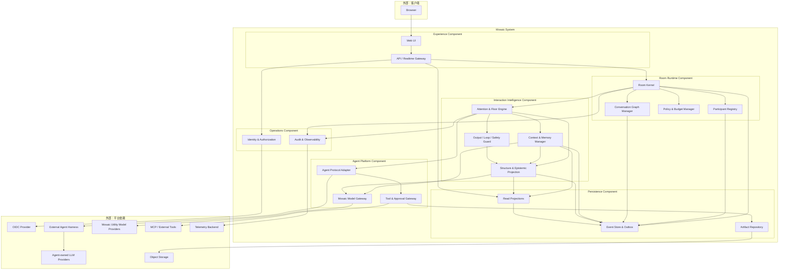

#### 7.1.3 逻辑接口设计

| 接口组 | 提供者 | 消费者 | 内容 |
|---|---|---|---|
| IF-ROOM-COMMAND | Room Kernel | API Gateway | Room/Thread/消息/控制命令 |
| IF-ROOM-QUERY | Read Projections | API Gateway | Timeline、Graph、Participant、Budget 快照 |
| IF-ROOM-EVENT | Event Store & Outbox | Projections、Interaction、Gateway | 已提交 Room Event 流 |
| IF-PARTICIPANT-REGISTRY | Participant Registry | Room Kernel、Context Manager | Profile 版本、Room Session 与能力 |
| IF-GRAPH | Conversation Graph Manager | Room Kernel、Context Manager | fork/pause/resume/merge 与图查询 |
| IF-POLICY | Policy & Budget Manager | Room Kernel、Attention、Tool Gateway | eligibility、预算、审批与模式参数 |
| IF-ATTENTION | Attention & Floor Engine | Room Kernel | round、intent、grant、cancel、quiescence |
| IF-CONTEXT | Context & Memory Manager | Attention、Agent Protocol Adapter | 可见性过滤后的上下文、摘要、Context Receipt 与历史查询结果 |
| IF-EPISTEMIC | Structure & Epistemic Projection | Attention、Context、Guard、Room Kernel | 按主体非干扰契约过滤的版本化 cluster/bridge/claim/evidence/stance/closure signals |
| IF-AGENT-PROTOCOL | Agent Protocol Adapter | Attention & Floor Engine、外部 Agent Harness | Observe/Intent/Generate/Summarize 下发，历史查询、取消与结果回传 |
| IF-MODEL | Mosaic Model Gateway | Context & Memory、Structure & Epistemic Projection | Mosaic 自用 embedding/utility；不承担 Agent 发言流量 |
| IF-TOOL | Tool & Approval Gateway | Agent Protocol Adapter、Context & Memory | 工具发现、调用、审批、Artifact；含按主体过滤的只读讨论历史查询（6.4） |
| IF-PERSIST | Event Store/Projection/Artifact ports | 领域模块 | append、load、query、put/get |
| IF-AUTHZ | Identity & Authorization | API Gateway、Tool Gateway | actor、tenant、role、resource decision |
| IF-OBS | Audit & Observability | 所有模块 | metric/log/trace/audit event |

### 7.2 行为模型

#### 7.2.1 用例设计 1：自主发言闭环

自主发言严格区分 Intent 与 Message。一次刺激可产生零个公开回复。若有多个获选者，FloorGrant 带 rank。`sequential` 下按新水位逐个验证；`simultaneous` 下所有草稿使用同一冻结水位；`independent_then_cross` 在独立首轮统一揭示后再创建 cross-response 子轮。三者都必须生成 Context Receipt，并在提交时验证 visibility、grant epoch 与 relation target。

#### 7.2.2 用例设计 2：人类抢占

控制命令有独立高优先级队列。Room 自动轮次状态以数据库事件为准；进程内 cancellation token 只负责尽快停止资源消耗。即使供应商不支持取消，迟到结果因 grant epoch 不匹配而不能发布。

#### 7.2.3 用例设计 3：故障与降级

- Intent 调用失败：记录失败；不默认让该 Agent 发言。
- 主模型失败：请求级重试与 fallback 由 Harness 按 Profile 声明的策略自行处理（见 6.4）；Room 只记录并展示最终实际模型。
- 部分 Agent 失败：本轮用剩余候选继续。
- Projection 延迟：客户端可用 Event delta 临时补齐，并在水位恢复后校正。
- Embedding 不可用：退化为关键词与结构化过滤。
- Object Storage 不可用：阻止新 Artifact 上传，不阻塞纯文本讨论。

#### 7.2.4 用例设计 4：收束、异议与证据阻塞

收束行为遵循 UC-006：Room Kernel 只固化生命周期与被接受结果，Structure & Epistemic Projection 提供带版本的认知快照，Attention 复用 Floor 收集 `conclude | object | abstain`。合格 objection 中止当前 closure proposal；证据不足时接受 `evidence_blocked` Capsule；预算/轮次硬顶绕过 closure acceptance，仅生成 Pause Capsule。

### 7.3 数据模型

#### 7.3.1 架构模式

采用“不可变事件 + 可重建投影 + 版本化配置 + 外置大对象”。Event Store 和配置/投影同处 PostgreSQL，但在逻辑上分属不同 schema。事件 payload 使用 JSONB 保留演进空间，关键索引字段使用强类型列。

#### 7.3.2 关键数据设计

| 表/集合 | 主键/唯一约束 | 说明 |
|---|---|---|
| tenants | tenant_id | 租户边界 |
| users | user_id, unique(tenant_id, external_subject) | 人类身份 |
| rooms | room_id, unique(tenant_id, slug) | Room 当前元数据与 version |
| agent_profiles | profile_id, version | 不可变版本化 Profile |
| participants | participant_id, unique(room_id, identity_ref) | Room Session 与状态 |
| threads | thread_id | 生命周期、当前 discussion_epoch 与认知阶段投影 |
| thread_edges | edge_id, unique(source, target, type) | Conversation Graph |
| room_events | event_id, unique(room_id, seq), unique(tenant_id, idempotency_key, command_kind) | 权威日志 |
| outbox | outbox_id, unique(event_id, consumer_class) | 提交后异步分发 |
| turn_intents | intent_id, unique(round_id, participant_id) | 私有原始记录 + 可见投影字段 |
| floor_grants | grant_id, unique(round_id, rank) | 发言许可及 epoch/expiry |
| model_runs | run_id | provider（Profile 声明）、Harness 自报 usage、latency、status；不存隐藏推理 |
| message_relations | relation_id, unique(source_event_id, target_event_id, kind, provenance, projection_version) | 显式与推断关系的可见读模型；显式来源仍以 Event 为权威 |
| epistemic_clusters | cluster_id, projection_version | 稳定 cluster、成员、质心、水位与算法版本 |
| epistemic_claims | claim_id, projection_version | Claim/Assumption/Open Question 及来源 |
| claim_relations | relation_id, projection_version | claim 间支持、挑战、修订与依赖 |
| evidence_requests | request_id | 证据需求、验收标准、状态与重开策略 |
| closure_capsules | closure_id, version | 类型化收束快照、异议、反证与 reopen trigger |
| pause_capsules | pause_id | 预算/轮次/人工暂停时的水位、已覆盖范围与未解决状态 |
| context_receipts | receipt_id, unique(run_id) | 实际上下文 ID/版本清单；不复制正文或 Prompt |
| projection_feedback | feedback_id | 人工纠正 inferred relation/claim 的 overlay event 投影 |
| memory_items | memory_id, version | 带来源与 scope 的派生记忆 |
| embeddings | embedding_id, unique(source_type, source_id, model_version) | pgvector 索引 |
| artifacts | artifact_id | 对象存储引用、hash、MIME、scan status |
| projection_offsets | projection_name, room_id | 投影重建水位 |
| audit_records | audit_id | 安全与管理操作审计 |

#### 7.3.3 静态数据结构模型

Room Event Envelope：

```json
{
  "event_id": "evt_01...",
  "tenant_id": "ten_01...",
  "room_id": "room_01...",
  "thread_id": "thr_01...",
  "discussion_epoch_id": "epoch_01...",
  "seq": 149,
  "type": "agent.message.posted",
  "schema_version": 1,
  "occurred_at": "2026-08-13T18:42:10.123Z",
  "actor": {"participant_id": "par_01...", "kind": "agent"},
  "causation_id": "grant_01...",
  "correlation_id": "round_01...",
  "visibility": {"kind": "public"},
  "payload": {},
  "metadata": {
    "policy_version": "pol_7",
    "profile_version": 3,
    "trace_id": "..."
  }
}
```

#### 7.3.4 数据所有权模型

| 数据 | 权威所有者 | 可重建消费者 |
|---|---|---|
| Room Event 顺序与内容 | Event Store | Timeline、Graph、Memory、Analytics |
| Room/Participant/Thread 当前状态 | Room Kernel 规则 + Event Log | Read Projections |
| Agent Profile 版本 | Participant Registry | Context Builder、UI |
| Intent 与 FloorGrant | Attention & Floor Engine，经 Event Store 固化 | UI、评测、审计 |
| Participant 显式关系 | Room Event payload | Message Relation Projection、Context、UI |
| 推断关系、cluster、claim、stance | Structure & Epistemic Projection | Attention、Context、Guard、评测；均带版本，可重建 |
| Closure Capsule | Room Kernel 接受后的 `closure.accepted` Event | Memory、UI、重开流程、评测 |
| Pause Capsule | Room Kernel 的 `pause_capsule.created` Event | UI、恢复流程、预算审计；不得作为认知终态 |
| Context Receipt | Context & Memory Manager / model run metadata | 审计、调试、评测；不成为对话事实 |
| Memory | Context & Memory Manager | Context Builder；来源仍指向 Event Log |
| Artifact 二进制 | Artifact Repository/Object Storage | UI/Tool Gateway；Event 仅持引用 |
| 身份与登录凭据 | Identity Provider；本地只存映射/会话 | Authorization |
| 观测数据 | Observability Backend | 运维与安全分析，不可反向成为业务权威 |

### 7.4 逻辑元素清单

| ID | 组件 | 模块 | 核心职责 |
|---|---|---|---|
| LE-01 | Experience | Web UI | Timeline、Graph、Participant、控制与流式草稿 |
| LE-02 | Experience | API/Realtime Gateway | 协议边界、鉴权、命令/查询、实时续传 |
| LE-03 | Room Runtime | Room Kernel | 生命周期、单 Room 顺序、命令验证、事件提交 |
| LE-04 | Room Runtime | Participant Registry | Profile、Participant Session、能力与状态 |
| LE-05 | Room Runtime | Conversation Graph Manager | Thread 与边关系、状态和合并约束 |
| LE-06 | Room Runtime | Policy & Budget Manager | 模式、硬规则、预算、审批与限额 |
| LE-07 | Interaction | Attention & Floor Engine | Candidate、Intent、评分、多样性与 Grant |
| LE-08 | Interaction | Context & Memory Manager | 上下文组装、摘要、检索和记忆治理 |
| LE-09 | Interaction | Output/Loop/Safety Guard | Schema、重复、注入、循环和发布校验 |
| LE-10 | Agent Platform | Agent Protocol Adapter | 外部 Harness 注册与连接、任务下发、结果校验、取消、幂等与 grant epoch 隔离 |
| LE-11 | Agent Platform | Model Gateway | Mosaic 自用模型（embedding/utility）的供应商抽象；不承担 Agent 发言流量 |
| LE-12 | Agent Platform | Tool & Approval Gateway | capability、审批、调用、Artifact |
| LE-13 | Persistence | Event Store & Outbox | 权威日志、幂等、事务分发 |
| LE-14 | Persistence | Read Projections | Timeline/Graph/状态/预算读模型 |
| LE-15 | Persistence | Artifact Repository | 大对象、hash、扫描与签名 URL |
| LE-16 | Operations | Identity & Authorization | OIDC、租户、角色、资源权限 |
| LE-17 | Operations | Audit & Observability | 审计、指标、日志、Trace 与告警 |
| LE-18 | Interaction | Structure & Epistemic Projection | 版本化关系、cluster、claim/evidence、stance、证据债务、Closure/Pause Capsule 与收束信号 |

## 8. 实现架构

### 8.1 实现元素模型

#### 8.1.1 模型设计

v0.1 使用 monorepo。Go 后端保持领域模块边界；TypeScript Web Client 通过从 Room Protocol Schema 生成的 SDK 调用。数据库迁移、部署清单和可观测配置与代码一起版本化。

#### 8.1.2 实现元素清单

| 逻辑元素 | 计划目录/包 | 说明 |
|---|---|---|
| LE-01 | `apps/web` | Next.js/React Web Client |
| LE-02 | `internal/gateway` | HTTP/WS、命令 DTO、查询、恢复协议 |
| LE-03 | `internal/room` | Room aggregate、command handler、event definitions |
| LE-04 | `internal/participant` | Profile/Session 领域模块 |
| LE-05 | `internal/conversation` | Thread graph 与 merge |
| LE-06 | `internal/policy` | mode、budget、permission、rate limit |
| LE-07 | `internal/attention` | round、intent、scoring、MMR、floor |
| LE-08 | `internal/context`、`internal/memory` | Context Builder、summary、retrieval |
| LE-09 | `internal/guard` | output schema、dedupe、loop/safety guard |
| LE-10 | `internal/agent` | Agent Protocol adapter、Harness connection、task/result/cancel lifecycle |
| LE-11 | `internal/model` | 自用模型 provider adapter（embedding/utility） |
| LE-12 | `internal/tool` | MCP/tool port、approval、result normalization |
| LE-13 | `internal/eventstore`、`internal/outbox` | PostgreSQL repository 与 dispatcher |
| LE-14 | `internal/projection` | projector 和 query repository |
| LE-15 | `internal/artifact` | S3-compatible adapter |
| LE-16 | `internal/auth` | OIDC middleware、RBAC/ABAC decision |
| LE-17 | `internal/telemetry` | OTel、audit sink、redaction |
| LE-18 | `internal/epistemic` | 结构/认知 projector、Closure/Pause Capsule、evidence debt、feedback overlay |
| 协议共享 | `api/room-protocol`、`packages/protocol-ts` | JSON Schema/OpenAPI/AsyncAPI 与生成客户端 |
| 服务入口 | `cmd/mosaic-server` | 依赖装配和进程生命周期 |

#### 8.1.3 实现元素规格视图输出策略

后续详细设计须为 LE-03、LE-05、LE-07、LE-08、LE-10、LE-13 和 LE-18 分别输出状态机/投影机、接口契约、失败语义和测试策略；Room Protocol 所有公开 Event/Command Schema 必须从 `api/room-protocol` 生成文档与兼容性测试。LE-18 还必须提供固定 Event fixture 下的跨算法版本对比、projection feedback 重放与降级测试。

### 8.2 技术模型

#### 8.2.1 运行框架

- Backend：Go 1.25+，标准 `net/http` 或轻量路由器，显式 goroutine/errgroup 管理；不引入隐藏控制流的重型 Agent Framework。
- Frontend：Next.js + React + TypeScript；服务端渲染用于壳与登录，Room 实时交互主要在客户端。
- Database：PostgreSQL 17+，启用 pgvector；迁移工具待详细设计确定。
- Object Storage：S3-compatible，本地开发用 MinIO 或兼容替代。

#### 8.2.2 通信框架

- 外部命令/查询：HTTPS JSON；OpenAPI 描述。
- 实时：WebSocket，消息使用 Room Event Envelope；断线按 `last_seen_seq` 恢复。
- 进程内：类型化 Go 接口 + 提交后 dispatcher。
- 跨进程演进：transactional outbox → NATS JetStream（达到拆分阈值后）；领域代码不依赖 NATS 类型。
- 自用模型：Provider Adapter 统一 HTTP streaming（embedding/utility）；超时与取消传播。

#### 8.2.3 OM 框架

OM（Operations & Maintenance）采用 OTel 统一埋点：

- Trace：command → event commit → round → model run → publication；
- Metric：房间活跃数、round latency、intent/generation 成功率、token 用量、WS lag、projection lag、cancel latency，以及 bridge yield、dissent survival、closure stability、evidence debt age 与 projection correction rate；
- Log：结构化 JSON，默认脱敏，不记录 Prompt/API key/隐藏推理；
- Audit：登录、成员/Policy 变更、审批、导出、删除、管理员读取；
- Health：liveness 仅检查进程，readiness 检查数据库和关键迁移水位，不因单一模型供应商故障摘除整个实例。

#### 8.2.4 其他实现元素技术模型

- 后台工作：v0.1 使用带 lease 的 PostgreSQL job/outbox 表和进程 worker；需要跨小时持久工作流、复杂补偿或大量定时任务时评估 Temporal。
- 缓存：v0.1 优先使用进程内有界缓存；只有多实例存在共享 presence/rate-limit 需求时引入 Redis。
- Secret：生产使用部署平台 Secret Manager；数据库只存 provider credential 引用和加密后的租户配置。

#### 8.2.5 接口实现机制清单

| 接口组 | v0.1 实现 | 演进点 |
|---|---|---|
| IF-ROOM-API | OpenAPI + HTTPS JSON | 公共 SDK |
| IF-ROOM-STREAM | WebSocket + seq resume | 多区域 fan-out |
| IF-ROOM-EVENT | Go interfaces + PostgreSQL outbox | NATS JetStream |
| IF-AGENT-PROTOCOL | HTTPS 回调 + 长连接（形态待 Agent Runtime 详细设计）：任务下发经受控 egress proxy 回调，推送与取消经 Gateway 终止的入站长连接；两条路径绑定 tenant/participant、幂等键与 grant epoch；回调目标执行 HTTPS-only 与 SSRF 双阶段校验 | 标准 Agent 协议 SDK、多 Harness 生态 |
| IF-MODEL | 自用模型 Provider adapters（embedding/utility），不承担 Agent 发言流量 | 独立 Model Gateway 服务 |
| IF-TOOL | MCP client + approval gate | 沙箱/远程执行集群 |
| IF-PERSIST | pgx/sql repositories | 读写分离/分区 |
| IF-AUTHZ | OIDC + scoped authorization | 企业 SCIM/细粒度 policy engine |
| IF-OBS | OTel | 独立审计仓库和 SIEM |

#### 8.2.6 技术选型

| 决策 | 选择 | 理由 | 未选方案与原因 |
|---|---|---|---|
| 架构形态 | 模块化单体 | 低运维成本，保持事务一致性与可测试边界 | 微服务：v0.1 缺少吞吐和团队规模依据 |
| Backend | Go | 长连接、并发取消、部署简单，契合单 Room actor-like 串行化 | Python：Agent 生态强但核心实时/并发边界更难收敛；Rust：首版开发成本高 |
| Web | Next.js/React | 成熟实时 UI 生态，可借鉴 LobeHub 前端经验 | 原生桌面/移动：不在 MVP 范围 |
| 主存储 | PostgreSQL | 事务、JSONB、RLS、全文、pgvector 与运维成熟 | 多数据库组合：过早复杂化 |
| 实时协议 | WebSocket | 双向控制、取消、presence 与流式体验 | 纯 SSE：客户端控制需另一路径 |
| 事件分发 | Transactional outbox | 与权威日志原子提交，故障恢复简单 | Kafka/NATS：首版不需要独立集群 |
| 向量检索 | pgvector | 与 scope/权限过滤同库事务管理 | 独立 Vector DB：尚无规模证据 |
| 长工作流 | PostgreSQL job/worker | v0.1 自动轮次短且有硬上限 | Temporal：在持久长任务出现后再引入 |

#### 8.2.7 开源策略

- 目标是开源，但许可证尚未决定；在决定前不接受外部代码贡献。
- 优先采用 Apache-2.0、MIT、BSD 等宽松依赖；强 copyleft 依赖必须经法律与架构评审。
- LobeHub 与 MaiBot 仅作为研究参考。不得复制其代码、资源或受保护品牌；MaiBot 为 GPL-3.0，未经明确许可证兼容性决策不得引入实现代码 [[R3]](#12-参考资料清单)。
- 建立 SBOM、依赖锁定、许可证扫描与第三方 NOTICE 流程。

### 8.3 数据模型

#### 8.3.1 架构模式

数据库按逻辑 schema 分区：`identity`、`core`、`event`、`projection`、`memory`、`ops`。所有多租户表以 `tenant_id` 为首要过滤条件；连接池事务在进入 repository 时绑定 tenant context，关键表启用 RLS 作为第二道防线。

#### 8.3.2 关键数据机制设计

- ID 使用 UUIDv7 或等价有序唯一标识；不得从数据库序列推测租户资源数。
- Event append 接受 expected room version，冲突返回可重试错误。
- Outbox 使用 `FOR UPDATE SKIP LOCKED` 领取，带 lease、attempt、next_retry_at 和 dead-letter 状态。
- Projection 以 `(projection_name, room_id, last_seq)` 幂等更新。
- Room Event 按时间/tenant 规模达到阈值后分区；删除遵守 tenant/room retention job。
- Artifact 写入先上传 quarantine key，完成 hash、MIME 和恶意内容扫描后发布引用。
- Embedding 必须记录 model/version/dimensions，模型切换时并行重建新索引，不覆盖旧向量。
- 所有 Structure/Epistemic Projection 带 algorithm_version、projection_version 与 event_watermark；新版本旁路重建并经 fixture/人工样本对比后切换，不覆盖旧结果。
- 显式关系目标必须做 tenant/visibility 校验；所有 relation/cluster/claim/Receipt/tombstone 查询按主体非干扰契约构建，缓存与错误路径不得泄露隐藏来源；删除内容可保留不含正文的 tombstone 维持图完整性，但 tombstone 本身不能泄露原目标属性。
- Context Receipt 按审计与隐私策略保留 ID/版本清单，不复制正文；来源删除后更新影响索引并按策略删除或墓碑化 Receipt 条目。

### 8.4 代码模型

#### 8.4.1 模型设计

依赖方向固定为：`cmd/apps → gateway/usecase → domain ports → adapters`。领域包不得 import 数据库、HTTP、特定 LLM SDK 或 WebSocket 类型。跨模块交互以领域命令、事件和端口为边界，禁止直接读取其他模块私有表。

#### 8.4.2 代码元素清单

```text
Mosaic/
├── api/room-protocol/       # Command/Event/OpenAPI/AsyncAPI schemas
├── apps/web/                # LE-01
├── cmd/mosaic-server/       # Composition root
├── internal/
│   ├── gateway/             # LE-02
│   ├── room/                # LE-03
│   ├── participant/         # LE-04
│   ├── conversation/        # LE-05
│   ├── policy/              # LE-06
│   ├── attention/           # LE-07
│   ├── context/             # LE-08
│   ├── memory/              # LE-08
│   ├── guard/               # LE-09
│   ├── epistemic/           # LE-18
│   ├── agent/               # LE-10
│   ├── model/               # LE-11
│   ├── tool/                # LE-12
│   ├── eventstore/          # LE-13
│   ├── outbox/              # LE-13
│   ├── projection/          # LE-14
│   ├── artifact/            # LE-15
│   ├── auth/                # LE-16
│   └── telemetry/           # LE-17
├── packages/protocol-ts/    # Generated TypeScript client/types
├── db/migrations/
├── deploy/
└── docs/design/
```

### 8.5 构建模型

#### 8.5.1 模型设计

单一 CI Pipeline 按变更范围并行执行：Schema compatibility、Go lint/test/race、Web lint/typecheck/unit、集成测试、端到端测试、安全/许可证扫描，最后生成可追溯镜像与 SBOM。

#### 8.5.2 构建元素清单

| 构建元素 | 来源代码元素 | 产物 |
|---|---|---|
| BE-01 `mosaic-web` | `apps/web` + `packages/protocol-ts` | 静态/Node Web 镜像 |
| BE-02 `mosaic-server` | `cmd` + `internal/*` | Linux Go 二进制/OCI 镜像 |
| BE-03 `room-protocol` | `api/room-protocol` | Schema bundle、OpenAPI/AsyncAPI、TS SDK |
| BE-04 `mosaic-migrations` | `db/migrations` | 迁移 bundle/迁移镜像 |
| BE-05 `mosaic-deploy` | `deploy` | Compose/Helm/Kustomize 配置（具体形式待定） |
| BE-06 `mosaic-sbom` | 所有锁文件与镜像 | SPDX/CycloneDX SBOM、provenance |

#### 8.5.3 硬件模型

开发环境最低建议 4 vCPU、8 GiB RAM、20 GiB 可用磁盘；生产初始规格应通过压测校准。LLM 推理由外部 Provider 承担，Mosaic v0.1 不要求本地 GPU。

### 8.6 交付模型

#### 8.6.1 模型设计

默认交付为两个应用镜像、一个迁移 bundle、协议 SDK 和部署清单。PostgreSQL、对象存储、OIDC 和观测后端由部署方提供或通过本地 Compose 配套。

#### 8.6.2 交付元素清单

| 交付元素 | 聚合构建元素 | 说明 |
|---|---|---|
| DE-01 Web Image | BE-01 | 原生 Web Client |
| DE-02 Server Image | BE-02 + BE-03 | Room Runtime/API/Worker 单镜像，不同进程角色用参数选择 |
| DE-03 Migration Bundle | BE-04 | 部署前向迁移；回滚以 forward-fix 为主 |
| DE-04 Protocol SDK | BE-03 | TypeScript 包与 Schema 文档 |
| DE-05 Deployment Bundle | BE-05 | local compose + production manifests |
| DE-06 Supply-chain Metadata | BE-06 | SBOM、签名、构建 provenance |

#### 8.6.3 软件包命名格式

```text
ghcr.io/<org>/mosaic-web:<semver>-<gitsha>
ghcr.io/<org>/mosaic-server:<semver>-<gitsha>
@mosaic/room-protocol:<semver>
mosaic-deploy-<semver>.tgz
```

### 8.7 部署模型

#### 8.7.1 部署节点及规格定义

| 节点 | 承载交付元素 | 初始副本 | 状态 |
|---|---|---:|---|
| Edge/Ingress | TLS、路由、WS upgrade | 1+ | 无状态 |
| Web Node | DE-01 | 1–2 | 无状态 |
| Runtime Node | DE-02 API role | 2（生产） | 无状态；Room 命令依赖 DB 串行化 |
| Worker Node | DE-02 worker role | 1–N | 有 lease 的临时执行状态 |
| PostgreSQL | DE-03 数据结构 | 主库 + 备份 | 权威持久状态 |
| Object Storage | Artifact | 托管/集群 | 大对象 |
| IdP | 外部 | 外部 | 身份权威 |
| 外部 Agent Harness | IF-AGENT-PROTOCOL 端点 | 外部 | Agent 侧执行、模型访问与上下文窗口管理（OQ-20） |
| Telemetry Backend | 指标/日志/Trace | 外部/托管 | 运维数据 |

#### 8.7.2 模型设计

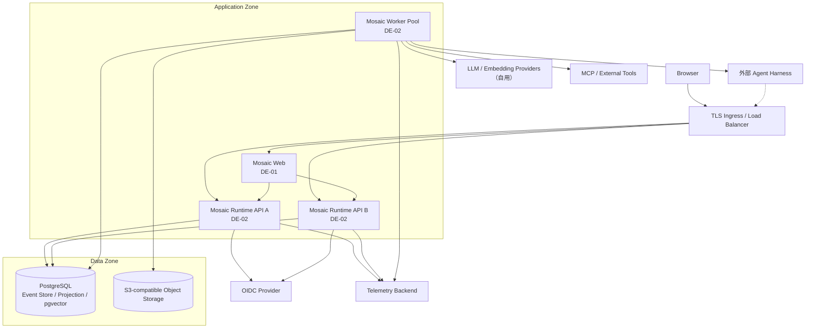

多实例不依赖 sticky session 才能保证正确性。若 WebSocket 使用本地连接表，提交事件通过 PostgreSQL outbox/notification 或后续 NATS fan-out 到持有连接的实例；断线客户端始终可按 seq 补齐。

外部 Agent Harness 经 IF-AGENT-PROTOCOL 双向接入：Worker 出站回调下发 Observe/Intent/Generate 任务，Harness 亦可通过 Edge 建立经鉴权的长连接接收事件推送与取消指令；两条路径均绑定 tenant/participant 并携带幂等键，迟到结果按 grant epoch 拒绝。外部 Harness 不在 Mosaic 信任域内，其接入按 9.1.4/9.3 的信任边界与 egress 策略治理。

### 8.8 运行模型

#### 8.8.1 并发、并行设计

- **Room 内串行，Room 间并行**：命令提交按 Room version 线性化。
- **Intent 并行**：候选 Agent 的评估可并行，但受 tenant/Harness semaphore 和 budget 限制。
- **Generation 有界并行/有序发布**：Open Floor 可同时生成 1–3 个草稿，按 grant rank 和新水位验证后提交。
- **人类控制抢占**：pause/cancel 命令不等待当前模型完成；撤销 grant epoch 后立即生效。
- **Backpressure**：每 Room 最大待处理刺激、全局 model-run semaphore、provider rate-limit bucket 和 bounded WS queue；慢客户端断线后走恢复协议。
- **幂等**：客户端 command id、Provider retry id、Outbox consumer id 都有唯一约束。

#### 8.8.2 运行交互分析

##### 8.8.2.1 用例设计 1：服务崩溃恢复

事件提交后、异步分发前崩溃时，Outbox 仍与事件同事务存在；新 worker 领取 lease 并继续。模型调用若已发出但 run 状态不确定，恢复器按 provider 能力查询或标记 `unknown/failed`，不盲目重复产生公开消息。任何重新执行的发布都需通过 grant 与幂等键验证。

##### 8.8.2.2 用例设计 2：高负载降级

按顺序执行：关闭非必要 presence → 延长 ambient debounce → 缩小 Intent 候选集 → 降低每轮最大 speaker → 降低 Intent 评估频率 → 暂停自动续聊但保留人类消息。降级必须产生可见系统状态，不静默改变 Room 行为。

### 8.9 模型链追踪矩阵

| 逻辑元素 | 代码元素 | 构建元素 | 交付元素 | 部署节点 |
|---|---|---|---|---|
| LE-01 Web UI | `apps/web` | BE-01 | DE-01 | Web Node |
| LE-02 Gateway | `internal/gateway` | BE-02 | DE-02 | Runtime Node |
| LE-03–LE-09 Room/Interaction | `internal/room` 等 | BE-02 | DE-02 | Runtime + Worker Node |
| LE-18 Epistemic Projection | `internal/epistemic` | BE-02 | DE-02 | Runtime + Worker Node + PostgreSQL |
| LE-10–LE-12 Agent Platform | `internal/agent/model/tool` | BE-02 | DE-02 | Worker Node |
| LE-13–LE-14 Persistence | `internal/eventstore/outbox/projection` + migrations | BE-02/BE-04 | DE-02/DE-03 | Runtime/Worker + PostgreSQL |
| LE-15 Artifact | `internal/artifact` | BE-02 | DE-02 | Worker + Object Storage |
| LE-16–LE-17 Operations | `internal/auth/telemetry` | BE-02 | DE-02 | Runtime/Worker + external backends |
| Room Protocol | `api/room-protocol`, `packages/protocol-ts` | BE-03 | DE-04 + DE-02 | Web/Runtime/Worker |

## 9. 基于架构的安全/韧性/隐私/可靠/可用/Safety 等属性分析

### 9.1 安全/韧性威胁分析

#### 9.1.1 价值资产清单

| 资产 | 价值/风险 |
|---|---|
| Room 对话、记忆和 Artifact | 可能包含商业秘密、PII 和未发布方案 |
| Agent Profile 与 Prompt | 项目认知策略、供应商配置和知识产权 |
| 自用模型与 Tool/API 凭据 | 可导致用量滥用和外部系统入侵 |
| Tool 权限与审批 | 可触发读取、写入或外部副作用 |
| Event Log 完整性 | 决定讨论事实、审计和恢复正确性 |
| Epistemic Projection、Closure/Pause Capsule 与 Context Receipt | 可能影响发言机会、收束判断、重开与用户对讨论结果的理解 |
| Tenant/Identity 映射 | 决定数据隔离与授权 |
| 使用量数据 | 滥用检测与公平限额 |
| 构建与发布链 | 可导致供应链攻击 |

#### 9.1.2 暴露面清单

- 登录、回调、REST/WS API 与文件上传；
- Prompt、消息、URL、Artifact、Memory 导入；
- LLM/Embedding Provider 出站调用（自用模型）；
- 外部 Agent Harness 接入与回调（OQ-20）；
- MCP/工具调用与审批回调；
- 管理后台、导出和删除接口；
- 数据库、对象存储、日志/Trace 和备份；
- 开源依赖、构建流水线和容器镜像。

#### 9.1.3 攻击路径模型

##### 9.1.3.1 Room 私密数据外泄

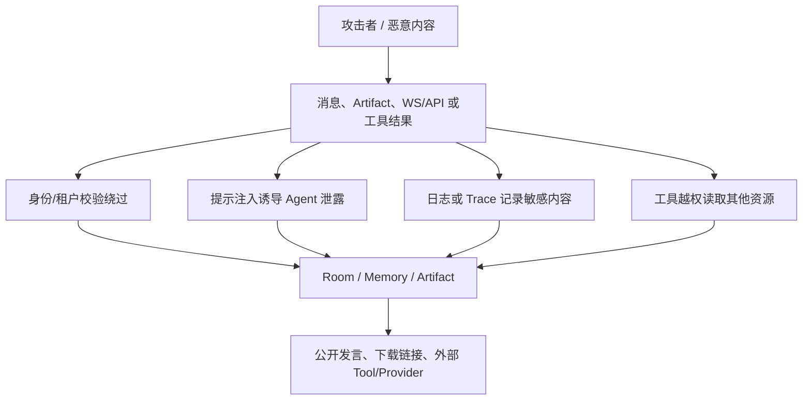

控制点：OIDC + tenant-scoped authorization + RLS；上下文最小化；工具 capability token；Prompt/Tool 内容不可信标记；输出 DLP/secret scan；signed URL 短 TTL；日志字段白名单和脱敏；审批与审计。

##### 9.1.3.2 资源耗尽与循环

恶意用户或 Agent 输出可诱导自动续聊、分支爆炸、重复工具调用。控制点为：每 Room/Thread/round 四级限额，最大自动轮数、最大分支深度、最大 speaker、cooldown、重复检测、Harness semaphore、人工暂停和用量告警。限额拒绝由确定性 Policy 执行，不能由模型覆盖。

#### 9.1.4 架构元素分类列表

| 类别 | 元素 |
|---|---|
| 信任边界入口 | Web UI、API/Realtime Gateway、OIDC Callback、外部 Agent Harness 接入与回调（IF-AGENT-PROTOCOL） |
| 核心受信领域 | Room Kernel、Policy & Budget、Event Store |
| 受控 AI 区 | Attention、Context/Memory、Structure & Epistemic Projection、Agent Harness 接入层、Safety Guard |
| 高风险外部区 | 外部 Agent Harness 及其 Provider、自用模型 Providers、MCP/Tools、上传内容 |
| 敏感持久区 | PostgreSQL、Object Storage、Secret Store、Backup |
| 运维区 | Audit/Telemetry、CI/CD、管理员接口 |

#### 9.1.5 韧性控制点清单

| 风险 | 控制 |
|---|---|
| 自用模型 Provider 超时/限流 | deadline、circuit breaker、per-provider queue、可见降级 |
| 外部 Harness 失联/无响应 | 宽松 round/grant 期限到期转 `unavailable` 状态、取消与 grant 撤销通道、本轮用剩余候选继续 |
| 外部 Harness 回调 SSRF/DNS 重绑定 | HTTPS-only、URL 规范化、注册与连接前双阶段 DNS/IP 校验、私网/保留地址与非批准端口拒绝、禁重定向、受控 egress proxy |
| 实例崩溃 | outbox、lease、幂等、grant epoch、重建投影 |
| 数据损坏 | PITR、校验和、event append-only 权限、恢复演练 |
| 慢客户端 | bounded queue、断线、seq resume |
| 恶意输出 | Schema validation、sanitization、DLP、tool isolation |
| 事件风暴 | per-tenant/room rate limit、debounce、backpressure |
| Projection 卡住 | lag alert、dead-letter、单 Room 重建 |

#### 9.1.6 安全韧性威胁模型

采用 STRIDE + LLM 专项威胁：Spoofing（冒充 Participant）、Tampering（篡改 Event）、Repudiation（否认审批）、Information Disclosure、Denial of Service、Elevation of Privilege，以及 Prompt Injection、Indirect Prompt Injection、Model Data Leakage、Tool Confused Deputy、Memory Poisoning、Projection Poisoning、Metric Gaming、Premature Convergence 和 Autonomous Loop。

#### 9.1.7 安全韧性逻辑模型

```text
Untrusted Input
  → Authentication / Tenant Resolution
  → Authorization / Rate Limit
  → Command Schema & Idempotency
  → Room Kernel / Policy Gate
  → Minimal Context Builder
  → Model or Tool Sandbox Boundary
  → Output Schema / DLP / Loop Guard
  → Transactional Event Commit
  → Visibility-aware Projection
```

### 9.2 安全模型

#### 9.2.1 0~n 层安全设计框架

##### 9.2.1.1 初始化过程安全

- 启动时校验迁移版本、Schema 兼容、必需 Secret 引用和 TLS 配置；
- 启动失败不得打印 Secret；
- 默认无 Provider/Tool 权限，显式配置后启用；
- 首个管理员通过一次性 bootstrap token 或 IdP group 建立，token 使用后失效；
- 开发默认配置不能直接用于生产。

##### 9.2.1.2 运行安全域

1. Public Edge：仅 TLS、WAF/rate limit、静态资源；
2. Application：无长期 Provider Secret 明文落盘；
3. Data：私网、最小数据库角色、备份加密；
4. Tool Execution：与核心进程凭据和网络隔离；
5. Operations：管理员强认证、审计、break-glass 流程。

##### 9.2.1.3 防绕过

- UI 禁用不是安全边界，所有命令在 Gateway 与领域层重复检查权限；
- Agent/Tool 不能直接写 Event Store；只能提交受验证命令/结果；
- signed URL 不授予 Room 成员权限，生成前必须校验，TTL 短且绑定对象；
- 外部 Harness 回调 URL 必须经受控 egress proxy；注册及每次连接前重新解析并拒绝 loopback、private、link-local、保留地址、云元数据地址、非批准端口和重定向；
- projection 查询必须满足主体非干扰契约：响应等价于只使用调用者可见来源重建的结果；tenant/visibility 过滤与 RLS 为双重兜底；
- Mosaic 自用模型的 fallback 不允许自动扩大数据地域或合规范围；外部 Harness 的模型地域与合规边界由接入方在 Profile 中声明并承诺，Mosaic 按声明审计（OQ-20）。

##### 9.2.1.4 自保护

- Secret/PII redaction；
- 进程只读根文件系统、非 root、最小 Linux capabilities；
- egress allowlist；
- dependency/SBOM/signature verification；
- 异常用量、批量导出、权限变更与审计关闭尝试告警。

#### 9.2.2 1~n 层子系统安全模型

| 子系统 | 主要控制 |
|---|---|
| Experience | CSP、CSRF、防 XSS、安全 Markdown/链接渲染 |
| Room Runtime | command authorization、idempotency、expected version、budget hard limits |
| Interaction | untrusted-content labels、context minimization、memory/projection provenance、typed relation visibility、feedback overlay、anti-Goodhart metric policy、no hidden-CoT storage |
| Agent Platform | 自用模型 provider allowlist、外部 Harness 接入认证与回调校验、宽松协议期限（请求级超时归 Harness）、tool capability、human approval、sandbox |
| Persistence | encryption、RLS、append-only role、PITR、retention/delete job |
| Operations | OTel redaction、audit integrity、RBAC、break-glass review |

### 9.3 安全/韧性部署模型

- Ingress、应用、数据、工具执行与运维面使用独立网络策略；
- PostgreSQL/Object Storage 不直接暴露公网；
- Worker 的自用模型 Provider 与 Tool egress 按域名或网关 allowlist；所有外部 Harness 回调强制经受控 egress proxy，执行 URL 规范化、DNS/IP 双阶段校验、私网/保留地址和端口拒绝、禁重定向，并记录 tenant、注册目标与最终解析目标；外部 Harness 的入站长连接经 Edge 终止、鉴权并按租户限速；
- Runtime API 无权读取生产 Secret 明文，只从 Secret Manager 获得短期凭据；
- 备份跨故障域、加密并定期恢复演练；
- 生产至少两个 Runtime API 副本，worker 可水平扩展；数据库为首个单区域关键依赖，需托管 HA 或明确 RTO/RPO。

### 9.4 隐私属性分析模型

- 默认不使用用户 Room 内容训练基础模型；Provider 的数据使用政策必须按租户可见并可选择。
- Global Profile Memory 默认关闭，需用户明确保存；Room/Thread Memory 可查看、编辑、删除和查看来源。
- 只向每次模型调用发送最小必要上下文；记录发送的数据分类和 Provider/Region，但不在普通日志复制正文。
- 支持 Room 数据导出、删除和 retention policy；Embedding、摘要、缓存与备份有级联删除/到期策略。
- Presence、typing 和普通轮次的 `silent` 仅用于即时体验/聚合状态，默认不长期保留细粒度行为数据；收束轮改用显式 `abstain`，超时单独记录。
- 推断 relation/claim/stance 只能从该 Participant 有权访问的来源构建；每个投影响应必须等价于仅使用该主体可见来源重建的结果，跨 visibility 边、ID、数量、聚类标签、水位、错误与 timing 差异均不得泄露不可见事件存在。
- Context Receipt 默认保存引用 ID、版本和分类而非正文，并纳入导出、删除、retention 和管理员审计。

### 9.5 可靠性与可用性属性分析模型

首版建议目标（正式 SLO 需压测后批准）：

| 指标 | 目标 |
|---|---:|
| API 月可用性 | 99.9% |
| 已提交事件持久性 | 依赖托管 PostgreSQL，目标 ≥ 99.99% |
| committed event → 在线客户端 P95 | < 1 s |
| pause 命令生效 P95 | < 500 ms |
| Room Event RPO | ≤ 5 min（生产 PITR） |
| 服务 RTO | ≤ 30 min（单区域） |
| Projection 恢复 | 可按 Room 重建，不影响 Event Log |

不承诺 LLM 端到端响应时间，因为外部 Provider 占主导；UI 必须展示排队、评估、生成、失败和降级状态。

### 9.6 性能与容量属性分析模型

v0.1 设计容量假设：单 Room 1–10 个 Participant、每轮最多 3 个 Agent 生成、自动续聊最多 6 轮、文本消息为主。压测需覆盖：

- 1,000 个并发 WS 连接与 100 个活跃 Room（初始目标，非承诺）；
- 同 Room 并发人类命令冲突与重试；
- Provider 429/超时、部分失败和取消；
- Outbox backlog、Projection 重建和慢客户端；
- 10 万事件 Room 的快照 + 增量加载；
- pgvector 在 scope/tenant 过滤下的检索延迟；
- 10 万事件 Thread 的增量 cluster/claim 投影、全量重建时间、版本切换水位与修正 overlay 重放；
- 结构热点、dyad share 与 frontier slot 在高并发下的确定性和公平性。

扩展阈值：当单实例 CPU/内存、Outbox lag、WS fan-out 或故障隔离成为 SLO 主因时，优先拆 Model Worker/Realtime Fanout；不要先拆 Room Kernel 与 Event Store 事务边界。

### 9.7 资源限额与可持续性属性分析模型

Mosaic 不做成本管理（v0.4）：费用发生在 Harness 与其 Provider 之间，系统不采集价目、不核算费用、不按价格做任何运行时决策。资源限额只按 Mosaic 可观测的维度执行：

- Intent 与 Generate 分层调用以控制调用次数（具体模型选择归 Harness）；候选过滤减少无效调用；
- 预算维度仅含轮次、token、时长与发言数；token 以 Harness 自报 usage 为准，仅用于限额与告警（见 6.2.2）；
- 预算只作确定性 admission 与熔断，不进入候选价值排序（见 6.2.2）；
- 每轮在评分前为同一模式的最大 speaker 预留对称 token 额度；额度不足时统一缩短 response cap、减少本轮 speaker 上限、暂停或询问人类，不得替换已获选 Agent；
- Room/Thread/tenant/participant 四级限额；
- Context token 上限、摘要水位与缓存；
- 重复观点相似度过滤；
- 用量达到限额的 70/90/100% 时提示、降级、硬停，全部作用于 Mosaic 可控资源；
- 默认把“沉默”视为成功结果，避免用活跃度驱动无意义 token 消耗。

### 9.8 Safety 属性分析模型

Mosaic 不把 Agent 拟人化等同于隐瞒其 AI 身份。每个 Agent 明确标识模型/配置来源和当前实际 Provider。系统必须支持：

- 房间级内容政策与年龄/组织要求；
- 自伤、违法、高风险专业建议等场景的输出策略和升级提示；
- 不确定性与来源引用；
- 人类一键暂停、移除 Agent、删除 Memory；
- 不把多数 Agent 的一致意见、语义相似或结构收敛展示为事实证明；
- UI 区分 Participant 显式关系与系统推断关系，并允许有权限的人类提交 projection feedback；
- 避免人格配置诱导欺骗、依赖或冒充真实人物。

### 9.9 公共组件安全配置分析

| 组件 | 安全基线 |
|---|---|
| PostgreSQL | TLS、非公网、RLS、最小角色、PITR、审计扩展按需 |
| Object Storage | private bucket、SSE、短期 signed URL、versioning/quarantine |
| Web/Ingress | TLS 1.2+、HSTS、CSP、CSRF、body/connection limits |
| OIDC | Authorization Code + PKCE、state/nonce、短 session、key rotation |
| Containers | non-root、read-only rootfs、seccomp、resource limit、signed image |
| OTel | body 默认不采集、attribute allowlist、tenant-aware access |
| MCP/Tools | server allowlist、capability scope、egress policy、approval、sandbox |

## 10. 组件化或服务化架构六独立能力

| 能力 | 设计结论 |
|---|---|
| 独立开发 | 每个逻辑模块拥有包边界、端口和测试；禁止跨模块私有表访问 |
| 独立测试 | Room Kernel/Attention/Graph 使用确定性领域测试；Provider/DB 用 contract/integration test |
| 独立构建 | v0.1 后端聚合构建，Web/Protocol/Migration 独立构建；模块尚不要求单独镜像 |
| 独立部署 | Web 与 Server 可独立部署；API/Worker 同镜像按角色部署；领域模块暂不独立部署 |
| 独立运行 | API 与 Worker 可独立扩缩；单一 Provider、Tool 或 Projection 故障可隔离 |
| 独立演进 | Room Protocol 版本化；Adapter 可替换；达到阈值后可沿 Model Worker、Realtime、Projection 边界拆分 |

结论：v0.1 追求“逻辑独立、物理聚合”。不为形式上的六独立能力牺牲 Room 事务一致性。

## 11. 其他说明

### 11.1 MVP 切片

v0.1 只实现能够证伪或证实核心产品假设的垂直切片：

1. OIDC 登录与单租户/多租户基础隔离；
2. 创建 Room，加入人类和 3 个异构 Agent，含 Model Binding 同构检测提示；
3. Timeline、Participant 状态、最小 Conversation Graph，以及显式/推断关系的视觉区分；
4. Open Floor、Roundtable（默认 rebuttals=1）、Deep Dive 三种模式，`sequential / simultaneous / independent_then_cross` 揭示策略，以及定向交锋快速通道；
5. Observe/Intent/Floor/Generate/Publish、结构化讨论历史查询接口、Context Receipt 与收束轮；
6. 点名、暂停、支线 fork/pause/resume/close/reopen/merge 和 `discussion_epoch_id`；
7. 版本化结构投影最小实现：reply 基图、typed relations、稳定 cluster、provisional/productive bridge、exploration debt 与 dyad share；
8. Closure Capsule 与 `consensus / bounded_disagreement / decision / option_map / evidence_blocked / abandoned` 类型；预算/轮次硬顶另生成 Pause Capsule；
9. Room/Thread 摘要、pgvector 检索，以及 feature-flag 下的最小 Claim/Evidence 派生投影；Claim 投影失败不得阻塞核心讨论；
10. 手工/半自动 Evidence Request，证据满足后提议新 epoch 重开；
11. 每轮/token/时长限额、公平预留（仅 admission/熔断，不参与价值排序）和基本观测；
12. 只读、低风险工具作为可选演示；
13. 导出与基本删除，覆盖 projection、Receipt、Capsule 与 Artifact 的级联策略。

### 11.2 架构演进阶段

| 阶段 | 目标 | 基础设施 |
|---|---|---|
| v0.1 验证 | 单区域、原生 Web、10 人以内 Room | 模块化单体 + PostgreSQL/pgvector + Object Store |
| v0.2 协作 | 多人类、权限完善、评测闭环、移动适配 | 共享 realtime fan-out/Redis 视证据引入 |
| v0.3 生态 | Room Protocol SDK、Channel Adapter、更多工具 | NATS/独立 worker 视 SLO 引入 |
| v1.0 规模化 | 多区域、企业治理、稳定协议 | 按数据与故障域拆分，不预先指定所有服务 |

### 11.3 架构适应度函数

CI/运行时持续检查：

- 领域包不得依赖具体 Provider/DB/HTTP SDK；
- 逻辑架构、时序图、接口和代码模型中，Agent 发言流量必须经过 Agent Protocol Adapter 到外部 Harness，且不得连接 Mosaic Model Gateway；
- Event Schema 向后兼容；
- 任何 Agent Message 必须能追溯到有效 FloorGrant（人类消息除外）；
- 任何由 `intent.endorsed` 产生的 FloorGrant 必须可追溯到一个具名人类 actor；Agent 不能保送 Agent；
- 意图窗口与 round/grant 期限只能取 Policy 配置的静态值，不得按 provider 延迟或价格动态调整；
- 任何预算/熔断逻辑不得引用价格或费用数据，预算维度仅含轮次、token、时长与发言数；预算 admission 必须使用预先声明的公平预留策略，不能在 Floor 后替换已获选 Agent；
- 任何 `thread.closed` 必须追溯到被接受的 Closure Capsule 或显式人类放弃；预算/轮次硬顶只能产生 `pause_capsule.created + thread.paused` 和可见未收敛标记；
- `abstain`、timeout、unavailable 与人类无输入不得被聚合为同意；
- Closure Capsule 必须覆盖主要 claim/cluster，并保留合格 dissent、assumptions、falsifiers、Evidence Requests 与 projection version；
- inferred relation/claim/cluster 必须可从固定 Event fixture 按 algorithm_version 重建，且不得修改原始 Event payload；
- 每次 Intent/Generate 必须有完整 Context Receipt，且 Receipt 不得复制 Prompt/正文；
- bridge rate、跨 Agent 密度和收束率不得单独进入在线 Floor 奖励；
- 任何 Tool Run 必须有 capability decision；
- Projection 可从空库对固定 Event fixture 重建为一致结果；
- 自动讨论在配置轮次/预算内必然终止；
- 迟到模型结果不能在 pause/revoke 后发布；
- Tenant A 的 token 无法查询 Tenant B 的任何资源；
- 对任一主体 P，projection/history API 响应必须与仅使用 P 可见来源重建的 fixture 完全一致，隐藏来源不得改变计数、标签、水位、错误或 timing 分类；
- 外部 Harness 回调必须通过 SSRF fixture：拒绝 loopback/private/link-local/metadata/保留地址、非批准端口、重定向和 DNS 重绑定；
- 日志 fixture 不包含 prompt、secret、PII 正文。

### 11.4 主要风险与缓解

| 风险 | 影响 | 缓解 |
|---|---|---|
| Agent 观点同质化 | 产品核心价值不成立 | 异构模型/Profile、MMR、多样性评测；以用户采纳数据验证 |
| 两阶段调用 token 消耗过高 | 无法持续使用 | 候选过滤、低 token Intent 调用、缓存、限额熔断（不参与选择）、沉默成功 |
| 讨论死循环或被硬顶掐断 | 讨论质量与体验崩坏 | 结构化收敛检测、类型化 Closure Capsule、证据阻塞、剩余轮次提示与低代价新 epoch 重开 |
| cluster/bridge 投影自指或版本漂移 | 指标不可解释、同一历史得出不同价值判断 | 聚类基图与跨 cluster 关系分层，冻结水位、算法版本、旁路重建与 fixture 对比 |
| 结构指标被 Goodhart 化 | Agent 滥连 bridge、闲聊或过早收束 | provisional/productive 分离、组合延迟指标、人工基线；指标不直接进入在线奖励 |
| 热点与双人讨论捕获 Attention | frontier 观点被饿死，讨论退化为二人辩论 | exploration debt、centrality 衰减、dyad share 与有限 frontier slot |
| `object` 或沉默语义造成收束失真 | 无限否决或把无响应误作同意 | 合格 objection 负担、dissent parking、显式 abstain，timeout/unavailable 独立状态 |
| 限额熔断间接偏向快速模型 | 异构视角被资源策略系统性排除 | 评分前对称预留、统一降 cap、迟到滚入下一轮，禁止 Floor 后替换已获选 Agent |
| 发言仲裁被感知为隐藏 Conductor | 违背产品定位 | 公开 Policy/理由；仲裁只控制机会，不生成观点；用户可切模式 |
| Conversation Graph UI 过于复杂 | 用户无法理解走向 | Timeline 为主、Graph 渐进披露、默认自动折叠/摘要 |
| Event Sourcing 实现复杂 | 研发速度下降 | 只对 Room 核心使用；投影工具化；严格 Schema/fixture |
| 外部模型不稳定/政策变化 | 可用性和合规风险 | Adapter、fallback、显式实际模型、地区/租户约束 |
| 外部 Harness 回调被用于 SSRF | Worker 访问内部服务、云元数据或管理面 | 强制 egress proxy、双阶段解析校验、私网/保留地址与端口拒绝、禁重定向和 DNS 重绑定测试 |
| 混合可见性投影泄露隐藏来源 | 无权成员从 cluster/claim 计数、标签或错误推断私有内容 | 主体非干扰契约、按可见来源重建、缓存键隔离与跨 visibility fixture |
| Prompt injection / Memory poisoning | 泄漏与长期错误行为 | provenance、最小上下文、tool gate、人工编辑、TTL |
| “AI 平等成员”误读为权限平等 | 安全越权 | 明确语义对称与控制权限非对称 |
| 名称/许可证冲突 | 品牌或开源风险 | 名称检索、许可证决策、SBOM、避免复制参考项目代码 |

### 11.5 开放问题与决策门

| ID | 问题 | 决策时点 |
|---|---|---|
| OQ-01 | Mosaic 名称、域名、GitHub organization 与商标是否可用？ | 对外发布前 |
| OQ-02 | 项目采用 Apache-2.0、AGPL-3.0 还是其他许可证？ | 接受外部贡献/引入代码前 |
| OQ-03 | OQ-20 已决后：v0.1 首批支持哪些外部 Agent Harness 接入形态与认证方式？自用模型（embedding/utility）选择哪些 Provider，数据地域如何配置？ | Agent Runtime 详细设计前 |
| OQ-04 | Floor score 的初始权重和公开粒度如何通过用户研究确定？ | Attention 功能设计前 |
| OQ-05 | 支线 merge 是否默认需人类确认？ | Conversation Graph 功能设计前 |
| OQ-06 | 多人类协作中谁拥有 pause/policy/删除权限？ | Authorization 详细设计前 |
| OQ-07 | Room Event 的默认 retention 和审计墓碑内容？ | 数据/隐私评审前 |
| OQ-08 | 是否在 v0.1 接入 MCP，还是完全延后工具能力？ | MVP 排期前 |
| OQ-09 | 对外 Room Protocol 的稳定范围：仅 Event，还是含 Agent Harness API？ | v0.2 SDK 规划前 |
| OQ-10 | 如何用人工标注校准 bridge yield、dissent survival、closure stability 与人类结果信号，建立噪声下限？ | 评测平台设计前 |
| OQ-11 | v0.1 的 cluster 基图采用何种时间窗口/语义分段，projection feedback 如何影响下一版本？ | Epistemic Projection 详细设计前 |
| OQ-12 | 各 closure_type 的接受权、纯 Agent 房间 quorum 与人类确认默认值是什么？ | Closure 功能设计前 |
| OQ-13 | Claim/Evidence 投影在 v0.1 仅用于离线评测，还是进入 Context/Closure 的在线路径？ | MVP 排期前 |
| OQ-14 | Context Receipt 的默认 retention、导出范围与删除后 tombstone 策略是什么？ | 数据/隐私评审前 |
| OQ-15 | frontier slot 与 dyad share 的默认阈值如何按模式校准，避免保护探索变成强制反对？ | Attention 功能设计前 |
| OQ-16 | 各 Agent 按 Model Binding 差异化组装上下文导致“同桌不同视角”，是否及如何向用户暴露这一差异？ | 已决（v0.4）：上下文窗口管理划归 Agent Harness，Mosaic 统一交付讨论输入 + 权威历史查询接口，见 6.3/6.4 |
| OQ-17 | Floor 评分权重是否会系统性压制意外或离题插话，frontier slot 名额与评分公开粒度如何校准，避免仲裁成为隐性主导者？ | 已决（v0.4）：人类保送（`intent.endorsed`）+ 记分卡透明（权重可见可配、落选 Intent 可查），见 6.2.2/6.2.3 |
| OQ-18 | 纯 Agent 房间检测到话题漂移后，由谁、以何种机制把讨论拉回目标？ | 已决（v0.4）：redirect 重聚焦窗口 + 按模式漂移阈值，无人自愿则静默，见 6.9.4 |
| OQ-19 | 圆桌观战节奏（多 Agent 生成延迟叠加）与每轮全员 Intent 评估成本的目标体验阈值是什么？ | 已决（v0.4）：房间不压节奏、不设延迟优化逻辑，仅保留宽松 round/grant 期限；请求级超时/重试/fallback 归 Harness，见 6.2.3/6.4 |
| OQ-20 | Agent 集成模型：由 Mosaic 托管调用（Model Gateway 直连 Provider，当前文档默认），还是外部 Harness 自带模型访问（如 Codex + GPT 组合，OQ-16/OQ-19 决策的隐含前提），或两者并存？该决策影响原则 15 的适用边界、成本核算（9.7）、熔断与地域策略（9.1.5/9.2.1.3）、usage 对账与 Profile 中 Model Binding 的语义 | 已决（v0.4）：外部 Harness 自带模型访问为主——Mosaic 不持有 Provider 凭据、不代理 Agent 发言流量；Model Binding 退化为声明性身份/审计信息，见 6.4/9.7 |

## 12. 参考资料清单

| 编号 | 资料 | 用途 |
|---|---|---|
| R1 | [参考对话：Kimi 多 Agent 功能调研](chatgpt-conversation://6a4b5721-b87c-83ee-b978-0b22531f95c8) | 产品目标、约束、Grok/Kimi/IM 讨论与初步架构输入 |
| R2 | [LobeHub GitHub Repository](https://github.com/lobehub/lobehub) | Agent Registry、模型/工具生态、Agent Groups 与自托管实现参考；2026-08-13 访问 |
| R3 | [MaiBot GitHub Repository](https://github.com/Mai-with-u/MaiBot) | 拟人化群聊中“何时开口/沉默”的产品与行为参考；GPL-3.0；2026-08-13 访问 |
| R4 | [PostgreSQL Documentation](https://www.postgresql.org/docs/) | 事务、并发、JSONB、RLS 与运行基线 |
| R5 | [OpenTelemetry Documentation](https://opentelemetry.io/docs/) | 统一可观测模型 |
| R6 | [Model Context Protocol](https://modelcontextprotocol.io/) | 可选工具边界参考 |
