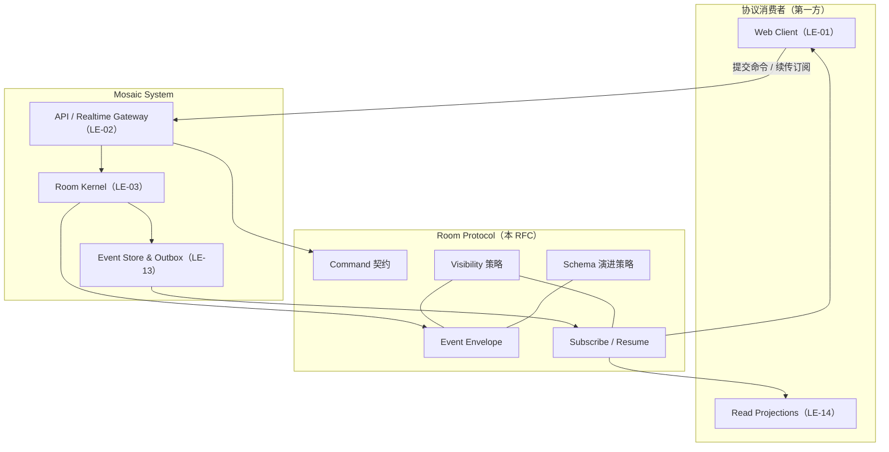
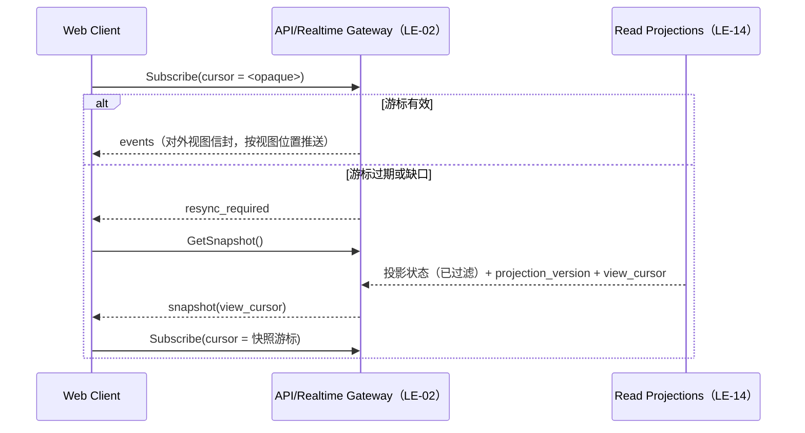

# 特性设计说明书（RFC 提案）：RFC-0001 Room Protocol——事件信封、命令语义与协议演进

**状态 (Status):** Approved（2026-08-25 项目负责人确认；首轮审校修订 v0.4 后批准）

**作者 (Authors):** Mosaic 项目组 / ZCode

**创建日期 (Created):** 2026-08-25

**更新日期 (Updated):** 2026-08-25

**相关 Issue/PR:** #TBD（RFC 入库时创建 tracking issue）

# 0. 文档控制

| 项目 | 内容 |
|---|---|
| RFC 编号 | 0001 |
| 系列位置 | RFC 序列第 1 篇；全部其他 RFC 的前置 |
| 上游输入 | [架构设计说明书](../2026-08-13-mosaic-architecture-design.md) v0.6 §2.3、§6.1、§7.3、§11.3 |
| 吸收开放问题 | OQ-09（Room Protocol 的稳定范围，本 RFC 提出裁决建议：按系统内部闭环消解） |
| 下游 | RFC-0002～RFC-0011、`api/room-protocol` Schema 工程、CI 兼容性测试门禁 |

## 0.1 修订记录

| 版本 | 日期 | 修订人 | 说明 |
|---|---|---|---|
| v0.1 | 2026-08-25 | Mosaic 项目组 / ZCode | 初稿：事件信封、命令契约、顺序与续传、可见性、Schema 演进策略、事件族清单与稳定层级、OQ-09 裁决建议 |
| v0.2 | 2026-08-25 | Mosaic 项目组 / ZCode | 评审修订：确立内部闭环定位——移除对外 SDK 与对外兼容承诺表述，OQ-09 改为按内部闭环消解；确认 payload 上限 256 KiB（命令不承载批量上下文）；移除按版本门控的承诺表述 |
| v0.3 | 2026-08-25 | Mosaic 项目组 / ZCode | 措辞修正：Harness 集成表述由"ACP 适配边界"改为"适配器边界"（跟随 RFC-0002 v0.3 的端口 + 适配器模型） |
| v0.4 | 2026-08-25 | Mosaic 项目组 / ZCode | 首轮审校修订（P0+P1+明确修订）：对外续传/快照/历史查询改为按可见视图生成的 opaque cursor，全局 seq 仅内部可见（P0）；命令契约强化（持久 command receipt、请求指纹、idempotency_conflict、回放重鉴权、身份由鉴权与路径绑定）；事件类型命名规则放宽为多段点分并统一 `message.posted`；Schema 演进新增 expand-first 与永久 upcast；T1 标注改为随 owning RFC 暂定；新增内部消费者支持合同（3.1.8）；OQ-09 补外化护栏；可见性判定时点定为事件发生时 |

# 1. 概述

## 1.1 简介

Room Protocol 是 Mosaic 唯一权威事实源（Room Event Log）的协议表达。本 RFC 定义三件套契约——命令（Command）、事件（Event）、订阅与续传（Subscribe/Resume），以及两套横切策略——可见性（Visibility）与 Schema 演进（Evolution）。Web 客户端、读投影、记忆与评测回放工具等**第一方消费者**消费该协议；Agent Harness 不直接消费 Room Protocol——其集成经 [RFC-0002](2026-08-25-rfc-0002-agent-protocol.md) 的适配器边界翻译。系统内部闭环：协议不对外发布、不设对外兼容承诺；`api/room-protocol` Schema 工程与第一方 SDK 以其为权威源。

本 RFC 不定义任何行为的"好坏"（那是 RFC-0003 仲裁、RFC-0005 收束的职责），只定义"发生的事情如何被诚实地表达、传递和演进"。

## 1.2 动机

架构基线 v0.6 在 §6.1/§7.3 描述了事件溯源机制，但尚未形成可独立评审的协议契约：事件信封字段语义分散在正文示例中；§11.3 适应度函数依赖"Event Schema 向后兼容"，而兼容规则本身（能否删字段、未知字段如何处理、破坏性变更走什么流程）未定义；OQ-09（协议稳定范围）未决。所有下游 RFC（尤其 RFC-0002 Agent Protocol）都在等待这份契约定稿，否则接口面会反复漂移。

不做本 RFC 的影响：事件字段随实现即兴演进、消费者各自猜测语义、兼容性门禁没有判定标准、第一方消费者（Web/投影/回放）没有可依赖的稳定基线。

## 1.3 目标

### 1.3.1 目标

1. 定义 Room Event Envelope v1 的字段、类型与语义；
2. 定义 Command 契约：幂等键、expected room version、错误分类与重试语义；
3. 定义顺序与一致性规则：room-local seq、单写序、断线续传与快照恢复协议；
4. 定义可见性模型：四级可见性、传播约束与不可推断要求；
5. 给出 v1 事件族完整清单，并为每个事件类型标注稳定层级（T1/T2/T3）；
6. 定义 Schema 演进与兼容性承诺：只增字段、显式版本、废弃流程；
7. 对 OQ-09 提出裁决建议：按"系统内部闭环"消解对外承诺问题。

### 1.3.2 非目标

- Floor 仲裁、评分与公平机制（RFC-0003）；
- Thread 生命周期与 typed relations 的语义校验（RFC-0004；本 RFC 仅提供其挂载字段）；
- 投影算法与主体非干扰契约的执行细节（RFC-0006；本 RFC 仅约束投影读取的输入）；
- Agent Harness 传输协议（RFC-0002）；
- 存储实现、DDL、分区与 outbox 派发机制（ADR 层，架构 §8.3 已定边界）；
- retention、导出、删除与墓碑策略（RFC-0010；本 RFC 仅预留墓碑事件的信封形态）。

# 2. 用例分析

| 用例 | 功能点 | 关键指标 | 安全隐私与 DFX 约束 |
|---|---|---|---|
| P-01 消息提交与幂等重试 | 客户端重发同一 idempotency key 的命令，服务端返回原结果而非重复事件 | 幂等重放响应 < 100ms；`(room_id, seq)` 无重复（AR-007） | 幂等键按 `(tenant_id, idempotency_key, command_kind)` 全局唯一，防跨租户碰撞 |
| P-02 断线重连与续传 | 客户端携带 opaque 视图游标续订，缺口时走快照 + 增量恢复 | 续传建立 < 1 RTT；10 万事件 Room 快照+增量加载 < 5s（架构 §9.6 压测项） | 快照只含调用者可见内容；游标序列不因隐藏事件产生跳号或推进差异 |
| P-03 并发命令与版本冲突 | 同 Room 并发命令因 expected version 不匹配被同步拒绝，返回可重试错误 | 冲突判定在提交事务内完成 | 冲突错误不泄露其他命令内容 |
| P-04 事件回放重建投影 | 从空库对固定 Event fixture 重放，投影结果一致 | 可确定性重建（架构 §11.3） | 回放走同一可见性过滤路径 |
| P-05 Schema 升级下新旧消费者共存 | 新版本事件含新增可选字段，旧消费者忽略未知字段继续工作 | 兼容性 fixture 全绿后允许发布 | 未知字段不得进入用户可见投影 |
| P-06 跨可见性命令提交 | moderator 级命令产生的 `system`/`moderators` 事件不对普通成员可见 | 不可见成员无法通过任何协议接口（含续传缺口）推断该事件存在 | 缺口表现不得区分"无事件"与"不可见事件" |

# 3. 方案设计

## 3.1 总体方案

协议由"三件套 + 两策略"组成。命令是可拒绝的变更请求；事件是事务提交后的不可变事实；订阅/续传是消费事件的标准方式。可见性与演进策略横切三者。



### 3.1.1 Room Event Envelope v1

```json
{
  "event_id": "evt_01H8...",
  "tenant_id": "ten_01H8...",
  "room_id": "room_01H8...",
  "thread_id": "thr_01H8...",
  "discussion_epoch_id": "epoch_01H8...",
  "seq": 149,
  "type": "message.posted",
  "schema_version": 1,
  "occurred_at": "2026-08-25T10:00:00.123Z",
  "actor": {"participant_id": "par_01H8...", "kind": "agent"},
  "causation_id": "grant_01H8...",
  "correlation_id": "round_01H8...",
  "visibility": {"kind": "public"},
  "payload": {},
  "metadata": {"policy_version": "pol_7", "profile_version": 3, "trace_id": "..."}
}
```

| 字段 | 必填 | 类型 | 语义 | 取值范围 |
|---|---|---|---|---|
| event_id | 是 | string | 全局唯一、不可预测、时间有序的事件标识 | UUIDv7，`evt_` 前缀 |
| tenant_id / room_id | 是 | string | 归属边界；room 是顺序与一致性边界 | UUIDv7 |
| thread_id | 否 | string | Room 级事件（如 `room.started`）为 null | UUIDv7 |
| discussion_epoch_id | 否 | string | Thread 作用域事件的讨论纪元；随 RFC-0004 定稿 | UUIDv7 |
| seq | 是 | int64 | Room 内单调递增、无重复；由提交事务分配，客户端不可指定；**仅内部可信消费者可见**（投影/回放/outbox），对外视图以 opaque cursor 替代（3.1.3） | ≥ 1 |
| type | 是 | string | 至少两段点分 lower_snake_case（`family.name[.sub]`），命名空间向左扩展 | 见 3.1.5 事件族清单 |
| schema_version | 是 | int | 该 type 的 payload 版本，从 1 起 | ≥ 1 |
| occurred_at | 是 | string | 提交事务时间戳，UTC 毫秒 | RFC 3339 |
| actor | 是 | object | `participant_id` + `kind`（human / agent / system）；由 Gateway 鉴权绑定，客户端不可指定 | 见约束 3.4 |
| causation_id | 否 | string | 直接原因（command / grant / run），构成因果链 | 本 Room 内有效 ID |
| correlation_id | 否 | string | round / run 关联，仅轮内语义 | 本 Room 内有效 ID |
| visibility | 是 | object | `{kind, participants?}`；kind 为 `public / participants / moderators / system` | 见 3.1.4 |
| payload | 是 | object | 按 `type + schema_version` 对应的 JSON Schema 严格校验 | 单事件 ≤ 256 KiB |
| metadata | 否 | map | 白名单字段（policy_version、profile_version、trace_id 等）；禁止存放正文类内容 | 白名单由 Schema 定义 |

**对外视图信封**：订阅、快照与历史查询投递给外部消费者的事件为"视图信封"——`seq` 不外发（替换为 opaque position），`context_watermark` 等水位类字段按主体可见视图重写；权威信封（含 seq）只存在于存储与内部消费路径。

### 3.1.2 Command 契约

```json
{
  "command_kind": "post_message",
  "expected_room_version": 42,
  "idempotency_key": "cmd_01H8...",
  "issued_at": "2026-08-25T10:00:00.000Z",
  "payload": {}
}
```

- `expected_room_version`：乐观并发控制。与当前 Room version 不符时整体拒绝，客户端按新快照重放；不提供"无版本盲写"模式。
- `idempotency_key`：客户端生成，**必须 UUIDv7**（与接口层强制一致）。命中唯一约束 `(tenant_id, idempotency_key, command_kind)` 时返回**持久化的 command receipt**（原结果与本次事件批次），标记 `replayed: true`，不产生新事件；回放时**重新鉴权**，请求指纹（command_kind + payload 摘要）不一致返回 `idempotency_conflict`。
- `tenant_id / room_id / actor` 由鉴权结果与请求路径绑定；命令体内出现的同类字段一律忽略并与绑定值比对，不一致直接拒绝。
- 错误分类（HTTP 语义仅作参考，传输映射归 ADR）：

| 错误 | 语义 | 客户端动作 |
|---|---|---|
| `validation_failed` | payload 或命令结构不合法 | 修正后重发（换幂等键） |
| `version_conflict` | expected version 不匹配 | 拉取快照后重放 |
| `room_state_invalid` | Room/Thread 生命周期不允许（如已 closed） | 提示用户，不重试 |
| `idempotent_replay` | 非错误；返回原结果 | 幂等消费 |
| `unauthorized / forbidden` | 身份或可见性不足 | 终止 |
| `idempotency_conflict` | 同幂等键的请求指纹不一致 | 拒绝，客户端换键重发 |
| `rate_limited` | 触及租户/Room 限流 | 退避重试 |

### 3.1.3 顺序、一致性与续传

1. 一个 Room 的写入按单调 seq 线性化；不同 Room 之间无全序承诺。
2. 事件与 outbox 记录同一事务提交（架构 §6.1.2）；消费者只见已提交事件，不存在"半事件"。
3. 生成类命令不持有数据库锁：LLM 结果提交时验证 grant 未撤销、Room 未暂停、Thread 可写、epoch 匹配（迟到拒绝语义归 RFC-0002/0003，本 RFC 提供验证挂载点）。
4. **内部与外部水位分离**：全局 `seq` 只对内部可信消费者（读投影、回放、outbox）暴露；对外订阅、快照与历史查询一律使用**按调用者可见视图生成的 opaque cursor**——受限读者的游标序列不得因隐藏事件产生跳号或推进差异，否则违反不可推断承诺（P-02/P-06、架构 §6.10.1 的水位不可泄露条款）。
5. 客户端订阅携带上次获得的 opaque cursor：
   - 游标有效：从其视图位置起推送增量；
   - 游标过期/缺口/超出保留窗口：返回 `resync_required`，客户端先取快照再从快照游标续订。
6. 快照 = `{room_version, projection_version, view_cursor, projection_state_ref}` 四元组；状态引用已按调用者可见性过滤；投影滞后时客户端可用事件增量临时补齐并在游标推进后校正（架构 §7.2.3）。



### 3.1.4 可见性模型

| kind | 可见范围 | 典型事件 |
|---|---|---|
| public | Room 全体可见成员 | `message.posted`、`round.closed` |
| participants | `visibility.participants` 列出的 Participant 子集 | 定向消息、受控线程事件 |
| moderators | 房间管理员与审计者 | Policy 变更详情、审批细节 |
| system | 仅运行时内部 | 内部状态迁移、同构检测中间态 |

约束：

- 可见性在命令验证阶段确定，随事件固化，后续策略变更不回溯改写既有事件的可见范围；可见性判定以**事件发生时**的角色与成员关系为准（读取时角色变化不回溯；`moderators` 级事件对后来晋升的管理员默认不可见，除非策略显式开放）；
- 订阅、快照、历史查询对每个消费者执行可见性过滤；缺口水位的呈现不得泄露不可见事件的存在（计数、间隙、timing 均不可区分，架构 §6.10.1 主体非干扰契约在传输层的体现）；
- TurnIntent 的用户可见投影只含 intent type、target、简短 rationale、分数区间与选择结果；模型原始输出、供应商请求体、隐藏推理不得进入 public payload（架构 §6.1.3）。

### 3.1.5 事件族清单与稳定层级

稳定层级定义（第一方兼容纪律；协议不对外发布，不构成对外承诺）：

- **T1（稳定）**：字段集与语义进入兼容承诺；任何变更（含 additive）必须走 RFC 修订，破坏性变更升主版本；
- **T2（演进）**：允许新增可选字段（additive）；删除或语义变更需废弃流程（见 3.1.6）；
- **T3（内部）**：`visibility=system` 的事件族，无对外承诺。

| 事件族 | v1 事件类型 | 稳定层级 |
|---|---|---|
| Room | `room.created`、`room.started`、`room.paused`、`room.closed` | T1 |
| Membership | `participant.admitted`、`participant.joined`、`participant.left`、`participant.muted`、`participant.homogeneity.noticed` | T1；`homogeneity.noticed` payload 为 T2 |
| Conversation | `message.posted`、`reaction.added` | T1 |
| Thread | `thread.forked`、`thread.paused`、`thread.resumed`、`thread.phase.changed`、`thread.closed`、`thread.reopened`、`thread.merged`、`thread.archived` | T1；`phase.changed` payload 为 T2 |
| Attention | `round.opened`、`intent.recorded`、`intent.endorsed`、`floor.granted`、`floor.revoked`、`round.closed` | T1 |
| Agent execution | `generation.started`、`generation.failed`、`tool.approval_requested`、`tool.completed` | 信封 T1，payload T2（随 RFC-0002 收口） |
| Memory | `memory.proposed`、`memory.accepted`、`memory.edited`、`memory.expired` | 信封 T1，payload T2（随 RFC-0007 收口） |
| Control | `automation.paused`、`automation.resumed`、`budget.exhausted`、`policy.changed` | T1 |
| Epistemic feedback | `projection.feedback.recorded`、`evidence.requested`、`evidence.resolved` | 信封 T1，payload T2（随 RFC-0006 收口） |
| Closure | `closure.proposed`、`closure.accepted`、`closure.rejected`、`pause_capsule.created` | 信封 T1，capsule payload T2（随 RFC-0005 收口） |

T1 暂定说明：上表 T1 标注在对应 owning RFC（0003/0005/0006/0007/0009）Accepted 之前均为**暂定**，字段集快照随 owning RFC 一并冻结，避免下游未定稿即产生 T1 返工。

结构变更：`typing.started` 从权威事件日志中移出。typing/presence 属于可丢失的暂态信号（架构 §6.6），进入独立的 ephemeral 信号通道，不占用 seq、不参与回放；该通道的协议形态归 Gateway 详细设计。

### 3.1.6 Schema 演进与兼容性承诺

1. **严格写、宽容读**：写入侧 payload 按 Schema 严格校验、拒绝未声明字段（超范围分数被拒绝而非静默修正，架构 §6.2.1）；读取侧（SDK、投影）必须忽略未知字段。
2. **只增字段**：同 `schema_version` 内只允许新增可选字段；字段类型、必填性、语义不得变更。
3. **破坏性变更**：发布新事件类型或递增 `schema_version`；旧类型进入废弃流程，不允许原地改写。
4. **Expand-first 发布**：涉及读取方能力的变更必须先发布具备新旧双版本读取（upcast）能力的消费者，再放开新版本写入；历史 Schema 与 upcast 读取路径**永久保留**，确保回滚到旧二进制后仍可回放全量日志。
5. **废弃流程**：标记 `deprecated` → 保留不少于两个 minor 版本（或 90 天，取长者）→ 停止写入；已提交事件永不改写。
6. **新增事件类型流程**（checklist，进入 `api/room-protocol` 工程）：定义 JSON Schema（draft 2020-12）→ 标注稳定层级 → 提供固定 fixture → 通过兼容性与回放门禁 → 登记 CI 生成物（TS/Go 边界模型）。
7. **信封本身**为 T1：字段新增走 RFC 修订，永不删除。

### 3.1.7 OQ-09 裁决建议（待评审确认）

> **建议**：OQ-09 按前提消解——Mosaic 系统内部闭环（**v0.1 立场**）。Room Protocol 只服务第一方消费者，不对外发布、不设对外稳定承诺，也不存在对外 SDK；Agent Harness 不直接消费 Room Protocol，集成经 RFC-0002 的适配器边界在 adapter 内翻译。
>
> **外化护栏**：若未来任何阶段需要外化协议（SDK / 第三方接入），必须先经独立 RFC 定义**脱敏的 view DTO**（对外视图信封与本 RFC 的视图化思路同源），不得直接公开持久化信封；届时本节随 RFC 修订。内部闭环的支持边界见 3.1.8。
>
> **版本化纪律保留**：3.1.6 的全部规则与事件族分级（T1/T2/T3）作为仓库内部工程纪律继续执行——它们约束同仓同版本发布的所有第一方消费者，保证"同一日志可跨版本重建"（回放一致性与 fixture 门禁），不是对外合同。

理由：Web 客户端与协议同仓同版本发布，不需要对外兼容窗口；Harness 侧的对接职责由逐 agent 适配器承担（RFC-0002，ACP 仅为可选适配器），自有协议外化只有维护成本没有生态收益；OQ-09 原问题中"是否含 Agent Harness API"随之失效——Harness 接入不经过 Room Protocol。

### 3.1.8 内部消费者支持合同（P1 修订）

内部闭环不等于无治理。第一方消费者实行登记制，登记内容包括进入条件、负责人与退役条件：

| 消费者 | 进入条件 | 负责人 | 退役条件 |
|---|---|---|---|
| Web Client（apps/web + protocol-ts） | 随主仓发布 | 前端模块 owner | 产品决策 |
| Read Projections（LE-14） | 架构基线固定 | 后端 owner | 架构修订 |
| 回放 / 评测工具（RFC-0011） | fixture 仓登记 | 评测 owner | 指标退役 |
| Agent 适配器边界（RFC-0002） | 适配器注册表登记 | 集成 owner | 适配器退役 |

未登记消费者不得依赖信封细节；新增派生存储需同步登记数据类别与删除钩子（与 RFC-0010 类别目录同口径）。

## 3.2 技术选型

| 决策点 | 选择 | 放弃方案与原因 |
|---|---|---|
| 信封格式 | 自定义信封 + JSON Schema（draft 2020-12）按 type 校验 payload | 直接复用 CloudEvents 1.0：`id/type/time` 可对齐，但 room seq、visibility、causation 语义无法映射，且引入双重版本治理；protobuf/Avro：二进制 schema 演进规则与"只增字段 + RFC 评审"治理模型不匹配，可评审性差 |
| 顺序标识 | Room 内单调 `seq`（int64） | 全局 LSN：泄露存储实现；全局 ULID 排序：跨 Room 无全序需求，客户端续传反而复杂 |
| event_id | UUIDv7 | 数据库序列：可推测资源量（架构 §8.3.2 明确禁止）；Snowflake：引入 worker id 运维负担 |
| 幂等位置 | 服务端唯一约束 + 原结果重放 | 客户端自行去重：重试语义不可审计 |
| 暂态信号 | typing/presence 走独立 ephemeral 通道，不进日志 | 入日志 + 暂态标记：日志纯度被破坏，回放需过滤，水位语义被稀释 |

## 3.3 功能与性能设计

- **协议工件**（落入 `api/room-protocol`）：`envelope.schema.json`、`command.schema.json`、每事件族一个 payload schema 目录、事件族注册表（含稳定层级）、fixture 集（正常/边界/兼容性用例）。
- **快照契约**：四元组 `{room_version, projection_version, view_cursor, projection_state_ref}`；状态引用已按调用者可见性过滤；不含事件正文（正文按游标增量拉取）。
- **payload 上限确认（评审）**：命令/事件 payload 不承载批量讨论上下文（上下文交付归 RFC-0002 适配层），256 KiB 仅约束结构化字段，确认沿用；
- **性能目标**（建议值，随架构 §9.5 压测后批准）：

| 指标 | 目标 |
|---|---|
| 命令提交 → 事件落账 P95 | < 200 ms（不含 LLM 生成） |
| 已提交事件 → 在线订阅者 P95 | < 1 s（AR-006） |
| 10 万事件 Room 快照 + 增量加载 | < 5 s |
| 幂等重放响应 | < 100 ms |

- **影响范围**：`internal/gateway`（命令/订阅接口）、`internal/room`（信封构造与版本验证）、`internal/eventstore`（唯一约束）、`packages/protocol-ts`（生成物）。CI 新增：Schema 兼容性门禁、fixture 回放一致性门禁（架构 §8.5.1 已预留）。

## 3.4 安全隐私与 DFX 设计

- **actor 绑定**：`actor` 由 Gateway 鉴权结果填充，命令 payload 中的任何身份字段被忽略并告警；防 Participant 冒充（STRIDE-Spoofing）。
- **跨租户**：所有协议接口先解析 tenant，幂等键、快照、订阅均以 tenant 为前置过滤（AR-012）。
- **不可推断性**：续传游标、快照与历史查询对受限读者不得因隐藏事件产生跳号、水位推进或 timing 差异；双世界 fixture（存在/不存在隐藏事件）对所有对外 API 响应完全一致（P-06）。
- **审计**：命令受理、拒绝、幂等重放进入结构化审计（不复制 payload 正文）。
- **可测试性**：兼容性 fixture（新旧消费者共存）、回放 fixture（空库重建一致性）进入 CI 门禁；协议层不确定性行为零（同输入同输出，模型非确定性已被事件固化隔离）。
- **可靠性**：事件提交与 outbox 同事务；崩溃后消费者按水位恢复（架构 §8.8.2.1）。

## 3.5 编程与调用设计

### 3.5.1 编程模型基本设计

- **开发环境**：协议以 JSON Schema 为权威源，TS/Go 只生成**边界模型**（DTO 与校验器），不生成领域模型；工具链选型见 [ADR-0007](../adr/ADR-0007-protocol-toolchain.md)。
- **开发约束**：消费者不得依赖 payload 中未在 Schema 声明的字段；新增事件类型必须先过 3.1.6 checklist。
- **可验收设计**：兼容性测试套件（T1 字段集快照对比）+ 回放一致性套件（固定 fixture → 空库重建 → 投影 diff 为空）。

### 3.5.2 接口定义与设计

#### SubmitRoomCommand（提交命令）

接口描述：向指定 Room 提交一条命令；幂等；返回提交后的事件（或原结果）。

接口原型：`POST /v1/rooms/{room_id}/commands`

输入/输出参数：

| 参数名称 | 输入/输出 | 类型 | 描述 | 取值范围 |
| --- | --- | --- | --- | --- |
| Authorization | 输入 | header | Bearer 会话凭据，解析 actor | 有效会话 |
| command_kind | 输入 | string | 命令类型 | 命令注册表 |
| expected_room_version | 输入 | int | 乐观并发版本 | ≥ 0 |
| idempotency_key | 输入 | string | 幂等键 | UUIDv7 |
| payload | 输入 | object | 按命令 Schema 校验 | ≤ 256 KiB |
| committed_events | 输出 | array[Envelope] | 本次提交产生的事件 | — |
| replayed | 输出 | bool | 是否幂等重放 | true/false |

返回参数：

| 参数名称 | 类型 | 描述 | 取值范围 |
| --- | --- | --- | --- |
| room_version | int | 提交后的 Room 版本 | ≥ 0 |
| error | object | 见 3.1.2 错误分类 | — |

- 异常处理：见 3.1.2 错误表；所有拒绝不产生部分写入。
- 约束说明：传输映射（HTTP/SSE 细节）归 ADR；本接口语义与传输解耦。
- 变更说明：首版。
- 调用参考代码：

```ts
const res = await mosaic.rooms.submitCommand(roomId, {
  command_kind: "post_message",
  expected_room_version: version,
  idempotency_key: crypto.randomUUID(),
  payload: { body, reply_to, addressed_to, relations },
});
```

#### GetRoomSnapshot（获取快照）

接口描述：获取 Room 当前读投影快照与水位，用于断线恢复或初次进入。

接口原型：`GET /v1/rooms/{room_id}/snapshot`

输入/输出参数：

| 参数名称 | 输入/输出 | 类型 | 描述 | 取值范围 |
| --- | --- | --- | --- | --- |
| room_version / projection_version / view_cursor / state_ref | 输出 | — | 快照四元组（3.3）；state_ref 已按调用者可见性过滤 | — |

返回参数：

| 参数名称 | 类型 | 描述 | 取值范围 |
| --- | --- | --- | --- |
| visibility_filtered | bool | 快照是否经过调用者可见性过滤 | 恒为 true |

- 异常处理：Room 不存在 → `not_found`；无权限 → `forbidden`。
- 约束说明：快照是投影而非事实；水位落后时由客户端用增量事件补齐。
- 变更说明：首版。
- 调用参考代码：`const snap = await mosaic.rooms.snapshot(roomId);`

#### SubscribeRoomEvents（订阅事件）

接口描述：从上次获得的 opaque 视图游标续订 Room 事件流；缺口时返回 `resync_required`。

接口原型：`GET /v1/rooms/{room_id}/events?cursor=<opaque>`

输入/输出参数：

| 参数名称 | 输入/输出 | 类型 | 描述 | 取值范围 |
| --- | --- | --- | --- | --- |
| cursor | 输入 | query | 上次获得的 opaque 视图游标 | 服务端签发令牌 |
| event | 输出 | Envelope 流 | 按 seq 有序推送 | 见事件族清单 |

返回参数：

| 参数名称 | 类型 | 描述 | 取值范围 |
| --- | --- | --- | --- |
| resync_required | 错误信号 | 水位缺口/过期，走快照恢复 | — |

- 异常处理：连接中断后客户端重携水位重订；服务端无粘性依赖。
- 约束说明：推送内容已按调用者可见性过滤；默认传输为 SSE（ADR），协议语义传输无关。
- 变更说明：首版。
- 调用参考代码：`for await (const ev of mosaic.rooms.events(roomId, cursor)) { ... }`

### 3.5.3 编程手册设计

单独输出《Room Protocol SDK 手册》，章节：信封字段速查、事件族与稳定层级、命令错误处理与幂等实践、续传恢复模式、新增事件类型 checklist。SDK 手册随 `packages/protocol-ts` 版本发布，Schema 变更时同步更新。

# 4. 缺点和风险

| 风险 | 影响 | 应对 |
|---|---|---|
| 通用信封 + JSON 无编译期强类型 | 字段拼写/类型错误到运行期才暴露 | 边界模型代码生成 + 严格写校验 + fixture 门禁 |
| room-local seq 对分区/迁移不友好 | 后期大 Room 分区时 seq 连续性维护成本 | 分区策略在存储 ADR 中预留 seq 段位方案；协议本身只承诺单调不承诺连续 |
| additive-only 积累废弃字段 | payload 膨胀、消费者误解 | 废弃窗口 + 事件类型升级路径（新类型替代旧类型） |
| 四级可见性粒度可能不够 | 未来需要更细的 per-field 可见性 | visibility 对象预留扩展位；语义变更走 RFC 修订（T1） |
| 256 KiB payload 上限 | 超大结构化内容被拒 | 超限内容走 Artifact 引用（架构 §6.7），信封只存引用与元数据 |
| v0.1 全 Experimental 期间契约漂移 | 下游 RFC/SDK 返工 | 本 RFC Accepted 后立即冻结 T1 字段集快照作为 CI 基线 |

# 5. 现有技术

| 参考 | 借鉴 | 差异 |
|---|---|---|
| Matrix room event spec | Room 作用域事件、depth/prev 事件链、事件类型命名空间 | Matrix 为联邦 DAG（prev_events 哈希链）；Mosaic v0.1 单权威线性日志，不做联邦与拜占庭容错 |
| CloudEvents 1.0 | 信封字段命名（id/type/time/source）与扩展属性模式 | 采纳命名对齐，不复用整体规范（见 3.2） |
| EventStoreDB | 流 + 期望版本乐观并发、订阅/续传语义 | 采用其并发与续传语义；存储用 PostgreSQL（架构 §8.2.6）而非专用库 |
| Debezium outbox 模式 | 事件与副作用同事务提交、按水位分发 | 语义一致，实现内嵌于进程内 dispatcher（架构 §6.1.2） |
| Zulip 消息模型 | 按 stream/topic 的指针续读（`last_seen_seq` 同构） | Mosaic 以 Room 为流单位，Thread 是图节点而非订阅单位 |

# 6. 未解决问题

1. **OQ-09 终裁**：3.1.7 的"内部闭环消解"需评审确认。
2. payload 上限 256 KiB 已确认适用（命令不承载批量上下文）；Closure Capsule 等大体量事件超限时再按事件族细分。
3. 废弃窗口"两个 minor 或 90 天"的取值。
4. `reaction.added` 是否维持 T1（若 payload 快速迭代应降 T2）。
5. 墓碑事件的信封形态（`type`、`visibility`、payload 最小集）——与 RFC-0010 联合定稿。
6. ephemeral 信号通道是否需要独立的最小协议说明（建议并入 Gateway 详细设计，不出独立 RFC）。
7. 快照是否需要支持"仅事件水位、不含投影"的轻量模式（移动端弱网场景；按主流程需要纳入，不设版本门槛）。

# 7. 附录

## 7.1 参考资料

- 架构设计说明书 v0.6：§2.3 核心对象、§6.1 Room Protocol 与权威事件日志、§7.3 数据模型、§11.3 架构适应度函数
- [CloudEvents 1.0 Specification](https://github.com/cloudevents/spec/blob/v1.0.2/cloudevents/spec.md)
- [Matrix Room Events Specification](https://spec.matrix.org/latest/server-server-api/#room-events)
- [JSON Schema Specification Draft 2020-12](https://json-schema.org/draft/2020-12/json-schema-core)
- [EventStoreDB Documentation: Optimistic Concurrency](https://developers.eventstore.com/server/v23.10/clients/optimistic-concurrency-and-idempotence/)

## 7.2 术语表

| 术语 | 英文 | 含义 |
|---|---|---|
| 信封 | Envelope | 事件的外层结构，含路由、顺序、可见性与因果元数据 |
| 水位 | Watermark | 消费者已处理到的 seq 位置，续传与投影重建的基准 |
| 幂等键 | Idempotency Key | 客户端为命令分配的唯一键，服务端据此去重 |
| 期望版本 | Expected Version | 命令携带的乐观并发检查值 |
| 稳定层级 | Stability Tier | T1 稳定 / T2 演进 / T3 内部的兼容性承诺分级 |
| 暂态信号 | Ephemeral Signal | 可丢失、不进权威日志的实时信号（typing/presence） |
| 第一方消费者 | First-party Consumer | 与协议同仓同版本发布的内部消费者（Web 客户端、投影、回放工具） |

## 7.3 文档更新计划

- 评审期（Draft → Reviewing）：收集对 OQ-09 建议、稳定层级划分与 3.1.6 规则的意见；
- Accepted 后：冻结 T1 字段集快照进入 CI，`api/room-protocol` 工程按本 RFC 初始化；
- 后续：每个涉及新事件类型的 RFC（0003～0011）落地时同步更新事件族注册表与本 RFC 修订记录。
