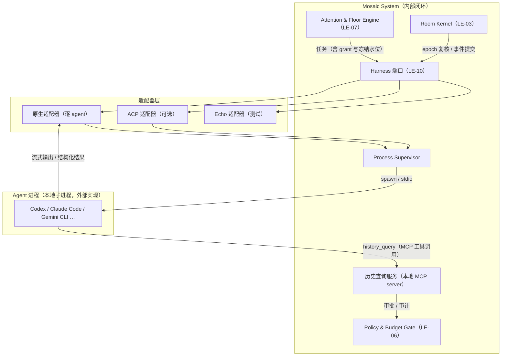

# 特性设计说明书（RFC 提案）：RFC-0002 Agent Protocol——外部 Harness 接入（本地进程 + 适配器模型）

**状态 (Status):** Approved（2026-08-25 项目负责人确认；首轮审校修订 v0.5 后批准）

**作者 (Authors):** Mosaic 项目组 / ZCode

**创建日期 (Created):** 2026-08-25

**更新日期 (Updated):** 2026-08-25

**相关 Issue/PR:** #TBD（RFC 入库时创建 tracking issue）

# 0. 文档控制

| 项目 | 内容 |
|---|---|
| RFC 编号 | 0002 |
| 系列位置 | RFC 序列第 2 篇；主流程关键路径最高优先级（P0） |
| 上游输入 | [架构设计说明书](../2026-08-13-mosaic-architecture-design.md) v0.6 §5.1.2、§6.3、§6.4、§8.2.5、§9.1.5；[RFC-0001](2026-08-25-rfc-0001-room-protocol.md)；[Harness 调研报告](../research/2026-08-25-harness-survey.md) |
| 吸收开放问题 | OQ-03（首批 Harness 接入形态与认证方式 → 本 RFC 裁决建议：本地进程 + 原生适配器为主，ACP 为可选适配器；自用模型 Provider 部分归 Model Gateway ADR）；OQ-08（MCP 是否进 v0.1 → 历史回查通道建议采用本地 MCP server，联动决策） |
| 已决前提 | OQ-20（v0.4）：外部 Harness 自带模型访问；Mosaic 不持有 Provider 凭据、不代理 Agent 发言流量 |
| 下游 | RFC-0003（Intent/Generate 任务语义）、RFC-0007（上下文与历史查询内容面）、RFC-0009（权限审批策略）、[ADR-0006](../adr/ADR-0006-agent-integration.md)、`internal/agent`（LE-10）实现 |

## 0.1 修订记录

| 版本 | 日期 | 修订人 | 说明 |
|---|---|---|---|
| v0.1 | 2026-08-25 | Mosaic 项目组 / ZCode | 初稿：Mosaic 自有集成协议（出站任务回调 + 入站结果 API + 入站长连接） |
| v0.2 | 2026-08-25 | Mosaic 项目组 / ZCode | 重写为 ACP 客户端模型：Mosaic 作为 ACP 客户端经 stdio JSON-RPC 集成 agent 进程 |
| v0.3 | 2026-08-25 | Mosaic 项目组 / ZCode | 按评审修订：确立"Mosaic 自有 Harness 端口 + 适配器抽象"——本地进程原生适配为主要方向，ACP 降为可选适配器；结构化输出契约上移为端口级规范；历史回查通道归适配器实现（推荐本地 MCP server 形态）；grant epoch、进程监督、幂等语义保持不变 |
| v0.4 | 2026-08-25 | Mosaic 项目组 / ZCode | 按调研结论修订：首批适配器定为 Codex / ZCode / Kimi Code CLI（OQ-03 组成部分）；新增 OS 适配要求（Windows 原生 / WSL / macOS）与各家 session / mode / provider / model 配置的 `adapter_options` 收敛；历史回查通道改为双轨（MCP 或结构化工具请求，由适配器按 agent 能力选择）；登记 ZCode headless 缺口风险；上游引用 Harness 调研报告 |
| v0.5 | 2026-08-25 | Mosaic 项目组 / ZCode | 首轮审校修订（P0+P1+明确修订）：接入改为分级晋级（闭环梯队 = echo + native-codex + WSL/Linux 参考 OS，其余逐家以 spike + conformance 门禁晋级，ZCode 缺口不再阻塞主循环）；逻辑 Session 与进程寿命解耦；补 `attention_assessment` 结构化块；历史查询返回脱敏 HistoryItem 视图并绑定任务上下文与多维预算；`unavailable` 定为运维状态不进权威日志；新增 Worker 所有权 lease + fencing；本地进程强制 egress 边界；Profile 改双层管理（宿主登记可执行工件 + 租户选择配置）；DraftUpdate 安全子集；进程树资源与运行版本固定；失败事件语义统一；事实核验更新（app-server 官方 experimental 等） |

# 1. 概述

## 1.1 简介

Agent Protocol 定义 Mosaic 与外部 Agent Harness 的集成抽象，分两层：**端口层**是 Mosaic 自有的域级契约——四类任务、结构化结果、取消、grant epoch、usage 上报，由域层（Attention/Kernel）直接依赖；**适配器层**实现该端口，主要方向是**本地进程原生适配**：按 Agent Profile 以子进程方式（`os/exec`）启动既有 agent（Codex、Claude Code、Gemini CLI 等），逐 agent 对接其 headless/结构化输出模式。ACP（Agent Client Protocol）是可选适配器之一：当 agent 已有现成 ACP 实现时采用，省去原生适配成本。集成方向始终是"Mosaic 调用外部"，系统内部闭环：不发布对外协议、无对外 SDK、不设对外稳定承诺。

## 1.2 动机

目标 Harness 首先是本地 CLI 进程：它们各有成熟的 headless/结构化输出能力，直接以子进程对接是最短路径。v0.2 曾把 ACP 定为唯一协议载体，但这把 Mosaic 的域语义（任务回合、grant epoch、结构化校验）耦合到 ACP 的方法集上：没有 ACP 实现的 agent 反而要多绕一层，ACP 规范演进也会传导进域层。v0.1 初稿的自有回调协议则方向更错（要求外部实现 Mosaic 端点）。修正结论：用适配器模式把"域要什么"（端口）与"agent 怎么接"（适配器）分离——换 agent、增 agent、甚至换集成协议都不动域层；ACP 的价值（会话/流式/权限/取消的现成语义）收纳进它自己的适配器里。架构 8.2.5 标注的"形态待定"由本 RFC 定案。

不做本 RFC 的影响：主流程 Observe/Intent/Floor/Generate/Publish 闭环（MVP 切片 5）无法开工，RFC-0003/0007/0009 的接口面全部悬空。

## 1.3 目标

### 1.3.1 目标

1. 定义 Harness 端口：任务、结构化结果、取消、grant epoch、usage 的端口级契约；
2. 定义适配器抽象：接口、能力声明、注册与选择机制（Profile 指定）；
3. 定义本地进程原生适配的主要形态：进程托管、headless 模式对接、结构化输出解析、取消语义、回合连续性；
4. 定义 ACP 适配器的映射（可选项）；
5. 定义权威历史回查：端口级语义 + 适配器通道（推荐本地 MCP server）；
6. 定义进程监督与资源限额；
7. 对 OQ-03（形态部分）提出裁决建议。

### 1.3.2 非目标

- 对外集成协议与对外 SDK（系统内部闭环，不发布）；
- 以 ACP 为唯一集成协议（v0.2 方案，已修正——ACP 只是适配器之一）；
- 远端/多机 Harness 形态（演进项；安全约束见 3.4.3，引入条件另行评审）；
- Intent 评分、Floor 选择与 reveal 策略（RFC-0003）；
- 上下文组装内容与 Context Receipt 内容面（RFC-0007）；
- 工具泛化与审批策略（RFC-0009；本 RFC 只定义历史查询工具的通道与门禁挂点）；
- Mosaic 自用模型 Provider 选择（OQ-03 后半，归 Model Gateway ADR）；
- Agent 直调 Agent（架构原则 3 永久禁止）。

# 2. 用例分析

| 用例 | 功能点 | 关键指标 | 安全隐私与 DFX 约束 |
|---|---|---|---|
| A-01 意图评估并行（架构 UC-002） | 每个 Agent Participant 一个常驻进程与回合上下文；一轮刺激并行下发 `evaluate_intent` 回合 | 回合下发（进程已就绪）P95 < 1s（不含模型）；并行受 per-agent/tenant semaphore | prompt 只含该 Participant 可见的统一讨论输入（架构 §6.3） |
| A-02 生成与流式草稿 | `generate` 回合；适配器将 agent 流式输出转发为客户端 draft stream；最终输出解析为 PublicDraft | 回合以 stop 语义结束 | draft 是体验态，未提交不成事实（架构 §6.6） |
| A-03 取消与迟到拒绝（架构 UC-004） | 适配器尽力取消（ACP：session/cancel；原生：中断信号升级）；解析结果提交前复核 grant epoch，失配丢弃 | 取消动作发出 < 500ms | 正确性不依赖 agent 响应取消（epoch 兜底） |
| A-04 收束轮评估（架构 UC-006） | `evaluate_closure` 复用回合机制，结构化输出 `conclude / object / abstain` | 复用 A-01 | timeout 为系统状态，永不计为同意（架构 §6.9.5） |
| A-05 agent 进程崩溃/僵死 | supervisor 检测退出或无响应 → Participant 标记 `unavailable`（**运维状态，不进权威日志**，见 3.1.7）→ 本轮用剩余候选继续（AR-008） | 崩溃 → 状态可见 < 5s（model_runs + presence 指标断言） | 按 Profile 退避重启；崩溃不产生发言 |
| A-06 幂等 | task_id 与回合一一对应；适配器重复提交/重复解析去重 | 重放零副作用 | 端口层唯一性约束 |
| A-07 历史回查（架构 §6.3） | agent 经其工具通道（本地 MCP server）或结构化请求发起查询；适配器执行权威查询并回注回合 | 有界查询往返 P95 < 1s | 非干扰契约过滤 + 审批审计 + 计入 Context Receipt |
| A-08 usage 采集 | 端口规范允许结构化自报；各适配器按 agent 能力尽力采集，缺失记 `unknown`，限额退化为轮次/时长维度 | — | 不采集价格、不虚构数值（架构 §9.7） |
| A-09 Agent Profile 注册 | **双层**：宿主管理员登记可执行工件（命令模板 + 二进制摘要固定）；tenant admin 从登记表选择并配置白名单参数（非敏感值 + secret 引用）、能力期望、权限、Model Binding 声明、重启与资源策略 | 注册即静态校验（工件已登记且摘要匹配、参数在白名单内） | 管理动作全审计；Profile 版本化不可变（架构 §3.3.1）；tenant 级不可配置任意 command |
| A-10 同构检测联动（架构 §6.4） | 注册/加入/绑定变更时比对 provider+model 声明 | 创建时同步 | 仅提示不阻止；确认后降级常驻标识 |
| A-11 新适配器接入 | 第三方按适配器接口与能力声明新增原生适配器，域层零改动 | conformance 套件全绿即可注册 | 适配器代码经评审进入 `internal/agent/adapters/` |

# 3. 方案设计

## 3.1 总体方案

### 3.1.1 分层与拓扑



- **端口层（域所有）**：任务、结果、取消、epoch、usage 的契约与生命周期管理，不出现任何 agent 专有概念；
- **适配器层**：实现端口，屏蔽 agent 差异；域层与 Room Protocol（RFC-0001）都不感知适配器内部；
- **agent 进程**：自带 provider 凭据与出网、自带上下文窗口管理与请求级重试（OQ-20、原则 15）；Mosaic 不向进程注入任何自身凭据。

### 3.1.2 Harness 端口（端口级契约）

```text
HarnessPort:
  SubmitTask(task: Task) -> Handle
  Handle.Cancel()                    # 尽力而为，正确性由 epoch 保证
  Handle.Updates() -> Stream[Update] # draft stream 与过程状态
  Handle.Result() -> Result | Stale  # 提交前经 epoch 复核
```

**Task**（域 → 适配器）：`task_id`（幂等键）、`kind ∈ {observe, evaluate_intent, generate, summarize, evaluate_closure}`、`participant/room/thread/epoch`、`grant`（generate 必带：grant_id、rank、reveal_strategy、context_watermark）、`deadline`（宽松期限，Policy 静态值）、`context`（有界统一讨论输入 ≤ 256 KiB + receipt_ref）。

**Result**（适配器 → 域）：结构化输出 + `usage?`（input/output tokens、实际 model）+ stop 语义；`usage` 缺失记 `unknown`，不虚构。

**结构化输出契约（端口级规范）**：适配器必须把 agent 的最终产出规整为符合 JSON Schema 的结构化块——`turn_intent / attention_assessment / public_draft / grounded_summary / closure_intent`（Intent/Draft Schema 随 RFC-0003 定稿）；展示正文（markdown 等）作为 PublicDraft 的展示载体。校验严格：超范围值拒绝而非静默修正（架构 §6.2.1）。`observe` 任务返回轻量 `attention_assessment` 块（`{salience ∈ [0,1], disposition: observe|consider|ignore, note?}`）；适配器可声明不支持 observe，端口降级为 Ack（不阻塞主流程）。

**能力声明**：每个适配器注册时声明 `streaming`、`cancel`（通知式/中断式）、`history_channel`（mcp / structured_request；**生产适配器禁止 `none`**，仅测试适配器允许）、`continuity`（回合连续性支持）、`usage_reporting`；端口按声明降级（如无 streaming 则客户端只显示状态不显示草稿）。

**DraftUpdate 契约（草稿流安全子集）**：`Handle.Updates()` 只广播 DraftUpdate Schema——文本增量与阶段状态枚举（排队/评估/生成中/校验中），广播前过可见性与 DLP/secret scan；**禁止转发原始 tool_call/plan 帧**（过程细节留在适配器内，遵守架构 §6.1.3 公开投影原则：不暴露供应商请求体与隐藏中间态）。

### 3.1.3 本地进程原生适配（主要方向）

- 每个 agent 一个原生适配器（如 `adapters/codex`、`adapters/claude-code`、`adapters/gemini-cli`），以 `os/exec` 启动 Profile 声明的 command，对接该 agent 的 headless/结构化输出模式（一次性或常驻交互模式按 agent 能力选择）；
- prompt 注入：任务类型说明、统一讨论输入、grant 信息、目标输出 Schema 说明；适配器负责把 agent 输出解析为结构化块并校验，解析失败按 Profile 有限重试或记 `generation.failed`；
- **取消**：尽力而为——支持中断的 agent 先发中断信号，超时升级终止进程；连续性依赖 agent 的会话恢复能力（Profile 配置）时，终止即丢失该回合上下文，重建走权威历史回查；
- **回合连续性**：优先使用 agent 原生会话/恢复机制（Profile 声明）；无此能力时每回合独立、上下文由 Mosaic 统一交付（架构 §6.3 的既定分工不受影响）；
- 适配器内部状态（进程句柄、会话映射）不外泄；崩溃由 supervisor 统一处置；
- **首批适配器（v0.5 改为分级晋级，OQ-03 组成部分）**：闭环梯队 = **echo 适配器（常备）+ 一个真实适配器（建议 native-codex，理由：headless 最成熟）+ 一个参考 OS（建议 WSL/Linux，与部署目标一致）**；ZCode、Kimi Code 与 Windows 原生/macOS 为第二梯队，逐家以端到端 spike + conformance 结果晋级——native 与 ACP 通道的选择同样以逐家 spike 证据为准（Kimi/Codex 均有 ACP 路径），不预设"原生优先"结论；ZCode headless 缺口解除前**不阻塞主循环**（该 Participant 能力降级可见）。各家能力现状与缺口见调研报告矩阵；
- **OS 适配**：支持矩阵覆盖 Windows 原生、WSL、macOS 三形态。沙箱机制差异（Codex 在 Linux/WSL 走 Landlock/seccomp、Windows 原生走受限进程令牌）、shell 与路径语义、进程信号语义（POSIX 信号 vs Windows 控制台事件/强制终止）由适配器与 supervisor 的 per-OS 策略吸收，端口契约不变；WSL 作为独立目标对待（文件系统边界与网络命名空间不同于 Windows 原生）；
- **各家配置的收敛**：session 句柄的获取与传递（resume 标志 / 会话映射文件 / rollout 文件）、mode 映射（审批×沙箱模式组合）、provider/model 传递（配置文件 vs CLI 标志 vs 环境变量）统一收敛进 Profile 的 `adapter_options`（允许 per-OS 覆盖），适配器负责翻译，域层不感知；
- **supervisor 通用规约（调研陷阱吸收）**：取消升级前优先走 agent 的优雅退出路径（Kimi 的会话映射在异常退出时会破坏）；子进程 stdin 管理要有明确规约（Claude 类 agent 在 stdin 未关闭时会挂起）。

### 3.1.4 ACP 适配器（可选）

当 agent 已有 ACP 实现时，用 ACP 适配器替代原生适配器，映射关系为适配器内部细节：

| ACP 方法 | 方向 | 适配器用途 |
|---|---|---|
| `initialize` | Mosaic → agent | 握手与能力协商 |
| `session/new` | Mosaic → agent | 为 Participant 建立会话（注入角色与目标） |
| `session/prompt` | Mosaic → agent | 承载任务回合；以 stop reason 结束 |
| `session/cancel` | Mosaic → agent（通知） | 取消在途回合 |
| `session/update` | agent → Mosaic（通知） | message chunk / tool_call / plan → draft stream |
| `session/request_permission` | agent → Mosaic | 权限请求 → Policy Gate |
| `fs/read_text_file` 等 | agent → Mosaic（可选） | 默认拒绝，按 Profile 白名单开放 |

结构化输出从 agent 回复中的结构化块提取（ACP 以 markdown 为可读默认，适配器约定块格式并校验）。ACP 的会话语义天然提供 `continuity` 与通知式 `cancel` 能力。

### 3.1.5 权威历史回查

端口级语义：按 Thread/epoch、视图游标窗、事件 ID、关系链、claim 谱系查询；可见性过滤（主体非干扰契约）；审批审计；计入 Context Receipt；每回合查询上限（默认 3）。**通道双轨，由适配器按 agent 能力选择**——两种通道都需要上下文注入，取舍标准是"对该 agent 哪个更好用"：

- **本地 MCP server**：Mosaic 为 agent 进程注入本地 MCP server（stdio），暴露 `history_query` 工具。Codex、Kimi Code、Claude Code、Gemini CLI 均具备 MCP client 能力，配置一次即得统一查询面。与 OQ-08 联动：若采纳，MCP 以"自用工具通道"身份进入 v0.1，外部 MCP 工具仍延后；
- **结构化工具请求**：agent 在输出中以 `history_query` 结构化块发起，适配器解析后以追加输入回注（ACP 适配器即用此映射）。无需 agent 侧任何配置，适合 MCP 不可用或配置受限的场景。

**通道授权绑定**：MCP 通道的访问凭据绑定 `(tenant, participant, task_id, epoch, 视图游标上限, deadline)`，任务结束（提交/过期/取消）即撤销——agent 无法跨任务、跨轮次或越过冻结水位查询。

**HistoryItem 视图（P1 修订）**：两通道的返回物都不是 Room Envelope 原文（权威信封是内部形态，见 RFC-0001 对外视图信封），而是独立的脱敏视图 DTO：

```json
{"item_id": "<opaque>", "author": "par_...", "kind": "message.posted",
 "body": "...（可见性过滤后）", "occurred_at": "...",
 "reply_to": "<opaque>", "relations": [{"kind": "challenges", "target": "<opaque>"}],
 "thread_ref": "<opaque>"}
```

**查询预算（多维）**：分页（默认 ≤ 200 条/页）、响应字节（默认 ≤ 1 MiB）、图遍历深度（默认 ≤ 4）、节点数（默认 ≤ 500）、执行时间（默认 ≤ 2s）、并发（每 agent 同时 1 个查询）——超限截断并附 `truncated` 标记，不静默。

适配器在能力声明中登记所选择的 `history_channel`；两种通道共用同一查询语义、HistoryItem 视图与安全约束，切换不影响端口契约。

### 3.1.6 grant epoch 与迟到拒绝

FloorGrant 绑定 `(room, thread, round, participant)` 与冻结水位随 generate 回合下发；适配器在向 Room Kernel 提交结果前复核：幂等 → fencing 有效 → grant 未撤销 → Room 未暂停 → Thread 可写 → epoch 匹配 → Schema 通过；任一失败即丢弃——**不发布任何正文类事件**，但允许提交状态事件（`generation.failed` 等 Agent execution 族）以保证失败可见（修订 #15，统一原表述）。取消（无论通知式还是中断式）是资源节约手段；正确性永远由 epoch 保证。

### 3.1.7 进程生命周期与监督

- Agent Profile 声明：`adapter`（类型 + 适配器参数）、可执行工件引用（宿主登记表，见 A-09）、能力期望、权限白名单、Model Binding（声明性）、重启策略、资源限额（进程树级 CPU/内存/PID/句柄/IO/日志输出上限 + 重启预算）；
- **逻辑 Session 与进程寿命解耦（P1 修订）**：Session 是持久化的逻辑对象（Participant × Room），进程寿命由适配器能力决定——常驻型（Codex/ACP 类）复用进程，回合型每回合冷启、上下文经权威历史回查重建；主循环只依赖逻辑 Session 的存续；
- **Worker 所有权与 fencing（P1 修订）**：每个逻辑 Session 的驱动权由 PG lease 持有；任务下发与结果提交携带 fencing token，失租 worker 的提交被拒（与 grant epoch 同路校验），杜绝多 worker 重复启动/重复提交；
- **运行版本固定（修订 #14）**：Profile 与 model_runs 记录并固定 adapter 版本、CLI 版本、输出协议版本与二进制摘要，结果可归因到确切工件；
- supervisor 负责 spawn、initialize 握手、健康检查、崩溃退避重启（受重启预算约束）、优雅退出；进程状态变化写 model_runs 并映射为 Participant 运行时状态；
- `unavailable` 是**运维状态**（model_runs + presence 投影），不写入 Room Event Log——可回放的权威日志不承载进程噪声；验收以指标断言（A-05）。

### 3.1.8 OQ-03 裁决建议（待评审确认）

> **建议**：主流程接入方向 = **本地 agent 进程 + 适配器抽象**，闭环梯队 = echo + 一个真实适配器（建议 native-codex）+ 一个参考 OS（建议 WSL/Linux）；其余适配器与 OS 分级晋级，通道（native vs ACP）以逐家端到端 spike + conformance 证据选择，不预设结论。ACP 适配器为可选项（Kimi Code 已具备 ACP；ACP 参考实现为 Gemini CLI）；echo 适配器常备用于 conformance。"认证"由进程信任边界替代——可执行工件由宿主管理员登记（摘要固定），Profile 注册是管理动作（审计 + 校验），agent 进程与 Mosaic 同宿主部署。远端/多机形态为演进项（届时才有网络认证与 SSRF 问题）。自用模型 Provider 归 Model Gateway ADR。

## 3.2 技术选型

| 决策点 | 选择 | 放弃方案与原因 |
|---|---|---|
| 端口归属 | Mosaic 自有端口（任务/结构化结果/epoch 为域语义） | **唯 ACP（v0.2 方案，修正）**：域语义耦合 ACP 方法集，无 ACP 实现的 agent 多绕一层，ACP 演进传导进域层；**自有对外协议（v0.1 初稿，作废）**：要求外部实现 Mosaic 端点，方向相反 |
| 主要适配方式 | 逐 agent 适配：原生（headless/结构化模式）为默认工作假设，native vs ACP 以逐家端到端 spike + conformance 证据选择 | 仅靠 ACP：不是所有目标 agent 都有现成 ACP agent；通用 CLI 包装（无协议）：无流式/取消/权限语义，且与原生适配相比无增益 |
| 历史回查通道 | 双轨：本地 MCP server 或结构化工具请求（适配器按 agent 能力选择，返回统一的 HistoryItem 视图） | HTTP 查询 API（v0.1 初稿）：本地进程场景凭空多开网络面 |
| 进程模型 | 每 Participant 一个常驻 agent 进程 + supervisor | 每任务临时进程：冷启动与上下文重建成本高；单进程多 Participant：隔离差、崩溃半径大 |
| ACP / MCP / A2A 分工 | ACP=可选适配器；MCP=agent 工具生态 + 历史回查通道；A2A 不用 | A2A 解决 agent 间直连，与架构原则 3 冲突 |

## 3.3 功能与性能设计

- **Agent Profile Schema**（核心字段）：`adapter`（native-codex / native-zcode / native-kimi-code / acp / echo + 适配器参数，清单可扩展）、`executable_ref`（宿主登记表工件引用 + 摘要，**不再接受任意 command/args/env**）、`adapter_options`（session / mode / provider / model / 沙箱参数的适配器翻译，允许 per-OS 覆盖）、`capabilities_expected`、`permission_allowlist`、`model_binding`、`restart_policy`、`resource_limits`（进程树级）；
- **首批适配器能力速览**：headless / 会话恢复 / MCP / OS 现状与缺口见调研报告矩阵（含分级晋级状态）；
- **代码组织建议**：`internal/agent/`（端口与 supervisor）+ `internal/agent/adapters/<name>/`（逐适配器），适配器不得被域层直接 import（CI 依赖检查）；
- **性能目标**（建议值，压测后批准）：

| 指标 | 目标 |
|---|---|
| 回合下发（进程已就绪）P95 | < 1s（不含模型生成） |
| 冷启动（spawn → 就绪）P95 | < 10s |
| 取消动作发出 | < 500ms |
| 历史回查往返 P95 | < 1s |
| 崩溃 → 状态可见（model_runs + presence） | < 5s |

- **影响范围**：`internal/agent`（端口、supervisor、适配器）、`internal/policy`（权限门禁联动）、本地 MCP server 组件、`model_runs` 表、CI conformance 门禁。

## 3.4 安全隐私与 DFX 设计

### 3.4.1 进程与权限

- **最小权限与子进程环境（修订 #12/#13）**：agent 进程以独立运行账户与受限工作目录运行；**子进程环境从空环境按 allowlist 构造**（不继承 Mosaic 服务环境），Profile 只存非敏感值与 secret 引用；Mosaic 不注入任何自身凭据（OQ-20）；资源限额覆盖**完整进程树**（CPU/内存/PID/句柄/IO/日志输出上限 + 重启预算），部署层实施（cgroups/容器，归部署 ADR）；
- **权限治理双层**：进程配置层——Profile 设定各 agent 自身的权限模式/审批标志/沙箱参数（各 CLI 均有对应机制）；工具层——Mosaic 提供的工具（history_query）经 MCP server 的审批门禁与审计，ACP 适配器的 `request_permission` 映射到同一 Policy Gate（RFC-0009 对齐）；
- **不可信输出**：agent 的一切输出（结构化块、正文、usage 自报）按不可信输入处理：Schema 校验、注入防护、DLP（架构 §9.1.7）；历史查询返回的讨论内容对 agent 亦带不可信标记，防上下文内注入。

### 3.4.2 可靠性与可观测性

- 崩溃/僵死 → `unavailable`，故障隔离（AR-008）；supervisor 退避重启，重启不产生发言；
- task/回合生命周期全量写 model_runs（task_id、run_id、适配器、stop 语义、usage 或 unknown、实际 model），OTel trace 贯穿；
- usage 缺失时 token 维度限额自动退化为轮次/时长/发言数（架构 §9.7），显式记 `unknown`。

### 3.4.3 出网边界与 SSRF（P1 修订）

本地 stdio 形态**消除的是出站回调面，不消除出网面**：不可信子进程仍可直接访问私网、云元数据与任意外部端点。因此：

- **生产部署强制 egress 边界**：agent 进程的网络出口经 OS 级网络策略或本地 egress 代理的 allowlist（默认仅放行其声明 Provider 域与必要依赖域）——部署 ADR 强制项，缺失时启动告警；
- 开发环境可放宽，但默认输出告警并可一键收紧；
- 远端形态演进项另启用 SSRF 六条约束（HTTPS-only、URL 规范化、双阶段 DNS/IP 校验、私网/保留地址与端口拒绝、禁重定向、受控 egress proxy）并 fixture 化进 CI。

## 3.5 编程与调用设计

### 3.5.1 编程模型基本设计

- **开发环境**：接入使用者编写 Agent Profile（选适配器 + 配 command），不写代码；适配器开发者按适配器接口与能力声明实现，域层零改动；
- **开发约束**：适配器不得泄露 agent 专有概念到端口；结构化输出必须过 Schema 校验；不得假设 agent 响应取消；
- **可验收设计**：conformance 三件套进 CI——echo 适配器（正确回环）、chaos 适配器（迟到/畸形结构化块/崩溃/取消场景）、结构化输出 fixture 集（TurnIntent / AttentionAssessment / PublicDraft / GroundedSummary / ClosureIntent 正反用例）；新适配器注册前必须全绿。

### 3.5.2 接口定义与设计

#### HarnessPort（Mosaic 内部端口）

接口描述：Attention/Kernel 与 agent 集成层之间的唯一边界；对上层屏蔽一切适配器细节。

接口原型：见 3.1.2。

输入/输出参数（Task）：

| 参数名称 | 输入/输出 | 类型 | 描述 | 取值范围 |
| --- | --- | --- | --- | --- |
| task_id | 输入 | string | 幂等键 | UUIDv7 |
| kind | 输入 | string | 任务类型 | observe / evaluate_intent / generate / summarize / evaluate_closure |
| participant_id / room_id / thread_id / epoch | 输入 | string | 归属与纪元 | — |
| grant | 输入 | object? | generate 必带：grant_id、rank、reveal_strategy、context_watermark | — |
| deadline | 输入 | string | 宽松期限（Policy 静态值） | RFC 3339 |
| context | 输入 | object | 有界统一讨论输入 + receipt_ref | ≤ 256 KiB |

返回参数：

| 参数名称 | 类型 | 描述 | 取值范围 |
| --- | --- | --- | --- |
| Result | object | 结构化块 + usage? + stop 语义 | 通过 Schema 校验 |
| Stale | 错误信号 | epoch 失配/已取消，结果被丢弃 | 不产生事件 |

- 异常处理：解析失败按 Profile 有限重试；进程崩溃转 A-05。
- 约束说明：deadline 到期 Mosaic 侧进入 `expired`，不等 agent。
- 变更说明：v0.3 起为适配器无关的端口规范。
- 调用参考代码：`handle := harness.SubmitTask(task); for u := range handle.Updates() { broadcast(u) }; res := handle.Result()`。

#### Adapter（适配器接口）

接口描述：适配器实现者面对的契约；注册时附能力声明。

接口原型：`Boot(profile) -> Session`、`Session.Run(task) -> AdapterHandle`（`AdapterHandle.Updates() -> Stream[DraftUpdate]`、`AdapterHandle.Result() -> Result | Stale`）、`Session.Cancel(task_id)`、`Capabilities() -> Decl`（streaming / cancel 方式 / history_channel / continuity / usage_reporting / observe）。

输入/输出参数：

| 参数名称 | 输入/输出 | 类型 | 描述 | 取值范围 |
| --- | --- | --- | --- | --- |
| profile | 输入 | object | Agent Profile（adapter 参数 + command 等） | 3.3 Schema |
| Result | 输出 | object | 端口级结构化块 | 见 HarnessPort |
| Decl | 输出 | object | 能力声明 | 枚举集合 |

- 异常处理：Boot 失败 → 注册校验或运行时报错，不产生发言。
- 约束说明：适配器内部可自由使用 agent 原生机制，但端口两侧的数据必须符合契约。
- 变更说明：首版（v0.3）。
- 调用参考代码：（接口，由 `internal/agent/adapters/*` 实现）。

#### 结构化输出契约（端口级规范）

接口描述：所有适配器必须产出的协议载体；agent 原生输出格式由各适配器自行解析规整。

接口原型：`{"block": "<kind>", "usage": {...}?, "data": {...}}`

| 参数名称 | 输入/输出 | 类型 | 描述 | 取值范围 |
| --- | --- | --- | --- | --- |
| block | — | string | turn_intent / attention_assessment / public_draft / grounded_summary / closure_intent | 枚举 |
| usage | — | object? | 自报用量与实际模型；缺失记 unknown | — |
| data | — | object | 按 block 对应 JSON Schema 严格校验 | — |

- 异常处理：校验失败拒绝而非修正；重试上限后记 `generation.failed`。
- 变更说明：v0.2 定义于 ACP 结构化块，v0.3 上移为端口级规范。
- 调用参考代码：（适配器内部规整逻辑）。

#### history_query（本地 MCP server 工具）

接口描述：历史回查通道之一；Mosaic 为每个 agent 进程注入的本地 MCP server 暴露的只读工具，凭据绑定任务上下文（3.1.5），任务结束即撤销。

接口原型：MCP tool `history_query`

| 参数名称 | 输入/输出 | 类型 | 描述 | 取值范围 |
| --- | --- | --- | --- | --- |
| thread_ref / epoch | 输入 | string | 定界（opaque 引用） | — |
| from_cursor / to_cursor | 输入 | string? | 视图游标窗（服务端签发） | opaque |
| item_ids | 输入 | array? | 批量取条目 | ≤ 200 |
| traverse | 输入 | string? | reply_to / relations / claim_lineage（flag） | 枚举，深度 ≤ 4 |
| items | 输出 | array[HistoryItem] | 可见性过滤后的脱敏视图（3.1.5） | ≤ 200 条 / 1 MiB / 2s |

- 异常处理：越权维度自动收敛为可见子集，不报错不泄露；超预算截断并附 `truncated`；超每回合查询上限拒绝并提示。
- 约束说明：每次调用经审批门禁与审计，计入 Context Receipt；响应满足主体非干扰契约。
- 变更说明：v0.5 改为 HistoryItem 视图 + 任务级凭据绑定 + 多维预算。
- 调用参考代码：（agent 侧经其 MCP client 调用）。

#### RegisterExecutable / RegisterAgentProfile（管理侧，双层）

接口描述：**宿主层**登记可执行工件（命令模板 + 二进制摘要固定，防"任意 command 即宿主代码执行"）；**租户层**从登记表选择工件并配置 Profile（版本化不可变快照）。

接口原型：`POST /admin/v1/executables`（宿主）；`POST /admin/v1/agent-profiles`（租户）

| 参数名称 | 输入/输出 | 类型 | 描述 | 取值范围 |
| --- | --- | --- | --- | --- |
| command_template + digest | 输入（宿主） | body | 可执行工件与二进制摘要 | 登记后摘要固定 |
| executable_ref | 输入（租户） | body | 引用已登记工件 | 注册表内 |
| adapter / adapter_options | 输入（租户） | body | 适配器与翻译参数（白名单内） | — |
| permission_allowlist / capabilities_expected / restart_policy / resource_limits | 输入（租户） | body | 见 3.3 | — |
| model_binding | 输入（租户） | body | 声明性绑定（同构检测输入） | — |
| profile_id + version | 输出 | — | 不可变版本 | — |

- 异常处理：工件未登记、摘要不匹配或参数越白名单拒绝注册。
- 约束说明：宿主层=部署管理员；租户层=tenant admin（RFC-0008）；全量审计。
- 变更说明：v0.5 由单层改为双层（P1 修订）。
- 调用参考代码：管理 CLI / 控制台。

### 3.5.3 编程手册设计

两份手册：《Agent Profile 配置指南》（选择适配器与 agent、权限白名单、资源与重启策略、本地 echo 调试）与《适配器开发指南》（接口与能力声明、结构化输出解析规范、取消与连续性处理、conformance 要求）。无对外 SDK 手册。

# 4. 缺点和风险

| 风险 | 影响 | 应对 |
|---|---|---|
| ZCode 暂缺公开 headless/JSON 输出模式（官方反馈渠道已有需求追踪） | 首批适配器之一受阻 | 内部推动需求落地；过渡方案：ACP 适配（若 ZCode 提供 ACP agent）或受限集成（hooks/单轮包装）；缺口解除前该 Participant 能力降级可见 |
| 逐 agent 原生适配的维护成本（N 个适配器） | 适配层代码量与升级跟进 | 适配器接口最小化 + 共享工具库（进程管理、输出解析）；优先适配首批清单；ACP 适配器覆盖有 ACP 实现的 agent |
| agent 原生输出解析脆弱（格式漂移、非结构化输出） | 主流程闭环失败率上升 | 优先使用各 agent 的结构化输出模式；Schema 严格校验 + 有限重试 + 失败可见；fixture 度量失败率并设阈值告警 |
| 各 agent 能力参差（取消、连续性、流式、usage） | 端口语义降级路径复杂 | 能力声明 + 端口按声明降级；降级必须产生可见状态，不静默 |
| ACP 规范演进 | 仅影响 ACP 适配器 | 耦合面已收敛在单适配器内；钉定版本 + 能力协商 |
| agent 进程运维（僵死、内存、句柄泄漏） | 宿主资源风险、回合悬挂 | supervisor 健康检查 + 宽松期限兜底 + 限额与退避重启；部署级沙箱 |
| usage 不可得 | token 维度限额失真 | 结构化自报为可选项；缺失显式 unknown，限额退化为轮次/时长，不虚构 |
| agent 进程权限面 | 越权读写宿主 | Profile 权限模式 + 沙箱参数；Mosaic 提供的工具全经审批审计 |
| prompt injection 经讨论上下文进入 agent | 泄漏、诱导工具滥用 | 不可信内容标记、最小上下文、权限门禁（架构 §9.1.3.1） |
| 多机部署演进成本 | 远端形态引入协议与安全面 | 演进项独立评审：届时启用网络形态 + SSRF 六条约束 + egress proxy 归属 |

# 5. 现有技术

| 参考 | 借鉴 | 差异 |
|---|---|---|
| ACP（Zed / JetBrains） | 会话/流式/权限/取消现成语义，作为可选适配器采纳 | Mosaic 的回合是 Floor 仲裁产物，比编辑器场景多 grant epoch、结构化校验与预算熔断层；且不是所有目标 agent 都有 ACP 实现 |
| MCP | agent 侧工具生态标准；Mosaic 以本地 MCP server 提供历史回查通道 | 互补分工：MCP 面向 agent↔工具；端口面向域↔agent |
| 各 agent 的 headless/结构化输出模式 | 原生适配的直接对接面（流式输出、JSON 事件、会话恢复能力） | 输出语义各家不同，由适配器归整为统一结构化块 |
| Zed 编辑器 | ACP 客户端先例：子进程托管与权限 UX | Mosaic 无交互编辑面；权限审批走房间审批事件 |
| Slack / Telegram Bot webhook 模式（v0.1 初稿同构） | 出站回调 + 幂等重试的成熟实践 | 已弃用方向：本系统是调用方，集成标准 agent，而非要求对方实现回调 |

# 6. 未解决问题

1. **闭环梯队终裁（OQ-03 组成部分）**：首个真实适配器（建议 native-codex：headless 最成熟）与参考 OS（建议 WSL/Linux：与部署目标一致）确认；后续晋级顺序（ZCode、Kimi Code；Windows 原生、macOS）与各梯队通过标准。
2. 各家通道选择（native vs ACP）的 spike 计划与通过标准（与 conformance 同门禁；Kimi/Codex 均有 ACP 路径可选）。
3. ZCode headless 缺口的解除路径与时间点（内部推动；过渡方案见风险表）；适配器详细设计前复访调研报告缺口清单。
4. 取消的进程级语义：中断信号升级的等待窗口，与"终止进程即丢会话上下文"的权衡（结合各 agent 会话恢复能力；Windows 形态的信号语义单独处理）。
5. usage 采集路径：结构化自报定为 Profile 必选还是可选（当前建议：可选 + 默认退化）。
6. 结构化输出失败的重试次数、退避与降级路径（与 RFC-0003 的 intent 重试策略联动）。
7. 进程沙箱与 **egress 边界实现**（cgroups / 容器 / OS 网络策略 / 本地 egress 代理）——部署 ADR 强制项（3.4.3）。
8. 远端/多机形态的触发条件与协议选型（ACP 网络形态成熟度，或届时启用 v0.1 初稿回调模型 + SSRF 六条约束）。
9. Codex `app-server`：已有官方文档但 WebSocket 等能力标注 **experimental、不支持生产负载**——作为候选通道持续观察，生产路径不依赖。
10. Kimi 非交互模式默认**自动权限策略**：Profile 的审批模式不能直接映射，适配器必须显式做权限参数映射并进入实测门禁。

# 7. 附录

## 7.1 参考资料

- 架构设计说明书 v0.6：§5.1.2 外部接口、§6.3 上下文职责划分、§6.4 Agent Runtime 与异构模型适配、§6.7 工具与 Artifact、§8.2.5 接口实现机制、§9.1.5 SSRF 策略
- [RFC-0001 Room Protocol](2026-08-25-rfc-0001-room-protocol.md)
- [Harness 调研报告（本仓库）](../research/2026-08-25-harness-survey.md)
- [ACP Introduction](https://agentclientprotocol.com/get-started/introduction)、[ACP Protocol Specification](https://agentclientprotocol.com/protocol/)、[ACP 可用 Agent 清单](https://agentclientprotocol.com/get-started/agents)
- [Model Context Protocol](https://modelcontextprotocol.io/)
- [Zed — Agent Client Protocol](https://zed.dev/acp)
- Codex：[Non-interactive mode](https://learn.chatgpt.com/docs/non-interactive-mode)、[Configuration Reference](https://learn.chatgpt.com/docs/config-file/config-reference)、[Windows sandbox](https://learn.chatgpt.com/docs/windows/windows-sandbox)
- ZCode：[官方文档](https://zcode.z.ai/cn/docs/welcome)、[feedback #29 非交互模式请求](https://github.com/zai-org/feedback/issues/29)
- Kimi Code：[GitHub](https://github.com/MoonshotAI/kimi-code)、[kimi 命令参考](https://www.kimi.com/code/docs/en/kimi-code-cli/reference/kimi-command.html)、[Changelog](https://www.kimi.com/code/docs/en/kimi-code-cli/release-notes/changelog.html)

## 7.2 术语表

| 术语 | 英文 | 含义 |
|---|---|---|
| Harness 端口 | Harness Port | Mosaic 域层依赖的集成契约：任务、结构化结果、取消、epoch、usage |
| 适配器 | Adapter | 端口的实现方；屏蔽具体 agent 的对接差异 |
| 原生适配 | Native Adaptation | 以子进程直接对接 agent 自身 headless/结构化模式的适配方式（主要方向） |
| ACP | Agent Client Protocol | Zed/JetBrains 维护的客户端↔agent 开放协议；本设计中为可选适配器 |
| 结构化块 | Structured Block | 端口级规范的结果载体，按 JSON Schema 严格校验 |
| 回合 | Turn | 一次任务下发及其以 stop 语义结束的完整交互 |
| 授权轮次 | Grant Epoch | FloorGrant 的时代编号；epoch 失配的结果被拒绝发布 |
| 宽松期限 | Loose Deadline | Policy 静态配置的 round/grant 期限，仅维持协议推进 |
| 监督器 | Supervisor | 负责 agent 进程生命周期管理的组件 |
| 历史回查 | History Query | agent 经工具通道发起、Mosaic 过滤审批后回注的权威历史查询 |

## 7.3 文档更新计划

- 评审期（Draft → Reviewing）：重点收敛未解决问题 1–4 与结构化输出契约细节；
- Accepted 后：`api/room-protocol` 增加结构化块 Schema；启动 `internal/agent` 端口、supervisor、首个原生适配器与 conformance 套件工程；架构文档 v0.7 同步修订 8.2.5 的 IF-AGENT-PROTOCOL 行（形态定为"本地进程 + 适配器，ACP 可选"）；
- 后续：RFC-0003/0007/0009 落地时扩展任务 kind 与查询维度，新适配器登记进 Profile 注册表，同步修订本 RFC。
