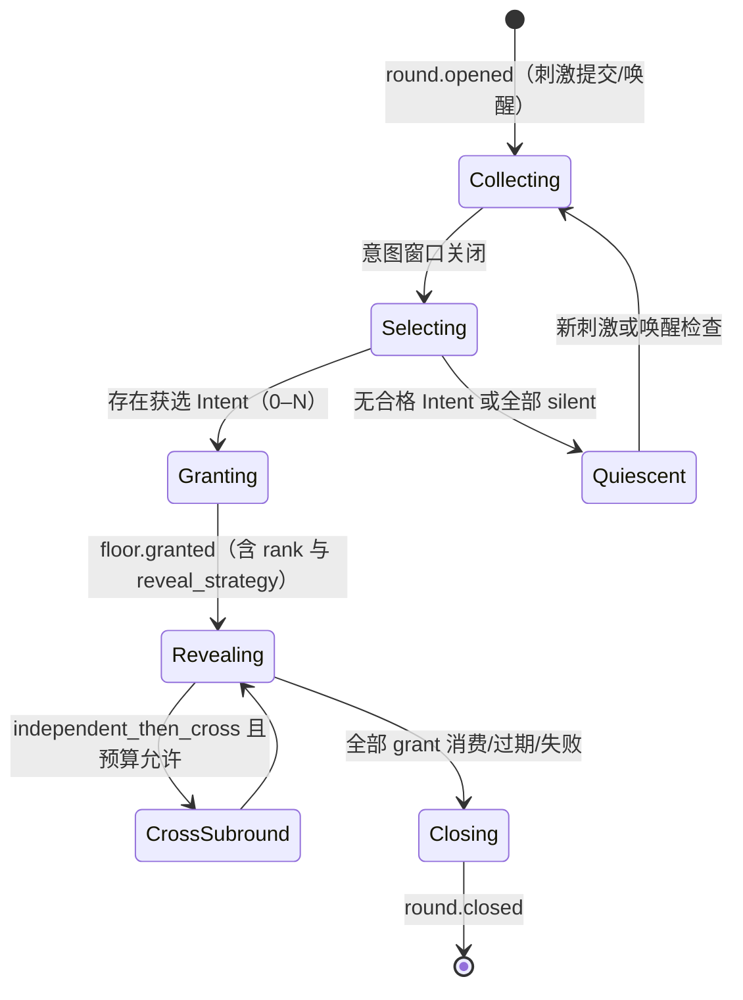

# 特性设计说明书（RFC 提案）：RFC-0003 Attention 与 Floor 仲裁

**状态 (Status):** Draft

**作者 (Authors):** Mosaic 项目组 / ZCode

**创建日期 (Created):** 2026-08-25

**更新日期 (Updated):** 2026-08-25

**相关 Issue/PR:** #TBD（RFC 入库时创建 tracking issue）

# 0. 文档控制

| 项目 | 内容 |
|---|---|
| RFC 编号 | 0003 |
| 系列位置 | RFC 序列第 3 篇；主流程闭环（Observe→Intent→Floor→Generate→Publish）的行为核心 |
| 上游输入 | [架构设计说明书](../2026-08-13-mosaic-architecture-design.md) v0.7 §2.6、§6.2、§6.8、§6.9.3、§6.9.4、§9.7；[RFC-0001](2026-08-25-rfc-0001-room-protocol.md)（Attention 事件族与命令契约）；[RFC-0002](2026-08-25-rfc-0002-agent-protocol.md)（evaluate_intent / generate 任务、结构化块、grant epoch、usage 自报） |
| 吸收开放问题 | OQ-04（初始权重与公开粒度）、OQ-15（frontier slot 与 dyad share 阈值校准）——本 RFC 提出裁决建议 |
| 已决背景 | OQ-17（人类保送 + 记分卡透明）、OQ-18（漂移重聚焦窗口）、OQ-19（宽松静态时限、超时/重试归 Harness）、OQ-20（Harness 自带模型访问） |
| 下游 | RFC-0005（收束轮复用本 RFC 的 round/Floor 机制）、RFC-0006（结构特征供给方）、RFC-0011（评测口径）、`internal/attention`（LE-07）实现 |

## 0.1 修订记录

| 版本 | 日期 | 修订人 | 说明 |
|---|---|---|---|
| v0.1 | 2026-08-25 | Mosaic 项目组 / ZCode | 初稿：Round 生命周期、TurnIntent Schema v1、候选过滤与预算 admission、记分卡与 MMR 选择、公平机制默认值、五种模式参数、揭示策略与 cross 子轮、定向交锋通道、Attention 事件族 payload、OQ-04/15 裁决建议 |

# 1. 概述

## 1.1 简介

Attention 与 Floor 是 Control Plane 的核心：决定"下一步允许发生什么、谁有机会说、按什么顺序揭示"。核心循环为：刺激提交 → 候选发现 → 并行 Intent 评估 → 确定性资格与预算 admission → 透明记分卡评分 → MMR 式多样性选择 → FloorGrant 签发 → 揭示策略执行 → 有界生成 → 验证发布 → 下一轮或静默。本 RFC 把该循环的每一环定义为可评审契约：TurnIntent Schema、Attention 事件族 payload、模式参数集、记分卡与公平机制的默认值、预算 admission 语义。仲裁只分配发言机会与节奏，不裁定观点真伪（架构原则 4）；全部选择逻辑由确定性代码执行，模型自报分数只是输入（原则 5）。

## 1.2 动机

架构 v0.7 §6.2 已给出机制骨架，但未成契约：TurnIntent 字段散落在正文示例中、Attention 事件族（T1）的 payload 语义未定义、五种模式只有定性描述、权重与公平阈值无默认值（OQ-04/15 未决）、预算 admission 的公平预留只写了原则。RFC-0002 已定义 `evaluate_intent` / `generate` 任务与 `turn_intent` 结构化块，其**内容语义**必须由本 RFC 定稿，否则适配器无法实现、主流程闭环（MVP 切片 4/5）无法开工。此外，11.3 适应度函数中的多条约束（预算不参与排序、保送可追溯、静态时限）需要本 RFC 给出可测试的落地形态。

## 1.3 目标

### 1.3.1 目标

1. 定义 Round 生命周期与状态机（含 cross 子轮）；
2. 定义 TurnIntent Schema v1 与校验规则（RFC-0002 结构化块的内容规范）；
3. 定义候选发现、硬资格过滤与预算 admission（含对称 token 预留与熔断梯度）；
4. 定义记分卡：公式、默认权重、分数区间（band）公开粒度、MMR 选择；
5. 定义公平与多样性机制的默认值（floor share 退避、exploration debt、dyad share、frontier slot、centrality 衰减、人类保送、silent）；
6. 定义五种房间模式的参数集与默认值；
7. 定义三种揭示策略与 cross 子轮原语的统一语义（Roundtable rebuttals 为其参数化）；
8. 定义定向交锋快速通道（slot 数学、交锋链、上限）；
9. 定义 Attention 事件族 payload（round.opened / intent.recorded / intent.endorsed / floor.granted / floor.revoked / round.closed）；
10. 对 OQ-04、OQ-15 提出裁决建议。

### 1.3.2 非目标

- 收束轮的语义（conclude/object/abstain 的合格性、Capsule 构造）——RFC-0005，仅复用本 RFC 的 round/Floor 机制；
- Thread 生命周期与 typed relations 校验——RFC-0004；
- 结构特征（cluster/bridge/revisit/漂移签名）的计算——RFC-0006，本 RFC 只是消费方并定义降级路径；
- 上下文组装内容与 Context Receipt——RFC-0007；
- 预算的租户级配置面与计费语义——架构 §9.7 已定（无费用维度），本 RFC 只定义 admission 行为；
- 模型调用与超时重试——RFC-0002（原则 15）。

# 2. 用例分析

| 用例 | 功能点 | 关键指标 | 安全隐私与 DFX 约束 |
|---|---|---|---|
| R-01 普通消息触发自主讨论（架构 UC-002） | 刺激提交开轮；候选 Agent 并行 evaluate_intent；评分选择 0–N；按 reveal 发布 | 刺激提交 → round.opened P95 < 200ms；窗口关闭 → floor.granted P95 < 1s | Intent 全记录；公开发言数遵守模式上限（AR-002） |
| R-02 点名与定向交锋（架构 UC-003、§6.2.6） | 被点名者获定向 slot 与优先资格；A→B→A 链以缩短窗口连续进行 | 链内意图窗口为常规的 2/3 | 定向 slot 受上限与 dyad share 约束，防二人捕获 |
| R-03 人类打断与撤销（架构 UC-004） | pause/cancel 提升优先级；撤销未消费 grant；迟到结果被 epoch 拒绝 | revoke 生效 < 500ms（AR-004） | 在途生成取消尽力而为，正确性由 epoch 保证 |
| R-04 人类保送（OQ-17 已决） | 对已记录 Intent 写 `intent.endorsed`，直接授予 Floor 或加权 | 保送 → grant < 1s | 不绕过预算/硬资格/安全；可追溯到具名人类 actor（11.3） |
| R-05 预算 admission 与公平预留（§6.2.2/§9.7） | 评分前按模式最大 speaker 预留对称 token；70/90/100% 提示/降级/硬停 | 预留计算不阻塞评分路径（< 10ms） | 预算只作 admission 不进排序；不得 Floor 后替换已获选者 |
| R-06 多获选者揭示（§6.2.5） | sequential / simultaneous / independent_then_cross 三策略；cross 子轮受预算约束 | simultaneous 冻结水位一致性可验证 | 必须记录 reveal_strategy、冻结水位与子轮关系 |
| R-07 迟到 Intent 滚入（§6.2.3） | 窗口后到达的 Intent 原样滚入下一轮评分 | 无额外惩罚延迟 | 慢速模型不被系统性排除（防资源策略偏向快模型） |
| R-08 记分卡查询（OQ-17 已决） | 未获选 Intent 的分数区间、类型与理由对成员可查 | 查询走读投影，P95 < 500ms | 只公开 band 不公开精确分；不采集隐藏推理 |
| R-09 静默与静默期（§6.2.3） | `silent` 是正常结果；无合格 Intent → quiescent，等待新刺激 | quiescent 不产生公开噪声 | silent 进入聚合旁听状态，不长期保留细粒度行为数据 |
| R-10 模式切换（§6.2.4） | Policy 变更后新模式在 round 边界生效 | 切换可见（policy.changed 事件） | 模式只改参数不改协议；变更入审计 |
| R-11 漂移重聚焦（OQ-18 已决） | Decision/Review 模式下漂移签名开启重聚焦窗口，redirect 类加权；无人自愿 → quiescent 并通知人类 | 窗口时长为模式静态值 | 不创设固定召集角色；不绕过硬资格 |

# 3. 方案设计

## 3.1 总体方案

### 3.1.1 Round 生命周期



- Round 对象：`round_id`（即该轮事件的 `correlation_id`）、stimulus event ref、thread/epoch、mode 参数快照、reveal_strategy、窗口配置；策略变更只在 round 边界生效（R-10）；
- grant 消费以 RFC-0002 任务结果提交为准：成功发布、`generation.failed`、`expired`、`declined` 均视为消费完成；`unavailable` 候选本轮放弃，剩余候选继续（AR-008）；
- 一轮可产生零个公开发言；零发言是合法结果而非错误（AR-002）。

### 3.1.2 TurnIntent Schema v1（RFC-0002 `turn_intent` 结构化块内容规范）

```json
{
  "intent_id": "int_01H8...",
  "participant_id": "par_01H8...",
  "thread_id": "thr_01H8...",
  "discussion_epoch_id": "epoch_01H8...",
  "action": "speak",
  "type": "challenge",
  "reply_to": "evt_01H8...",
  "addressed_to": ["par_kimi"],
  "relations": [
    {"target_event_id": "evt_prior", "kind": "challenges", "provenance": "explicit"}
  ],
  "public_rationale": "这里的成本假设尚未验证",
  "topic_tags": ["cost", "mvp"],
  "scores": {"relevance": 0.86, "novelty": 0.74, "urgency": 0.40, "confidence": 0.78},
  "estimated_tokens": 420,
  "context_watermark": 148,
  "schema_version": 1
}
```

校验规则（严格写，超范围拒绝而非静默修正）：

| 字段 | 约束 |
|---|---|
| action | `speak / react / fork / summarize / silent`；收束轮专用 `conclude / object / abstain` 的 payload 归 RFC-0005，但复用同一 round 机制 |
| type | `answer / extend / challenge / support / question / redirect / synthesize` |
| scores.* | ∈ [0.00, 1.00]，两位小数；越界拒绝。自报分数仅是评分输入，不得覆盖确定性约束 |
| addressed_to | ≤ 3 个 Participant；触发定向通道（3.1.9） |
| relations | 每条经 RFC-0004 的可见性与类型校验后随 `message.posted` 固化；Intent 阶段仅预校验结构 |
| public_rationale | ≤ 280 字符；进入用户可见投影；不含模型隐藏推理 |
| topic_tags | ≤ 8 个，预定义标签表 + 自由标签（长度限制） |
| estimated_tokens | 1..模式 response cap × 1.5；用于预算参考，不作为排序输入 |
| context_watermark | 必须等于本次任务交付水位（RFC-0002 适配器强制） |
| silent Intent | `action=silent`，其余字段可选；不产生公开噪声 |

### 3.1.3 候选发现与硬资格过滤

两阶段调用的第一阶段（架构 §6.8），全部确定性：

1. **硬资格**（所有模式恒定）：成员在线/启用、Thread 可写、未超 cooldown、非重复 Intent（同 round 同 participant 唯一）、点名/模式限制满足、预算 admission 通过（3.1.4）；
2. **语义预过滤**（可选，模式开关）：主题订阅 + 轻量 embedding 相关性，仅在 Open Floor / Deep Dive / Decision 启用；**Roundtable 与 Review 关闭语义预过滤**，保证跨界质疑有机会进入 Intent 阶段（架构 §6.2.4）。

### 3.1.4 预算 Admission 与公平预留

- 预算维度仅：轮次、token、时长、发言数（无费用维度，架构 §9.7）；作用域四级：tenant / room / thread / participant；
- **对称预留**：评分前按"该模式单轮最大自动发言者数 × response cap"预留 token；额度不足时按序统一缩短 response cap → 减少本轮 speaker 上限 → 暂停或询问人类；**禁止在 Floor 之后替换已获选 Agent**；
- token 用量以 RFC-0002 usage 自报为准；缺失（unknown）时该维度自动退化为轮次/时长，不虚构；
- 熔断梯度：70% 提示、90% 降级（缩 cap / 减 speaker / 延长轮间隔）、100% 硬停（自动续聊停止，人类消息不受限）；
- 预算只作 admission 与熔断，**不进入候选价值排序**（11.3 适应度函数）。

### 3.1.5 记分卡与选择

```text
score =
  w_r * relevance
  + w_n * novelty
  + w_d * viewpoint_diversity
  + w_u * urgency
  + w_t * direct_address
  - w_f * recent_floor_share
  - w_p * repetition_risk
```

- 建议默认权重（OQ-04 裁决建议）：`w_r=0.30, w_n=0.20, w_d=0.15, w_u=0.10, w_t=0.15, w_f=0.05, w_p=0.05`；每项可在 Policy 边界内按 Room 配置（单项 0–0.50，正值项之和归一化），配置版本化随事件记录；
- `novelty` / `repetition_risk` 使用 RFC-0006 版本化结构投影作为组合特征（frontier cluster、有效重访、provisional bridge 提高探索价值；无状态变化的重复关系提高重复风险）；**结构热度不能单独等价价值**，同时结合 embedding、最近 floor share、exploration debt、dyad share 与硬规则；
- **选择算法**：MMR 式贪心，逐个选取 `max(score - λ × max_sim(c, selected))` 直至名额用尽或无正边际候选；Roundtable 与 Review 模式下 `challenge` / `question` 类型将 λ 乘以 0.5（降低相似度惩罚），避免少数派因共享背景被压掉；
- **公开粒度（OQ-04 裁决建议）**：用户可见投影只公开**分数区间（band）**，不公开精确分——五档 band（<0.2 / 0.2–0.4 / 0.4–0.6 / 0.6–0.8 / ≥0.8）。精确分仅进入内部评测数据（RFC-0011），防止 Agent 针对精确分数做策略性拟合（反 Goodhart，架构 §6.10.5）；
- 记分卡透明（OQ-17 已决）：权重、硬资格规则、模式参数对成员可见、可配置、版本化；未获选 Intent 的 band 与理由保留可查（R-08）。

### 3.1.6 公平与多样性机制（建议默认值，OQ-15 裁决建议）

| 机制 | 语义 | 建议默认值 |
|---|---|---|
| floor share 滑窗 | 记录每 Participant 获选频率，`recent_floor_share` 进负项 | 滑窗 10 轮 |
| 连续发言退避 | 同一 Participant 连续获选后的冷却 | 连续 2 轮获选 → cooldown 1 轮（Deep Dive 交锋链豁免） |
| exploration_debt | 高新颖但长期未获回应的 frontier cluster 提高探索价值 | 连续 3 轮无回应 → novelty 权重 ×1.5（封顶） |
| dyad_share | 滑窗内同一 Participant 对占据的发言比例过高时降低继续获选概率 | 滑窗 10 轮、pair 占比 > 40% 触发降权；Deep Dive 豁免 |
| frontier slot | Open Floor 为孤立观点保留的探索名额 | 每 5 轮至多 1 个；连续 2 次未被使用或用户关闭后自动停用 |
| centrality 衰减 | 旧热点不能凭历史 fan-in 永久占据注意力 | 半衰期 20 轮 |
| 人类保送（OQ-17） | `intent.endorsed` 直接授予 Floor（默认）或加权（Policy 可配）；不绕过预算/硬资格/安全；对全体可见 | 默认直接授予 |
| silent | 正常结果，不产生公开噪声，进入聚合旁听状态 | — |

校准门（OQ-15）：上述保护机制只增加"被评分的机会"，不向 Agent 注入反方立场、不保证 frontier 必然发言；frontier slot 与 dyad 降权的最终阈值须经离线回放与人工标注基线（OQ-10/RFC-0011）确认后方可收紧，避免保护探索变成强制反对。

### 3.1.7 房间模式与默认参数

模式 = 参数束，不改变协议与对象模型。建议默认值（OQ-04/15 校准前基线）：

| 参数 | Roundtable | Open Floor | Deep Dive | Review | Decision |
|---|---|---|---|---|---|
| 单轮最大自动发言者 | 全员各 1 | 3 | 2 | 3 | 2 |
| rebuttals（cross 子轮数） | 1（可配 0–2） | 0（可开 ITC） | 0（交锋链即 cross 形态） | 0 | 0 |
| 自动续聊 | 关 | 有限（默认 3 轮） | 2–6 轮 | 关 | 关 |
| 意图窗口（宽松静态值） | 30s | 20s | 15s（链内 10s） | 30s | 45s |
| 语义预过滤 | 关 | 开 | 开 | 关 | 开 |
| 漂移重聚焦窗口（OQ-18） | 关（宽容） | 关（宽容） | 不适用 | 开 | 开 |
| 默认 reveal 策略 | independent_then_cross | simultaneous | sequential | sequential | sequential |
| response cap（token） | 600 | 500 | 900 | 500 | 400 |

产品文案不得把 rebuttals=0 的 Roundtable 表述为"Agent 之间会互相反驳"（架构 §6.2.4）。

### 3.1.8 揭示策略与 cross 子轮

| 策略 | 语义 | 一致性要求 |
|---|---|---|
| `sequential` | 按 grant rank 顺序生成与发布，后续生成前按新水位重新验证 | 利于呼应与即时去重；首名锚定风险由记分卡与 MMR 缓解 |
| `simultaneous` | 所有获选者基于冻结的同一 `context_watermark` 独立生成并同时提交，提交前仅硬校验 | 生成时互不可见（不仅是 UI 同时展示） |
| `independent_then_cross` | 先 simultaneous 产生独立首轮并统一揭示，再开放受预算约束的 cross-response 子轮 | 观点独立性与相互回应分离 |

- **cross 子轮是全系统唯一的交叉回应机制原语**：Roundtable 的 `rebuttals = k` 即本策略在 Roundtable 下的参数化命名，二者不得实现为两套机制（架构 §6.2.5）；
- 三种策略共享事件语义，但必须记录 `reveal_strategy`、冻结水位、候选完成/超时集合与子轮关系；
- cross 子轮复用完整 Intent→Floor 路径（非免评审直通），参与资格限于本轮已发言者，受预算与 dyad share 约束。

### 3.1.9 定向交锋快速通道

- 公开消息携带 `addressed_to` 时，被点名者在下一轮获得一个**定向回应 slot**：优先资格 + 发言顺序前置；slot 仍受硬资格、预算、cooldown 约束；
- **slot 上限**：每轮定向 slot ≤ 该模式单轮最大自动发言者数的一半（向上取整），且任何模式每轮至多 2 个；**Roundtable 等全员发言模式下定向 slot 只影响顺序与优先资格，不增加发言名额**（架构 §6.2.6）；
- 被点名者回应再次 `addressed_to` 原发言者形成 A→B→A 交锋链：同一 Thread 内以缩短意图窗口（默认 2/3）连续进行，直至模式最大交锋深度（默认 4）；
- 连续交锋受 `dyad_share` 与最大深度双重限制；达上限后双方回到正常评分队列；快速通道不改变评分公式对其他候选者的约束，也不构成 Agent 直调（一切发言仍是公开 Room Event，原则 3）。

### 3.1.10 意图窗口、期限与迟到处理

- 意图窗口与 round/grant 期限只能取 Policy 静态值，不得按 provider 延迟或价格动态调整（11.3 适应度函数；OQ-19 已决）；
- 窗口关闭后到达的 TurnIntent **原样滚入下一轮评分**（R-07）：自报分数与 rationale 保留，组合特征按下一轮的最新结构投影重算；
- grant 宽松期限到期：Mosaic 侧置 `expired`（系统状态，不是 Intent，不计为同意或反对）；请求级超时与重试归 Harness（RFC-0002）。

### 3.1.11 Attention 事件族 payload（RFC-0001 T1 家族的内容规范）

```json
// round.opened
{"round_id": "rnd_...", "stimulus_event_id": "evt_...", "mode": "roundtable",
 "reveal_strategy": "independent_then_cross", "intent_window": "30s", "policy_version": "pol_7"}

// intent.recorded（用户可见投影，公开 band 不公开精确分）
{"intent_id": "int_...", "participant_id": "par_...", "action": "speak", "type": "challenge",
 "reply_to": "evt_...", "addressed_to": ["par_kimi"], "public_rationale": "...",
 "score_band": "high", "selected": false, "endorsed": false}

// floor.granted
{"grant_id": "grant_...", "round_id": "rnd_...", "participant_id": "par_...",
 "rank": 1, "reveal_strategy": "simultaneous", "context_watermark": 148, "epoch": 7,
 "expires_at": "...", "response_cap": 600, "directed": false}

// floor.revoked
{"grant_id": "grant_...", "reason": "human_preemption | room_paused | budget | thread_closed"}

// round.closed
{"round_id": "rnd_...", "outcome": "published | quiescent | budget_stopped | revoked_all",
 "selected_count": 2, "silent_count": 1, "cross_subrounds": 1}
```

`intent.endorsed`（OQ-17）：`{intent_id, endorsed_by（具名人类 actor）, effect: "grant | boost"}`；由 `intent.endorsed` 产生的 FloorGrant 必须可追溯到该具名人类 actor，Agent 不能保送 Agent（11.3）。`message.posted`（actor.kind=agent）的 `causation_id` 必须指向有效 FloorGrant。

### 3.1.12 与 RFC-0002 / RFC-0006 的边界与降级

- **RFC-0002 侧**：`evaluate_intent` 任务承载 3.1.3 候选过滤后的 Intent 评估；`generate` 承载 grant 执行（含 response_cap、冻结水位）；取消与迟到拒绝由 grant epoch 保证；
- **RFC-0006 侧**：`novelty` / `repetition_risk` / exploration_debt / 漂移签名消费结构投影；**投影不可用时降级**——novelty 退化为 embedding 相似度 + topic_tags 重叠，repetition_risk 退化为最近窗口内容相似检测，漂移重聚焦自动关闭；floor share / dyad / cooldown 等公平机制不依赖投影，始终可用（架构 §6.10.1 的降级原则）。

### 3.1.13 OQ-04 / OQ-15 裁决建议（待评审确认）

> **OQ-04**：初始权重采用 3.1.5 默认值；公开粒度采用五档 band（不公开精确分）；在 Attention 功能设计前以用户研究校准（研究方案归 RFC-0011 评测框架），校准前 band 与权重默认值可配置但不承诺最优。
>
> **OQ-15**：frontier slot（Open Floor 每 5 轮 1 个）与 dyad_share（10 轮 > 40%）采用 3.1.6 默认值；设"校准门"——阈值收紧必须以离线回放 + 人工标注基线为前提，且保护机制永不注入立场、不保证发言。

## 3.2 技术选型

| 决策点 | 选择 | 放弃方案与原因 |
|---|---|---|
| 评分实现 | 进程内纯确定性计算（无外部规则引擎） | 规则引擎（OPA 类）：引入额外组件与延迟，规则集规模不需要 |
| 选择算法 | MMR 贪心 | 全排列最优/整数规划：候选 ≤10 时收益不可感知，复杂度高；纯分排序：无多样性控制 |
| 相似度来源 | embedding 优先，topic_tags/结构特征降级 | 仅结构特征：投影不可用时无兜底；仅 tags：粒度不足 |
| 权重与模式参数 | Policy 版本化参数（随事件快照） | 硬编码：不可配置违背记分卡透明；数据库动态热调：版本化与审计困难 |
| 意图窗口 | 静态配置值 + 迟到滚入 | 自适应窗口（按 provider 延迟）：11.3 明确禁止，且会系统性惩罚/偏向特定模型 |
| 人类消息路径 | 永不评分，仅权限/速率/Room 状态约束 | 参与评分：违背"人类发言不经内容评分"原则 |

## 3.3 功能与性能设计

- **内部端口原型**（语言无关，实现归 `internal/attention`）：

```text
AttentionPort:
  OpenRound(stimulus, policy_snapshot) -> RoundHandle
  RoundHandle.CloseWindow() -> Selection   # 窗口关闭，执行 admission→score→MMR
  RoundHandle.Endorse(intent_id, actor)    # 人类保送
  RoundHandle.Revoke(reason)               # 撤销未消费 grant（epoch +1）
  RoundHandle.Close(outcome)
```

- **性能目标**（建议值，压测后批准）：

| 指标 | 目标 |
|---|---|
| 刺激提交 → round.opened P95 | < 200ms（复用 RFC-0001 命令链路） |
| 意图窗口关闭 → floor.granted P95 | < 1s |
| admission + 评分 + MMR（≤10 候选）P95 | < 100ms |
| revoke 生效（AR-004） | < 500ms |
| 记分卡查询 P95 | < 500ms |

- **影响范围**：`internal/attention`（LE-07）、`internal/policy`（参数与预算联动）、`internal/agent`（任务下发消费 grant）、Attention 事件族 fixture、CI 确定性选择门禁。

## 3.4 安全隐私与 DFX 设计

- **防评分操纵**：Agent 自报 `scores` 只是输入，确定性约束不可被模型覆盖；公开 band 而非精确分，压缩策略性拟合空间（反 Goodhart）；
- **权重配置边界**：单项 0–0.50、正值和归一化；配置变更产生 `policy.changed` 事件并入审计；配置只在 round 边界生效；
- **可见性**：`intent.recorded` 公开投影遵守 RFC-0001 可见性模型；私有原始 Intent 记录（turn_intents 表）不暴露；不采集模型隐藏推理；
- **公平性回归**：固定 Intent fixture → 确定性选择结果必须逐位一致（CI 门禁）；floor share / dyad / frontier 的分布统计进入评测面板（只诊断不奖励）；
- **可靠性**：Attention 状态全部由事件重建（Room 单写序内）；崩溃后 round 以已提交事件恢复，未提交的选择重算；
- **预算公平**：评分前对称预留 + 降级顺序统一 + 迟到滚入，防止限额熔断间接偏向快速模型（架构 §11.4）。

## 3.5 编程与调用设计

### 3.5.1 编程模型基本设计

- **开发环境**：接入使用者通过 Policy 配置模式参数与权重（无需写代码）；评测者使用 Intent fixture 集（含各类型/分数/band 用例）做确定性回归；
- **开发约束**：选择逻辑不得调用外部模型；所有随机性来源（若引入 tie-break）必须可种化，保证同输入同输出；
- **可验收设计**：conformance 三件——确定性选择 fixture（同输入同选择）、公平机制回归（floor share/dyad 触发路径）、预算梯度测试（70/90/100 行为与"不替换已获选者"断言）。

### 3.5.2 接口定义与设计

#### TurnIntent（结构化块，RFC-0002 承载）

接口描述：Agent 对某一轮的结构化行动建议；是提案，不直接产生公开发言。

接口原型：见 3.1.2 JSON。

输入/输出参数：字段约束表见 3.1.2。

- 异常处理：Schema 校验失败按 RFC-0002 有限重试后记 `generation.failed`。
- 约束说明：`timeout / unavailable / expired` 是系统状态，不是 Intent。
- 变更说明：首版。
- 调用参考代码：（由 RFC-0002 适配器规整产出，域层经端口消费。）

#### AttentionPort（Mosaic 内部端口）

接口描述：Room Kernel 与 Attention 引擎之间的唯一边界。

接口原型：见 3.3。

输入/输出参数：

| 参数名称 | 输入/输出 | 类型 | 描述 | 取值范围 |
| --- | --- | --- | --- | --- |
| stimulus | 输入 | Event ref | 触发刺激（消息/唤醒） | 已提交事件 |
| policy_snapshot | 输入 | object | 模式参数 + 权重 + 预算（版本化快照） | 3.1.7 Schema |
| Selection | 输出 | object | 获选列表（含 rank、directed、response_cap） | 0–N |
| reason | 输入 | enum | revoke 原因 | human_preemption / room_paused / budget / thread_closed |

- 异常处理：预算硬停在 admission 层短路，不进入评分。
- 约束说明：端口内不得出现 LLM 调用与网络 I/O。
- 变更说明：首版。
- 调用参考代码：`sel := attention.OpenRound(evt, policy).CloseWindow()`。

#### EndorseIntent（人类保送命令）

接口描述：人类对已记录 Intent 显式保送；经 RFC-0001 SubmitRoomCommand 提交。

接口原型：`POST /v1/rooms/{room_id}/commands`，`command_kind = "endorse_intent"`

输入/输出参数：

| 参数名称 | 输入/输出 | 类型 | 描述 | 取值范围 |
| --- | --- | --- | --- | --- |
| intent_id | 输入 | string | 已记录的 Intent | 本 Room 内 |
| effect | 输入 | string | grant（默认）/ boost | Policy 允许值 |
| intent.endorsed / floor.granted | 输出 | Event | 保送事件与（grant 模式下的）授权 | — |

- 异常处理：Intent 不存在/硬资格不过/预算熔断 → 拒绝并给出原因。
- 约束说明：actor 必须为人类 Participant；对全体可见；不可保送自己的 Agent 之外约束按 Policy（Agent 不能保送 Agent，11.3）。
- 变更说明：首版。
- 调用参考代码：`await mosaic.rooms.command(roomId, {command_kind:"endorse_intent", payload:{intent_id, effect:"grant"}})`。

#### GetRoundScorecard（记分卡查询）

接口描述：查询某轮全部 Intent 的公开投影（含未获选者）。

接口原型：`GET /v1/rooms/{room_id}/rounds/{round_id}/scorecard`

输入/输出参数：

| 参数名称 | 输入/输出 | 类型 | 描述 | 取值范围 |
| --- | --- | --- | --- | --- |
| intents | 输出 | array | intent.recorded 公开投影（band、类型、理由、selected、endorsed） | — |
| weights / policy_version | 输出 | object | 该轮权重与模式参数快照 | — |

- 异常处理：无权限（非成员）→ `forbidden`。
- 约束说明：只返回 band；私有原始 Intent 不暴露。
- 变更说明：首版。
- 调用参考代码：`const card = await mosaic.rooms.scorecard(roomId, roundId)`。

#### FloorPolicy（模式参数配置 Schema）

接口描述：五种模式的参数束与权重边界的配置契约（policy.changed 版本化）。

接口原型：Policy 对象（3.1.5/3.1.7 字段全集）。

输入/输出参数：模式参数表（3.1.7）、权重（3.1.5 边界）、公平阈值（3.1.6）、预算梯度（3.1.4）。

- 异常处理：越界配置拒绝。
- 约束说明：只在 round 边界生效；快照随 round/grant 事件固化。
- 变更说明：首版。
- 调用参考代码：（管理/Policy 界面配置。）

### 3.5.3 编程手册设计

单独输出《Attention Policy 配置手册》：五种模式参数说明、权重与边界、公平阈值含义、预算梯度行为、记分卡 band 解释、常见调优场景（抑制抢话/保护少数派/收紧节奏）。面向房间管理员，不面向代码开发者。

# 4. 缺点和风险

| 风险 | 影响 | 应对 |
|---|---|---|
| 记分卡被 Agent 策略性拟合（Goodhart） | 多样性与新颖性失真 | 公开 band 不公开精确分；结构指标只作组合特征；离线评测先行（RFC-0011） |
| 默认权重/阈值未经校准即上线 | 选择质量不可预期 | 标注为建议值 + 用户研究计划（OQ-04/15）；配置可调可回滚 |
| 迟到滚入造成 Intent 积压 | 下一轮候选膨胀 | 滚入保留一轮后过期；候选集上限（模式预过滤兜底） |
| 定向通道被滥用为二人对话 | 公开讨论被捕获 | slot 上限 + 交锋深度 + dyad_share 三重限制 |
| simultaneous 冻结水位与发布去重冲突 | 同轮重复发言 | 发布前硬校验 + 结构重复告警进入下一轮特征 |
| 公平机制叠加导致无人获选 | 讨论停滞 | 保护机制只加机会不强制；全空选择 → quiescent 可见并唤醒人类 |
| 预算 unknown 退化失真 | token 维度限额失效 | 显式 unknown + 轮次/时长兜底；usage 自报为 Profile 可选项（RFC-0002） |
| cross 子轮预算失控 | 交锋无限延续 | rebuttals 上限 + 子轮复用完整 Floor 路径 + 预算熔断 |

# 5. 现有技术

| 参考 | 借鉴 | 差异 |
|---|---|---|
| Delphi 方法 | 匿名独立多轮估计后交叉反馈——`independent_then_cross` 的方法论先例 | Mosaic 非匿名、非收敛于中位数，保留具名异议 |
| 头脑风暴研究（production blocking） | 并行独立生成优于顺序抢答——`simultaneous` 的依据 | Mosaic 还需在线仲裁与预算约束 |
| 议事规则（Robert's Rules） | 发言权（floor）申请与授予的成熟语义 | Mosaic 用透明记分卡替代主席裁量 |
| 多 Agent 辩论文献 | 独立生成后互评减少锚定与回声 | Mosaic 把"独立-交叉"做成可评测的 reveal 原语 |
| MaiBot（GPL-3.0，仅行为参考） | "何时开口、何时沉默"作为一等行为 | 不引入其代码（架构 §8.2.7）；Mosaic 用确定性评分而非拟人启发式 |

# 6. 未解决问题

1. **OQ-04 终裁**：默认权重与五档 band 的公开粒度需用户研究确认（研究方案归 RFC-0011）。
2. **OQ-15 终裁**：frontier slot 与 dyad_share 默认阈值及校准门的执行细则。
3. 意图窗口静态默认值（30/20/15/30/45s）的实测校准（慢速模型占比未知）。
4. MMR 的 λ 取值与 challenge/question 降惩罚系数（0.5）的初始值。
5. RFC-0006 投影不可用时的降级权重集是否需要独立预设（当前复用主权重）。
6. 模式中途切换"round 边界生效"的确认（备选：即时生效但当前轮保持旧快照——行为等价，事件语义更繁）。
7. `estimated_tokens` 与实际 usage 偏差的处理策略（仅告警 vs 作为后续轮 admission 参考）。
8. `react` action 的最小产物形态（reaction 事件族联动，与 RFC-0001 Conversation 家族对齐）。
9. silent 聚合"旁听状态"的呈现粒度与保留期（与 RFC-0007/隐私策略联动）。

# 7. 附录

## 7.1 参考资料

- 架构设计说明书 v0.7：§2.6 轮次状态、§6.2 Attention/TurnIntent/Floor、§6.8 两阶段调用、§6.9.3 结构信号消费边界、§6.9.4 漂移拉回、§9.7 资源限额、§11.3 适应度函数、§11.4 风险
- [RFC-0001 Room Protocol](2026-08-25-rfc-0001-room-protocol.md)（Attention 事件族、命令契约、可见性）
- [RFC-0002 Agent Protocol](2026-08-25-rfc-0002-agent-protocol.md)（任务 kind、turn_intent 结构化块、grant epoch、usage）
- [Harness 调研报告](../research/2026-08-25-harness-survey.md)（各家 headless 时延特征对窗口默认值的输入）
- Delphi method；production blocking 研究（头脑风暴）；Robert's Rules of Order（概念参考）

## 7.2 术语表

| 术语 | 英文 | 含义 |
|---|---|---|
| 回合 | Round | 一次"刺激→意图→选择→发布"的完整仲裁单元 |
| 发言意图 | TurnIntent | Agent 对某一轮的结构化行动建议（提案，非发言） |
| 发言许可 | FloorGrant | 授予的有限时发言权，绑定 room/thread/round/participant/epoch/期限 |
| 记分卡 | Scorecard | 权重、硬规则与分数区间的公开透明面板 |
| 揭示策略 | Reveal Strategy | sequential / simultaneous / independent_then_cross |
| cross 子轮 | Cross Subround | independent_then_cross 的交叉回应子轮；Roundtable rebuttals 的统一原语 |
| 定向交锋 | Directed Exchange | 被点名者优先回应的快速通道（A→B→A 链） |
| 探索债务 | Exploration Debt | 高新颖但长期未获回应的 frontier cluster 累积的优先度 |
| 二人占比 | Dyad Share | 滑动窗口内某 Participant 对占据的发言比例 |
| 探索名额 | Frontier Slot | 为孤立观点保留的有限获选名额 |
| 静默期 | Quiescence | 无合格意图时的安静等待状态 |

## 7.3 文档更新计划

- 评审期（Draft → Reviewing）：重点收敛未解决问题 1–4 与 cross 子轮预算细则；
- Accepted 后：`api/room-protocol` 落 TurnIntent Schema 与 Attention 事件族 payload fixture；`internal/attention` 启动实现与确定性选择门禁；
- 后续：RFC-0005（收束轮）、RFC-0006（结构特征供给）、RFC-0011（评测口径）落地时同步修订本 RFC 的对应章节。
