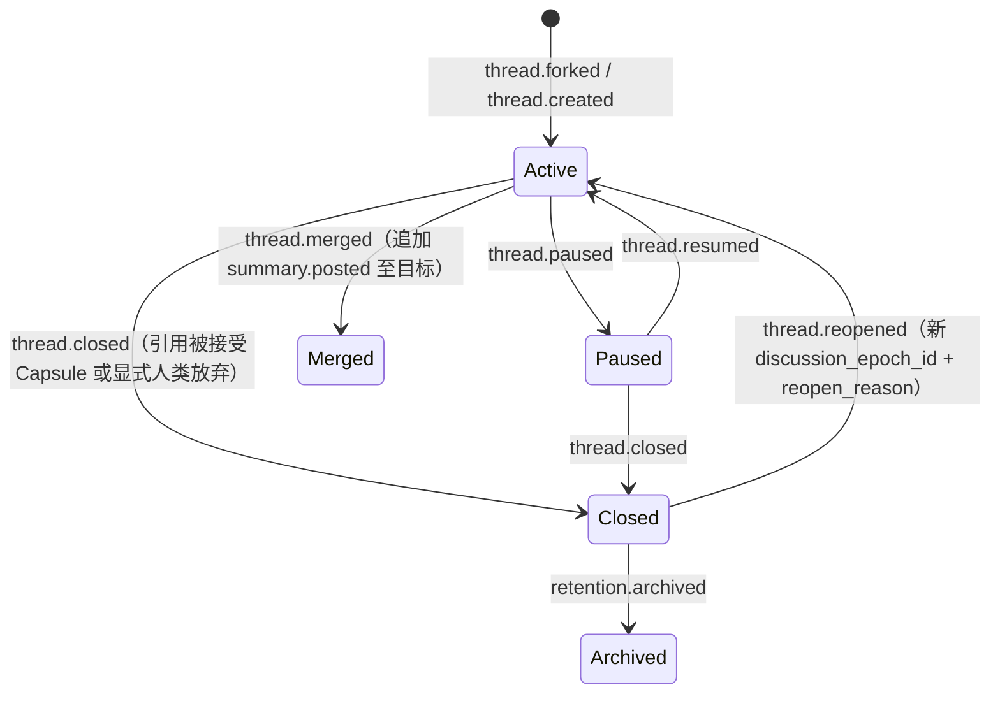

# 特性设计说明书（RFC 提案）：RFC-0004 Thread 生命周期与 Conversation Graph

**状态 (Status):** Draft

**作者 (Authors):** Mosaic 项目组 / ZCode

**创建日期 (Created):** 2026-08-25

**更新日期 (Updated):** 2026-08-25

**相关 Issue/PR:** #TBD（RFC 入库时创建 tracking issue）

# 0. 文档控制

| 项目 | 内容 |
|---|---|
| RFC 编号 | 0004 |
| 系列位置 | RFC 序列第 4 篇；Conversation Plane 的结构契约 |
| 上游输入 | [架构设计说明书](../2026-08-13-mosaic-architecture-design.md) v0.7 §2.5、§2.6、§3.3.1、§6.3、§6.9.1；[RFC-0001](2026-08-25-rfc-0001-room-protocol.md)（Thread 事件族与命令契约）；[RFC-0003](2026-08-25-rfc-0003-attention-floor.md)（fork intent 入口） |
| 吸收开放问题 | OQ-05（支线 merge 是否默认需人类确认）——本 RFC 提出裁决建议 |
| 下游 | RFC-0005（closed/reopen 与 Capsule 联动）、RFC-0006（relations 供结构投影）、RFC-0007（上下文隔离）、`internal/conversation`（LE-05）实现 |

## 0.1 修订记录

| 版本 | 日期 | 修订人 | 说明 |
|---|---|---|---|
| v0.1 | 2026-08-25 | Mosaic 项目组 / ZCode | 初稿：Thread 对象与生命周期状态机、Graph 边语义与不变量、typed relations 校验、fork/merge/pause/resume/close/reopen/archive 流程、上下文隔离契约、OQ-05 裁决建议 |

# 1. 概述

## 1.1 简介

Thread 是 Conversation Graph 的节点，也是上下文隔离的基本单元。本 RFC 定义 Thread 对象 Schema、生命周期状态机（active/paused/closed/merged/archived + reopen 新纪元）、四种图边（forked_from/responds_to/merged_into/related_to）的语义与不变量、事件级 typed relations 的声明与校验规则，以及 fork/merge 的完整流程。生命周期与认知阶段正交：前者是权威状态，后者是 RFC-0006 的可重建投影。

## 1.2 动机

架构 v0.7 §2.5/§6.9.1 给出了图语义骨架，但未成契约：边的约束（主锚唯一、执行依赖无环）散落正文；merge 接受权未决（OQ-05）；typed relations 的可见性校验规则是防泄露的关键路径却只有原则表述；reopen 与 Capsule 的引用关系需要与 RFC-0005 咬合。Graph 是"讨论走向可追踪"承诺的载体，必须先于 UI（MVP 切片 3/6）定稿。

## 1.3 目标

### 1.3.1 目标

1. 定义 Thread 对象 Schema 与生命周期状态机；
2. 定义四种图边的语义、约束与不变量（含环检测规则）；
3. 定义事件级 typed relations 的字段、类型枚举与校验规则（含可见性防泄露）；
4. 定义 fork 流程（命令与 Intent 双入口、支线初始状态）；
5. 定义 merge 流程（GroundedSummary 草稿、接受权、事件序列）；
6. 定义 pause/resume/close/reopen/archive 的触发、前置条件与事件 payload；
7. 定义支线上下文隔离契约；
8. 对 OQ-05 提出裁决建议。

### 1.3.2 非目标

- 收束与 Capsule 语义（RFC-0005，本 RFC 只定义 closed/reopen 的引用要求）；
- 认知阶段投影（RFC-0006）；
- 上下文组装内容与配额（RFC-0007，本 RFC 只定义隔离边界）；
- Floor/fork Intent 的评分（RFC-0003）；
- retention/archive 后的数据处理（RFC-0010）。

# 2. 用例分析

| 用例 | 功能点 | 关键指标 | 安全隐私与 DFX 约束 |
|---|---|---|---|
| T-01 fork 支线（架构 UC-003） | 从事件/Thread 分叉；独立目标、参与者子集、预算与自动轮次上限 | fork 命令 → thread.forked < 500ms | 最大分支深度硬上限（默认 3）；图操作全事件化可重建（AR-005） |
| T-02 merge 合并（架构 UC-005） | 生成带引用的 merge summary 草稿；接受后追加目标 Thread；源 Thread 保读 | 草稿生成走 RFC-0002 summarize 任务 | 合并不删除历史；摘要引用必须可解析 |
| T-03 pause/resume | 支线暂停/恢复；Room 暂停联动全部支线 | 状态迁移事件化 | 恢复权限按 RFC-0008 |
| T-04 reopen（联动 RFC-0005） | closed Thread 以新 discussion_epoch_id 重开，引用旧 Capsule | reopen_reason 枚举校验 | `thread.closed` 必须可追溯到被接受 Capsule 或显式人类放弃（11.3） |
| T-05 声明 typed relations | 发言附带 relations[]；跨 Thread/可见性目标校验 | 校验在命令验证阶段同步完成 | 不得通过关系边泄露私有事件存在（6.10.1） |
| T-06 环检测 | forked_from/responds_to/merged_into 构成执行依赖环时拒绝 | 提交时同步 DFS | related_to 允许成环 |
| T-07 archive | 关闭后的归档；不自动恢复 | 归档后只读 | 数据保留联动 RFC-0010 |

# 3. 方案设计

## 3.1 总体方案

### 3.1.1 Thread 对象 Schema

| 字段 | 必填 | 说明 |
|---|---|---|
| thread_id / room_id / tenant_id | 是 | 标识与归属 |
| goal | 是 | 讨论目标（一句话，≤ 500 字符） |
| participant_scope | 是 | 参与者子集（fork 时确定，可经命令调整） |
| mode_override | 否 | 模式覆写（缺省继承 Room） |
| source_event_id | fork 时必填 | 分叉锚点（主 forked_from） |
| state | 是 | active / paused / closed / merged / archived |
| discussion_epoch_id | 是 | 当前讨论纪元；reopen 时更换 |
| budget | 是 | 独立预算（轮次/token/时长/发言数） |
| context_watermark | 是 | 当前组装水位 |
| merge_policy | 是 | merge 接受策略（human_confirm / policy_auto） |

### 3.1.2 生命周期状态机



- `merged` 与 `archived` 不自动恢复；源 Thread 合并后只读可浏览；
- 认知阶段（exploring/diverging/integrating/converging/stable/evidence_blocked）由 RFC-0006 投影派生，经 `thread.phase.changed` 固化判断依据，不阻止写入。

### 3.1.3 图边语义与不变量

| 边类型 | 语义 | 约束 |
|---|---|---|
| forked_from | 从某事件或 Thread 分叉 | 主锚唯一（一个 Thread 只有一个 forked_from）；可有 0 个（主线） |
| responds_to | 讨论目标指向另一 Thread 的结论 | 目标必须存在且可见 |
| merged_into | 摘要/结论合并到目标 | 可多目标；目标不可为自身或后代 |
| related_to | 非层级关联 | 允许成环；不参与执行依赖 |

**不变量**：forked_from / responds_to / merged_into 构成的有向图必须无环（提交时同步 DFS 检测，成环拒绝并返回路径）；related_to 豁免。唯一约束 `(source, target, type)`（架构 §7.3.2 thread_edges）。

### 3.1.4 事件级 Typed Relations

```json
{
  "reply_to": "evt_primary",
  "addressed_to": ["par_kimi"],
  "relations": [
    {"target_event_id": "evt_a", "kind": "supports", "provenance": "explicit"},
    {"target_event_id": "evt_b", "kind": "challenges", "provenance": "explicit"}
  ]
}
```

- `kind ∈ {supports, challenges, extends, questions, evidence_for, supersedes, analogy, relates}`；`provenance` 在事件中恒为 `explicit`（系统推断关系只进 RFC-0006 投影，不得回写 payload，原则 13）；
- 校验规则（命令验证阶段，全部同步）：

| 规则 | 失败处理 |
|---|---|
| target_event_id 存在且同 tenant | 拒绝（validation_failed） |
| 目标事件对声明者可见（可见性交集，禁止指向不可见事件） | 拒绝并告警（防边泄露） |
| `reply_to` 单值且唯一锚点；每条 relation kind 合法、去重 | 拒绝 |
| 跨 Thread 目标：声明者必须是两 Thread 参与者交集成员 | 拒绝 |

- 一条消息可支持 A、质疑 B——因此 relations 是带类型的数组，不提供无类型 `relates_to[]` 简写。

### 3.1.5 Fork 流程

- 入口一：人类/有权限 Participant 提交 `fork_thread` 命令（RFC-0001 SubmitRoomCommand）；
- 入口二：Agent 在 Intent 中声明 `action=fork`（RFC-0003），获 Floor 后由系统执行 fork 而非公开发言；
- 支线初始状态：goal（fork 时必填）、参与者子集、源事件锚、继承或覆写的模式与预算、独立 context_watermark；
- 硬上限：Room 级最大分支深度（默认 3，Policy 可调）与最大并发活跃支线数（默认 8）——超限拒绝（架构 §9.1.3.2 分支爆炸控制）。

### 3.1.6 Merge 流程与 OQ-05 裁决建议

1. `propose_merge` 命令（参与者均可提议）→ 图校验（目标非自身/后代、无环）；
2. Context Builder 构建源 Thread 摘要输入 → RFC-0002 `summarize` 任务生成 GroundedSummary（含 cited_event_ids，引用必须可解析，RFC-0007）；
3. **接受（OQ-05 裁决建议）**：默认需人类确认（moderator 及以上，RFC-0008）；纯 Agent 房间可按 Policy 配置为自动接受，但 Capsule 化的收束型 merge 除外；
4. 接受后原子提交：`thread.merged`（含 targets 与 summary_event_id）+ `summary.posted`（追加到目标 Thread）；
5. 源 Thread 置 merged，只读保留；不删除任何历史事件。

### 3.1.7 Close / Reopen / Archive 前置条件

| 操作 | 前置条件 | 事件 |
|---|---|---|
| thread.closed | 被接受的 Closure Capsule（RFC-0005）或显式人类放弃事件 | `thread.closed {closure_id \| abandon_ref}` |
| thread.reopened | 引用旧 Capsule；`reopen_reason ∈ {new_evidence, changed_goal, changed_assumption, participant_change, human_request}` | `thread.reopened {prior_closure_id, reopen_reason, new_epoch}` |
| retention.archived | Room closed 且到期（RFC-0010） | `thread.archived` |

### 3.1.8 上下文隔离契约

支线默认**不接收**其他支线的完整内容；信息进入路径仅三条：显式 typed relations、经授权的投影（RFC-0006，主体非干扰）、合并摘要（本 RFC）。Context Builder 沿 reply_to / relations / claim 谱系回溯并按独立配额组装（细则归 RFC-0007）。

### 3.1.9 Thread 事件族 payload 示例

```json
// thread.forked
{"thread_id": "thr_...", "source_event_id": "evt_...", "goal": "...",
 "participants": ["par_a", "par_b"], "mode": "deep_dive", "budget": {"rounds": 4}}

// thread.merged
{"targets": ["thr_main"], "summary_event_id": "evt_summary", "accepted_by": "par_human"}

// thread.reopened
{"prior_closure_id": "cap_...", "reopen_reason": "new_evidence", "discussion_epoch_id": "epoch_new"}
```

## 3.2 技术选型

| 决策点 | 选择 | 放弃方案与原因 |
|---|---|---|
| 图存储 | PG `thread_edges` 表 + 递归 CTE 遍历 | 专用图数据库：无规模证据，运维负担 |
| 环检测 | 提交事务内同步 DFS | 异步/后台检测：违背"命令可拒绝"语义，坏图会先落地 |
| merge 摘要 | RFC-0002 summarize 任务（GroundedSummary） | 本地模板拼接：无事件引用保证，违背可追踪承诺 |
| relation 校验 | 命令验证阶段全量同步 | 写后补偿校验：泄露窗口不可接受 |

## 3.3 功能与性能设计

- **内部端口原型**：`GraphPort: Fork(cmd) / Merge(cmd) / Pause / Resume / Close / Reopen / QueryLineage(thread, mode)`；
- **性能目标**：fork 命令 → 事件提交 P95 < 500ms；10 万事件 Thread 的谱系/边遍历 P95 < 500ms；环检测（≤1000 节点）< 50ms；
- **影响范围**：`internal/conversation`（LE-05）、命令验证链、`thread_edges` fixture、CI 图不变量门禁（无环、主锚唯一、可见性边）。

## 3.4 安全隐私与 DFX 设计

- **防边泄露**：relation 目标可见性校验 + 跨可见性 fixture（隐藏事件不可被指向、计数不可泄露）；
- **可重建**：全部图操作事件化，投影可从空库重建（11.3）；
- **审计**：fork/merge/reopen 全量入审计（谁、何时、引用）；
- **降级**：图查询失败不阻塞 Timeline 主路径（Graph UI 渐进披露，架构 §11.4）。

## 3.5 编程与调用设计

### 3.5.1 编程模型基本设计

- **开发环境**：命令与查询经第一方 SDK；图 fixture 仓（正常/成环/跨可见性拒绝用例）；
- **开发约束**：领域层不得绕过 GraphPort 直接读写 thread_edges；
- **可验收设计**：图不变量门禁（无环、唯一主锚、墓碑边完整性——联动 RFC-0010）。

### 3.5.2 接口定义与设计

#### ForkThread（命令）

接口描述：从源事件/Thread 创建支线。

接口原型：`POST /v1/rooms/{room_id}/commands`，`command_kind = "fork_thread"`

输入/输出参数：

| 参数名称 | 输入/输出 | 类型 | 描述 | 取值范围 |
| --- | --- | --- | --- | --- |
| source_event_id | 输入 | string | 分叉锚点 | 本 Room 可见事件 |
| goal / participants / mode / budget | 输入 | body | 支线初始状态 | 见 3.1.1 |
| thread_id / discussion_epoch_id | 输出 | — | 新支线标识 | — |

- 异常处理：图校验/深度/配额失败 → 拒绝并返回原因。
- 约束说明：Agent 经 Intent fork 获 Floor 后由系统执行同一命令路径。
- 变更说明：首版。
- 调用参考代码：`await mosaic.rooms.command(roomId, {command_kind:"fork_thread", payload:{source_event_id, goal, participants}})`。

#### ProposeMerge（命令）

接口描述：提议合并支线到目标 Thread。

接口原型：`command_kind = "propose_merge"`

输入/输出参数：

| 参数名称 | 输入/输出 | 类型 | 描述 | 取值范围 |
| --- | --- | --- | --- | --- |
| source / targets | 输入 | string[] | 源与目标 | 目标非自身/后代 |
| merge_proposal_id | 输出 | string | 草稿句柄（附 GroundedSummary 引用） | — |

- 异常处理：环/自指拒绝；摘要生成失败可重试。
- 约束说明：接受权见 3.1.6（OQ-05 建议）。
- 变更说明：首版。
- 调用参考代码：（命令通道同上。）

#### GetThreadGraph（查询）

接口描述：获取 Thread 图与谱系（Timeline 为主、Graph 渐进披露）。

接口原型：`GET /v1/rooms/{room_id}/graph?thread_id=&mode=lineage|full`

输入/输出参数：

| 参数名称 | 输入/输出 | 类型 | 描述 | 取值范围 |
| --- | --- | --- | --- | --- |
| nodes / edges | 输出 | array | Thread 节点与四类边（可见性过滤后） | — |

- 异常处理：越权维度自动收敛。
- 约束说明：消费与 Timeline 同源的 committed 投影（架构 §6.6）。
- 变更说明：首版。
- 调用参考代码：`const g = await mosaic.rooms.graph(roomId)`。

### 3.5.3 编程手册设计

《Thread 与分支使用指南》（面向用户）：何时 fork、goal 写法、支线隔离语义、merge 流程与确认、reopen 条件。随 Web Client 文档发布。

# 4. 缺点和风险

| 风险 | 影响 | 应对 |
|---|---|---|
| Graph UI 复杂度淹没用户（架构 §11.4） | 走向不可读 | Timeline 为主、Graph 渐进披露、默认折叠摘要 |
| merge 摘要失真 | 结论回流失真 | 引用强制 + 人工确认默认（OQ-05）+ dissent_survival 指标（RFC-0011） |
| 环检测成本随图增长 | fork/merge 延迟 | 同步 DFS 限深 + 大图迁移到异步预检（阈值触发） |
| epoch 语义理解成本 | 用户混淆重开与续聊 | UI 明示纪元边界与 reopen 原因 |
| 深度/并发上限过紧 | 合理发散被限 | Policy 可调 + 上限事件可见 |

# 5. 现有技术

| 参考 | 借鉴 | 差异 |
|---|---|---|
| Git 分支/合并模型 | fork/merge 语义、合并不删历史、可追溯 | Mosaic 边类型更丰富（responds_to/related_to）且带可见性 |
| Zulip topics/streams | 讨论分叉与窄化（narrow）检索 | Zulip 无合并语义；Mosaic 是图不是树 |
| Matrix threading | Thread 归属与回复锚 | Matrix 无跨 Thread 类型化关系 |
| Hyperties/论辩图（argument mapping 工具） | supports/challenges 类型化边的表达力 | Mosaic 关系由发言者显式声明而非编辑器构建 |

# 6. 未解决问题

1. **OQ-05 终裁**：merge 默认人类确认（建议值）与纯 Agent 房间自动接受的边界（收束型 merge 是否恒需人类）。
2. 最大分支深度（默认 3）与并发活跃支线（默认 8）的校准。
3. `responds_to` 与 `related_to` 的判定辅助（是否提供 UI 建议双选）。
4. Thread 预算继承/覆写的粒度（fork 时逐项覆写 or 整体继承+偏移）。
5. archived Thread 的人工恢复路径（默认无，管理员命令？）。
6. 主线（无 forked_from）是否允许 responds_to（当前建议允许）。

# 7. 附录

## 7.1 参考资料

- 架构设计说明书 v0.7：§2.5 Conversation Graph、§2.6 生命周期正交、§3.3.1 生命周期约束、§6.3 上下文隔离、§6.9.1 显式关系与链路字段、§7.3.2 thread_edges
- [RFC-0001 Room Protocol](2026-08-25-rfc-0001-room-protocol.md)、[RFC-0003 Attention 与 Floor](2026-08-25-rfc-0003-attention-floor.md)、[RFC-0005 收束协议](2026-08-25-rfc-0005-closure-capsule.md)

## 7.2 术语表

| 术语 | 英文 | 含义 |
|---|---|---|
| 支线 | Fork / Side Thread | 从源事件分叉的独立讨论上下文 |
| 讨论纪元 | Discussion Epoch | 同一 Thread 一次开启到收束的标识；reopen 更换 |
| 主锚 | Primary Fork Anchor | 唯一的 forked_from 源 |
| 类型化关系 | Typed Relation | 发言显式声明的带类型事件间关系 |
| 执行依赖环 | Execution Dependency Cycle | forked_from/responds_to/merged_into 构成的环（禁止） |
| 墓碑 | Tombstone | 删除后保留图完整性的最小标记（RFC-0010） |

## 7.3 文档更新计划

- 评审期（Draft → Reviewing）：收敛未解决问题 1–3；
- Accepted 后：`api/room-protocol` 落 Thread 事件族 payload fixture 与图不变量门禁；`internal/conversation` 启动实现；
- 后续：RFC-0005/0007/0010 落地时同步修订引用点。
